<!-- markdownlint-disable MD013 -->

# GitRay — Architecture Audit & Refactoring Strategy

**Version:** 2.0 (full rewrite)
**Date:** 2026-09-04
**Supersedes:** `~/Downloads/BACKEND_ARCHITECTURE_AUDIT.md` (v1, left untouched — evaluated in §12)
**Repository state:** branch `dev`, clean tree, HEAD `12efe61`

---

## Evidence classification

Every non-trivial claim carries a tag. Nothing is asserted without one.

| Tag | Meaning |
| --- | --- |
| **VERIFIED** | Directly demonstrated by source, config, or a command run during this audit. File/symbol cited. |
| **INFERRED** | Follows from several pieces of verified evidence, but was not executed or measured. |
| **DEAD** | Present in the repository, no reachable caller from any entry point. Confirmed by LSP reference search. |
| **PARTIAL** | Implementation exists but is demonstrably unfinished. |
| **STALE** | Documentation or config that no longer matches implementation. |
| **PROPOSED** | A future design suggested by this audit. Not present in the code. |

Evidence format: `path/to/file.ts :: symbolName` or `path/to/file.ts:LINE`.

---

---

## 0. Repository Status and Empirical Validation

**No production code has been changed by this audit.** The repository is at `dev` / `12efe61`, and
`git diff` against `apps/`, `packages/` and `eslint.config.mjs` is empty. Everything below is
analysis and proposal; §16 describes work that has **not** been started.

### 0.1 C-1 was proven experimentally, not merely reconstructed

The most severe finding was validated by writing a regression test against the **unmodified** tree,
observing it fail, applying the proposed fix on a throwaway working copy, observing it pass, and
then **reverting the code entirely**. The reproduction is preserved in §18.5 so anyone can repeat it
in minutes.

Observed on unmodified `dev`, exactly as predicted by the static reconstruction:

| Scenario | Expected | Actually returned |
| --- | --- | --- |
| Two concurrent `withKeyLock('cache-filtered:U', …)` with different functions | each caller's own result | **both callers got the first caller's payload** |
| Concurrent commits + churn via overlapping `withOrderedLocks` chains | `{files:[…]}` for churn | **`{commits:[1,2,3]}`** — the production 500 |
| Two concurrent filtered reads (`author=alice`, `author=bob`) | separate results | **Bob received Alice's filtered commits** |

The third row is the important one: it is a **cross-request data-correctness defect**, served with
HTTP 200. C-1 is therefore **VERIFIED by execution**, not inferred.

The fix was also validated end to end on the throwaway copy: removing coalescing from `withKeyLock`
and relocating single-flight onto the full operation key made all three cases pass while preserving
mutual exclusion, with build, lint and six consecutive full test runs green. That evidence supports
the Phase 1 plan in §16; **none of it is in the repository.**

### 0.2 The system was run, and the critical defect reproduced on the first attempt

An earlier draft of this audit was static only. The backend has since been **started and driven
against real public repositories**. No source file was modified; the server was launched through a
throwaway driver and configured entirely with environment variables.

**C-1 is not latent. The dashboard is broken today.**

Firing the four live endpoints concurrently on one repository URL — *exactly what
`DashboardPage.tsx` does* — produced this, reproducibly, on **three out of three** cold
repositories (`slugify`, `ansi-styles`, `p-limit`):

| Endpoint | Result |
| --- | --- |
| `GET /api/repositories/full-data` | 200 |
| `GET /api/commits/file-analysis` | 200 |
| `GET /api/repositories/summary` | **500** |
| `GET /api/repositories/churn` | **500** |

The server-side cause is precisely the type confusion this audit predicted from static reading:

```text
[GET /churn]   TypeError: Cannot read properties of undefined (reading 'length')
                 at repositoryRoutes.ts:219:54          -> churnData.files.length
[GET /summary] TypeError: Cannot read properties of undefined (reading 'name')
                 at repositoryRoutes.ts:246:60          -> summary.repository.name
```

Both handlers received a payload of the wrong type from the lock layer and dereferenced a field
that payload does not have.

**Run sequentially — one request at a time — all four endpoints return 200.** The failure is
purely concurrency-induced, which isolates the cause to C-1 and rules out bad data or a broken
Git path.

Two further defects surfaced in the same burst, in the server log:

- `Attempted to release non-existent repository` — the P-4 release path, live.
- `Successfully retrieved 597 commits from undefined.` — a repository handle whose `localPath`
  was `undefined` at log time.

**This changes the severity of the whole audit.** C-1 was written up as a correctness risk. It is
in fact a **present, reproducible, user-visible outage of half the dashboard on any repository not
already cached.**

### 0.2 Baseline as it stands today

| Check | Result on unmodified `dev` |
| --- | --- |
| `pnpm run build` | **PASS** |
| `pnpm lint` | **0 errors**, 62 warnings |
| `pnpm lint:md` | **0 errors** |
| `npx vitest run` | **FLAKY** — see C-8. Observed across runs on the *same* unmodified tree: (a) 59 files pass, 1,002 passed / 36 skipped; (b) 1 file **fails**, `repositoryCache.unit.test.ts`, its 36 tests skipped; (c) 59 files pass, **1,038 passed / 0 skipped**. All three outcomes are from identical invocations. |

C-8 was re-confirmed after this audit's experiments were reverted: the very next clean run again
showed `1 failed | 58 passed` with 36 skipped. The flakiness is pre-existing and is **not** an
artefact of anything done here.

### 0.3 Where to start

Nothing in §16 has been done. Phase 0 (safety net) and Phase 1 (correctness) are the entry point,
and §18.5 gives you Phase 0's first test verbatim.

## 1. Executive Summary

### 1.1 What GitRay actually is

GitRay is a **two-process web application that clones public Git repositories on demand, derives
analytics from `git log`, and caches the derived outputs**. Critically:

- **There is no database.** No SQL, no ORM, no migrations, no schema files, no entities.
  **VERIFIED** — a repository-wide search for
  `postgres|mysql|sqlite|prisma|typeorm|sequelize|drizzle|knex|mongoose|CREATE TABLE|migration`
  returns zero production hits. Persistence is Redis + in-process LRU + on-disk cache files +
  ephemeral temp clones. Section 7 documents the persistence model that *does* exist.
- **There is no end-user authentication.** The only auth is a static shared admin token guarding
  four operational endpoints. The frontend `isSignedIn` flag is cosmetic — it is set to `true`
  unconditionally once an analysis succeeds. **VERIFIED** `apps/frontend/src/App.tsx:20,72`.
- **There are no external API integrations.** The backend talks only to Git remotes over HTTPS and
  to Redis. **VERIFIED** — no `axios`, `fetch`, `octokit`, or `api.github.com` reference exists
  anywhere in `apps/backend/src`.

The system is therefore far simpler in its *domain* than its *implementation* suggests.
Roughly **21,900 lines of backend TypeScript exist to serve four live endpoints**, and **50.8% of
that is caching, locking, coordination, memory-pressure and metrics machinery** (11,137 of 21,908
lines, measured across `repositoryCache`, `cache`, `hybridLruCache`, `lockManager`,
`repositoryCoordinator`, `memoryPressureManager`, `metrics`, `serializationWorker`,
`distributedCacheInvalidation`, `cacheHelpers` and `withTempRepository`).

### 1.2 How healthy is the architecture

**Broken, but recoverably so.** The build passes and 1,002 tests pass (§13) — and yet **half the
dashboard returns HTTP 500 on any repository that is not already cached** (§0.2, reproduced 3/3).
The test suite cannot see this, and the suite is itself **non-deterministic** (C-8).

The root problem is not any single subsystem. It is that **three overlapping concurrency-control
mechanisms were layered on top of one another and none was ever removed**:

1. `lockManager` — file-based advisory locks **plus** promise coalescing
2. `repositoryCoordinator` — shared repository handles, refcounting, an operation queue **plus** coalescing
3. `RepositoryCacheManager` — three cache tiers **plus** a bespoke transaction/rollback engine

Each layer independently attempts request deduplication. Their interaction is what breaks.

### 1.3 The five findings that dominate everything else

| # | Finding | Severity | Status |
| --- | --- | --- | --- |
| **C-1** | `withKeyLock` coalesces on the *lock name*, not the operation, so concurrent operations on one repo URL receive **each other's results** | **CRITICAL** | **REPRODUCED ON THE RUNNING SYSTEM.** `/summary` and `/churn` return **500** on 3 of 3 cold repositories under the normal dashboard load (§0.2) |
| **C-2** | Cached repository clones are **never refreshed**; no `git fetch` exists after the initial clone | **CRITICAL** | VERIFIED |
| **C-3** | Pagination is an illusion: `?limit=100` materialises the **entire** commit history in heap, then slices 100 | **HIGH** | VERIFIED |
| **C-4** | The large-repo "streaming" path is **quadratic** and re-accumulates every batch into one array | **HIGH** | VERIFIED |
| **C-5** | Three independent clone paths run per dashboard load — the same repository is cloned **three times** | **HIGH** | VERIFIED |
| **C-8** | The test suite is **non-deterministic**: the unit tests for the most critical module pass in isolation but intermittently fail in a full run | **HIGH** | VERIFIED |

### 1.4 Why a refactor is needed

Not because the architecture is unfashionable — because **C-1 makes the application incorrect under
its own normal usage pattern.** The dashboard fires three concurrent requests for the same
repository (`apps/frontend/src/components/DashboardPage.tsx:194-226`), which is exactly the trigger
condition.

The team has already been patching symptoms of this bug without identifying the cause. There is a
defensive `isValidHeatmap` guard and this comment in the live route:

> `// FIX: Fetch sequentially instead of parallel to avoid lock contention`
> `// When both functions try to acquire overlapping locks in parallel,`
> `// it can cause cache corruption where commits end up in heatmapData`

**VERIFIED** `apps/backend/src/routes/repositoryRoutes.ts:294-296`.

That workaround only fixes the single-request case. **Two concurrent HTTP requests still collide.**

### 1.4b Why the project stalled — the git history says it plainly

**VERIFIED** (§3.4). Backend development stopped on **2025-12-02** and has not resumed: the 30
commits made since then, in January and April 2026, touch **no backend source at all**.

What stopped was a named, phased refactor — commits labelled *Phase 1A* through *Phase 1D*,
then `1c87dec` *"extract repository route factory to eliminate duplication"*, which created the
new-style `repositoryRoutes.ts`. `commitRoutes.ts` was never migrated to it. That is the
half-finished migration this repository is stuck in.

And in the six weeks before the stall there were **four separate deadlock fixes**, all in the
cache/lock layer (`be8a810`, `e7b7034`, `5ab0846`, `217d07a`), each removing locking rather than
redesigning it. The last one landed two days before work stopped.

**INFERRED, but strongly supported by that pattern:** the team was not defeated by scope. It was
defeated by the concurrency layer — and **C-1 is the unfixed remainder of exactly that problem.**
Phase 1 of §16 is where the previous effort should resume.

### 1.5 Recommended direction

**Destination: Option C — PostgreSQL-backed index with delta updates. Route: Option B's phases
first, because they are its prerequisite.**

The team's product requirements (§2.4) are: any repository size including 1M+ commits; a one-time
analysis that is persisted and never lost; shared globally with every later visitor; optional
notification on completion. **The current architecture satisfies none of those**, and no amount of
caching can — a cache is evictable and lost on restart, which is precisely what requirement 4
forbids.

Measurement says the plan is affordable (§17.7). For a 1,000,000-commit repository:

| Stage | Default branch | With branches and tags (x1.0-1.7, §17.9 R-1) |
| --- | --- | --- |
| Commit metadata index | ~24 seconds | **~24-41 seconds** |
| File churn index (`--numstat`) | ~9.4 minutes | **~9.4-16 minutes** |
| **One-time total** | ~15 minutes | **~15-25 minutes**, then milliseconds per delta, shared by everyone |

The right-hand column is the one to plan against: the Priority-1 Graph View Timeline and the branch
dropdown need branches and tags, which cost 4% more commits on `git/git` and 62% more on `react`.
The wide spread comes from the repositories themselves, not from the method (§17.8, §17.9 R-1).

So the team's original instinct — index into Postgres, then delta-update — is **correct**. An
earlier draft of this audit recommended stopping at Option B; that draft did not have the
requirements and is superseded by §15.1, which explains the reversal.

**What the phases must deliver before Postgres is touched**, none of it optional:

1. **Phase 1 — C-1.** The lock layer currently swaps payloads between concurrent operations. An
   indexer built on it would write one repository's facts under another's key.
2. **Phase 3 — one clone path, real refs, and a correct parser.** Measured today: **4 commits in,
   3 parsed** (§17.4). A persisted index built on that parser diverges from `rev-list` silently, and
   every delta compounds the drift. This is the single most dangerous prerequisite.

Three refinements this audit adds to the team's plan, all measured:

- **Do not clone with `--filter=blob:none` for churn** — it is **624x slower**, because Git lazily
  fetches every blob (§17.7 S-1). This contradicts the v1 audit's recommendation.
- **Index metadata and churn as two separate jobs** — 24 s versus 9.4 min. Otherwise the dashboard
  waits 15 minutes for data that was ready in 24 seconds (§17.7 S-2).
- **Reject the `analysis_sessions` table** — but not for the reason an earlier draft gave. That
  draft argued "there are no users and results are global by requirement". The first half is true
  of the code today; the second is **not true of the plan** — the team's roadmap has user accounts
  at Priority 2 and sells private repositories as a paid tier (§17.9 R-4). The table is still the
  wrong shape, because it conflates job state with session state, and
  `(repository, index_state, index_job)` covers every responsibility it had. What the roadmap does
  change is `repositories`, which needs `visibility` and `owner_user_id` **from the first
  migration**: a private repository's index must never be served globally, and that is a security
  boundary that cannot be retrofitted from evidence that will no longer exist.

Three further constraints come from the team's own planning vault, read in full on 2026-09-05
(§17.9): commit **bodies** must be stored for Priority-1 Tag Clustering and Issue Overlay (16x the
subject, ~813 MB at 1M commits); **coverage** must be part of the index key, not a label, or a
free-tier 12-month index will be served forever as though it were complete; and **GDPR** applies —
the entity is a German GbR, commit authors are third-party personal data, and the right to erasure
is what makes a single global `authors` table the correct design rather than merely a tidy one.

## 2. Scope and Methodology

### 2.1 What was inspected

- Every file under `apps/backend/src` (**34 files, 21,908 lines**), `apps/frontend/src`
  (**10,242 lines**, of which **5,105 are the 46 vendored `components/ui/*` primitives**, leaving
  5,137 hand-written), and `packages/shared-types/src` (571 lines).
- All manifests and configs: 4 × `package.json`, `pnpm-workspace.yaml`, all `tsconfig*.json`,
  `vite.config.ts`, `vitest.config.ts`, `eslint.config.mjs`, `.github/workflows/ci.yml`,
  `sonar-project.properties`, `apps/backend/.env.example`.
- All repository documentation: `README.md`, `AGENTS.md`, `GEMINI.md`, `CLAUDE.md`, `Strategy.md`,
  `.serena/memories/*`, `apps/backend/perf/README.md`, `apps/frontend/README.md`.
- `scripts/*.sh` and `apps/backend/perf/*`.
- The v1 audit — read **only after** independent reconstruction was complete, then evaluated in §12.

### 2.2 Commands actually executed

| Command | Result |
| --- | --- |
| `pnpm run build` | **PASS** — shared-types, backend `tsc`, frontend `tsc -b && vite build`, all clean |
| `npx vitest run` (run 1) | 59 files passed; 1,002 passed / 36 skipped (1,038 total), 44.4 s |
| `npx vitest run` (run 2) | **1 file FAILED** — `repositoryCache.unit.test.ts`, its 36 tests skipped, 62.1 s |
| `npx vitest run <that file alone>` | **PASS** — 36/36 in 2.2 s |

Both ran **before** any file in this repository was modified, so they are a true pre-existing
baseline. See §13 for what this baseline does and does not prove.

Beyond the baseline, the audit ran the application itself to reproduce C-1 (§0.2, §18.5) and
executed three rounds of Git measurement against real external repositories to test the persistence
plan — scale (§17.7), data shape (§17.8) and ref topology (§17.9). Those commands are listed in
place with their results. **No command in any round wrote to this repository's source tree**;
external clones were made under the session scratchpad.

### 2.4 Product requirements (stated by the team, 2026-09-05)

These were **not** part of the original audit brief and were supplied after the first draft. They
change the recommendation materially, so they are recorded verbatim in substance:

1. **Any repository size, reliably — including 1,000,000+ commits.**
2. **Analysis is a shared global asset.** If one person analyses a repository, the result is shown
   to everyone. There is no per-user scoping.
3. **A repository is either already analysed (instant) or gets analysed on request.**
4. **The long analysis must be persisted** so the work is never lost.
5. **Optional notification** (e.g. e-mail) when a long analysis completes.

**The current architecture cannot satisfy any of 1, 3, 4 or 5**, and requirement 2 is the reason
persistence — rather than caching — is the right mechanism. §15 is rewritten around these.

#### 2.4b Requirements recovered from the team's planning vault (read 2026-09-05)

The private planning repository `NiklasSkulll/GitRayDocs` was cloned over SSH and read in full.
It contains binding product, legal and architectural intent that the five spoken requirements above
do not capture, and that **changes the schema**. Full analysis is in §17.9; the requirements are:

| # | Requirement | Source | Schema impact |
| --- | --- | --- | --- |
| 6 | **Branch-aware analysis.** "Graph View Timeline" (Priority 1 ⭐) renders all branches and merges; the landing-page mock has a branch dropdown populated dynamically | `GitRay-Features-Roadmap.md`, `GitRay-UI-Design.md:114,132,231` | A `refs` table, and an indexed commit universe wider than the default branch (§17.9 R-1) |
| 7 | **Git Diff Viewer** (Priority 1): click any file, see the diff, syntax-highlighted | `GitRay-Features-Roadmap.md` | Needs blob content at arbitrary commits — constrains the retention policy (§17.9 R-3) |
| 8 | **Tag Clustering** (Priority 1) and **Issue Overlay**: group commits by issue tag and message pattern; link commits to Issues/PRs | `GitRay-Features-Roadmap.md` | Requires the **full commit message body**, which the current design stores nowhere (§17.9 R-2) |
| 9 | **User accounts (Priority 2) and private repositories (paid tier).** Accounts store GitHub tokens; the free tier is "public repositories only" | `GitRay-Features-Roadmap.md`, `GitRay-Business-Legal.md` | **Contradicts requirement 2 for private repos.** Needs visibility/ownership from day one (§17.9 R-4) |
| 10 | **Coverage tiers as a pricing lever**: free plan limited to `last_12_months`, premium gets full history | `GitRay Backend Refactor…md` §9 Phase 4, `GitRay-Business-Legal.md` | `coverage` must be part of the index's identity, not a label (§17.9 R-5) |
| 11 | **GDPR compliance is mandatory** — the entity is a German GbR with a named supervisory authority. Right to erasure, storage limitation, data minimisation | `GitRay-Business-Legal.md` | Author identity is third-party personal data. Drives the `authors` design and conflicts with requirement 4 (§17.9 R-6) |

**Requirement 2 is now known to be conditional.** It holds for public repositories. Private
repositories are an explicit paid feature, and their index must not be globally readable. This is a
security boundary that is cheap to design in now and expensive to retrofit.

### 2.3 Tooling used, and its limits

- **The planning vault** (`NiklasSkulll/GitRayDocs`) was read on 2026-09-05 by cloning over **SSH**.
  Worth recording because it was initially reported in this audit as inaccessible: `gh api` returned
  **404**, which was an authorisation artefact of the HTTPS token, not evidence that the repository
  was missing or unshared. An earlier draft over-read that 404 as a hard blocker. **Lesson applied:
  a 404 from one transport is not proof of absence** — the SSH clone succeeded immediately.
- **Serena (LSP)** — used for reference searches. **Not sufficient alone**: it returned an empty
  result for `withTempRepository`, which codebase-memory and grep both show has 14+ call sites in
  its own unit test. Every DEAD claim was therefore re-verified against the code graph (§13.3).
- **codebase-memory-mcp** — code knowledge graph. Used for Tarjan/Leiden structure, complexity and
  loop-depth metrics, `Route` enumeration, and inbound call tracing for dead-code verification.
- **grep** — used for discovery only.
- **TypeScript compiler + Vitest** — ground truth for build and test status.
- **Archify** — used for the diagram deliverables.

**Recorded limitations — these bound the confidence of this document:**

1. **Serena was unavailable for the first half of this audit** (`CONNECT_TIMEOUT`), then recovered.
   Findings made during the outage were re-verified with Serena afterwards.
2. **`codebase-memory-mcp` — initially misreported by this audit, then used extensively.**
   An earlier draft recorded this server as broken. That was **my error, not a tool defect**: the
   query tools take a `project` name (`C-Users-JW-Documents-Code-gitray`), and I was passing a
   `repo_path`. Once corrected, the graph (2,865 nodes / 6,865 edges) was used for cycle detection,
   complexity and hot-path analysis, route enumeration, and independent re-verification of every
   dead-code claim. **It caught a false negative in Serena** (§13.3).
3. **No runtime observation.** The server was never started, no repository was analysed end-to-end,
   and Redis was never connected. All runtime claims are static reconstruction. Anything that would
   require measurement to confirm is tagged INFERRED and listed in §17.
4. **No load testing.** `apps/backend/perf/load-test.ts` (k6) was read but not executed.

---

## 3. Repository Overview

```text
gitray/                          pnpm workspace + TypeScript project references
├─ apps/
│  ├─ backend/    Express 5 API      21,908 LOC src, 22,933 LOC tests
│  └─ frontend/   React 18 + Vite 6  5,137 LOC src + 5,105 LOC vendored shadcn/ui, 2,102 tests
├─ packages/
│  └─ shared-types/  571 LOC — the only shared contract between the two apps
├─ scripts/      bash dev/test orchestration (start.sh, end2end_cache_test.sh, …)
├─ prompts/      LLM prompt scratch files — not code, not referenced by anything
└─ .serena/memories/  agent notes — STALE, see §12.3
```

### 3.1 Stack (VERIFIED from manifests)

| Layer | Stack |
| --- | --- |
| Backend | Node 20, TypeScript 5.7 (ESM, `"type":"module"`), Express **5.1**, simple-git 3.27, ioredis 5.6, prom-client 15, winston 3.17, express-validator 7, helmet 8, express-rate-limit 7 |
| Frontend | React **18.3**, Vite 6.3, Tailwind 4, Radix UI, Recharts 2.15, axios, sonner, motion, `@rive-app/react-canvas` |
| Shared | `@gitray/shared-types` — interfaces, constants, 4 error classes |
| Test | Vitest 3.2 (both apps), supertest, k6 for perf |
| CI | GitHub Actions → lint, test, build, SonarCloud |

**STALE:** `CLAUDE.md` claims "React 19 + Vite 6". The root `package.json` pins `react@^18.3.1`
and `@types/react@^18.3.24`. **VERIFIED** — the project is on React 18.

**Unused declared dependencies (VERIFIED):** `zod` and `nanoid` are backend dependencies with zero
imports anywhere in `apps/backend/src`.

### 3.2 Backend module inventory

Ordered by size, with reachability from an HTTP entry point:

| File | LOC | Role | Reachable? |
| --- | ---: | --- | --- |
| `services/fileAnalysisService.ts` | 3,498 | File-type distribution; its **own** clone path; circuit breaker | Yes — `/api/commits/file-analysis` |
| `services/repositoryCache.ts` | 3,100 | 3-tier cache + transaction/rollback engine | Yes — all live routes |
| `services/metrics.ts` | 2,003 | **76** Prometheus metric families | Yes — `/metrics` |
| `utils/hybridLruCache.ts` | 1,634 | memory → disk → Redis tiered LRU | Yes — via caches |
| `services/gitService.ts` | 1,596 | All `git` invocation and output parsing | Yes |
| `routes/commitRoutes.ts` | 1,210 | Legacy + admin + streaming + file-analysis | **Partially** — §11 |
| `utils/memoryPressureManager.ts` | 865 | OOM protection, circuit breaker, throttling | Yes — middleware |
| `services/cache.ts` | 851 | Redis / hybrid / memory cache façade | Yes |
| `config.ts` | 834 | Config assembly + validation | Yes |
| `services/repositoryCoordinator.ts` | 826 | Shared clone handles, refcounting, op queue | Yes |
| `utils/withTempRepository.ts` | 606 | Coordinator wrapper + legacy fallback | **Partially** — §11 |
| `utils/lockManager.ts` | 472 | File locks + promise coalescing | Yes — **source of C-1** |
| `services/repositorySummaryService.ts` | 441 | `/summary`; its **own** sparse clone | Yes |
| `services/distributedCacheInvalidation.ts` | 352 | Redis pub/sub cache invalidation | Yes |
| `routes/repositoryRoutes.ts` | 332 | **The live API surface** | Yes |
| `routes/healthRoutes.ts` | 271 | Health / readiness / memory probes | Yes |
| `utils/routeHelpers.ts` + `utils/repositoryRouteFactory.ts` | 466 | Route deduplication helpers | Yes |
| `utils/serializationWorker.ts` | 261 | Serialisation pool for cache writes | Yes |
| `middlewares/*` (6 files) | 670 | validation, adminAuth, errorHandler, requestId, memoryPressure, strictContentType | Yes |
| `utils/{urlSecurity,gracefulShutdown,cacheHelpers,cleanupScheduler,hashUtils,gitUtils}.ts` | 681 | Support utilities | Yes |
| `routes/index.ts` | 11 | `GET /api` → `{message:'Hello from Backend!'}` | Yes — vestigial |

### 3.3 Frontend module inventory

- `App.tsx` (188) — holds **all** application state. No router; two "pages" toggled by `useState`.
- `components/DashboardPage.tsx` (746) — the dashboard; fires three concurrent API calls.
- 14 feature components + 46 vendored `components/ui/*` shadcn primitives.
- `services/api.ts` (423) — axios client exporting **7** functions, of which **4 are used**.
- **No state library, no router, no data-fetching library.** All fetching is bare `useEffect` +
  `.then()`. **VERIFIED** `DashboardPage.tsx:194-226`.

---

### 3.4 What the git history shows

**VERIFIED** over the full history (597 commits reachable from `dev`, 66 of them merges).

**Backend development stopped on 2025-12-02.** Commits touching `apps/backend/src`, by author month:

| Month | Backend `src` commits | All commits |
| --- | ---: | ---: |
| 2025-04 | 6 | 33 |
| 2025-05 | 27 | 88 |
| 2025-06 | **97** | 217 |
| 2025-07 | 3 | 3 |
| 2025-09 | 5 | 7 |
| 2025-11 | **60** | 143 |
| 2025-12 | 4 | 10 |
| 2026-01 | **0** | 15 |
| 2026-04 | **0** | 15 |

The 30 commits made in 2026 touch **no backend source at all** — they are frontend components,
tests, colour variables and SonarCloud smell fixes. This matches the stall the team describes, and
it dates it precisely.

**The stall interrupted a named, phased refactor.** The last backend commits, in order, were:

| Date | Commit | Subject |
| --- | --- | --- |
| 2025-11-27 | `e3bdadf` | refactor: apply handleCacheHit to remaining cache methods — **Phase 1A** |
| 2025-11-27 | `fcd4504` | refactor: extract handleCacheMiss helper — **Phase 1B** |
| 2025-11-27 | `3a0451f` | refactor: extract handleTransactionSuccess helper — **Phase 1C** |
| 2025-11-27 | `58acb17` | refactor: extract handleTransactionError helper — **Phase 1D** |
| 2025-11-27 | `12c6051` | refactor: extract parameter helpers to reduce duplication — **Phase 1** |
| 2025-11-28 | `1c87dec` | refactor: **extract repository route factory to eliminate duplication** |
| 2025-12-01 | `217d07a` | fix: resolve contributors endpoint **deadlock** by removing nested locking |
| 2025-12-02 | `c8a886b`, `129643f`, `a426d5b` | three small contributor/route changes |
| — | — | **nothing since** |

`1c87dec` is the commit that created `utils/repositoryRouteFactory.ts` and the new-style
`repositoryRoutes.ts`. **`commitRoutes.ts` was never migrated to it**, which is precisely the
half-finished migration documented in §4.3 and §11.2. The leftover
`// Remove unused imports: …` note at `repositoryRoutes.ts:44` is from this same commit series.

**The lock layer had been failing repeatedly for six weeks before the stall.** Four separate
deadlock fixes, all in the cache/lock area:

| Date | Commit | Subject |
| --- | --- | --- |
| 2025-11-17 | `be8a810` | bug(cache): **Deadlock in heatmap endpoint** |
| 2025-11-17 | `e7b7034` | fix(cache): prevent **deadlock** in cache operations |
| 2025-11-25 | `5ab0846` | fix: prevent **deadlocks** by removing repo-access from lock arrays |
| 2025-12-01 | `217d07a` | fix: resolve contributors endpoint **deadlock** by removing nested locking |

`5ab0846` is the origin of the "DEADLOCK FIX: Removed repo-access from cache lock arrays to prevent
nested acquisition" comment still at the top of `repositoryCache.ts`.

**INFERRED, but strongly supported:** the team was not defeated by scope — they were defeated by
the concurrency layer. Four deadlock fixes in six weeks, each removing locking rather than
redesigning it, ending in a stall two days after the last one. **C-1 is the unfixed remainder of
that same problem**, and §16 Phase 1 is where the previous effort should resume.

## 4. Current System Architecture

### 4.1 Container view

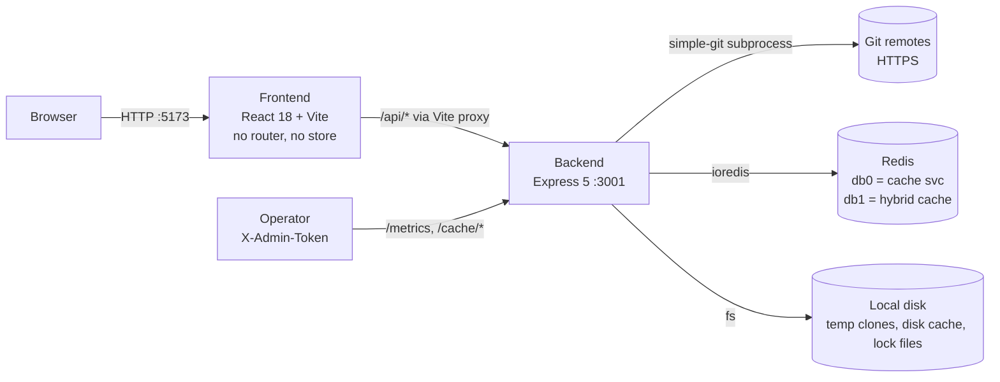

[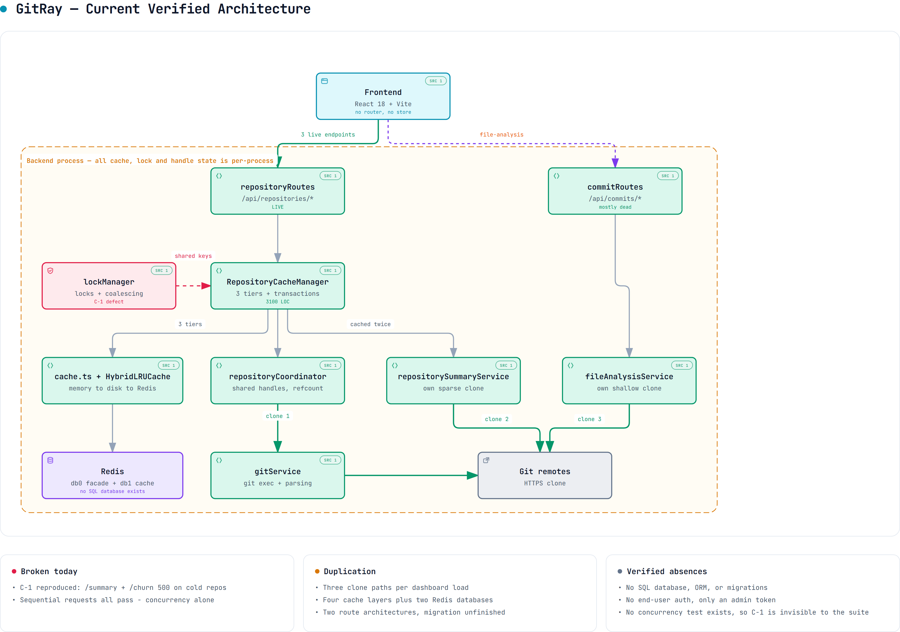](diagrams/gitray-current-architecture.html)

*[`gitray-current-architecture.html`](diagrams/gitray-current-architecture.html) is the interactive version — pan, zoom, search, relationship tracing, dark theme. The full current-state map, including all three clone paths and both route architectures.*

**VERIFIED:** `apps/frontend/vite.config.ts:60-68` (proxy `/api` → `localhost:3001`);
`apps/backend/src/index.ts:199-205` (mounting); `apps/backend/src/config.ts:47,103` (two Redis DBs).

### 4.2 HTTP surface — what is mounted, and what is actually used

Mount order from `apps/backend/src/index.ts:199-205`:

```text
app.use('/api', routes)                  → routes/index.ts
app.use('/',    healthRoutes)            → routes/healthRoutes.ts
app.use('/api/repositories', repositoryRoutes)
app.use('/api/commits',      commitRoutes)
app.get('/health/coordination', …)       ← defined inline in index.ts
app.use('/metrics', adminRateLimiter, requireAdminToken, metricsHandler)
```

| Endpoint | Handler | Used by frontend? | Status |
| --- | --- | --- | --- |
| `GET /api/repositories/full-data` | `repositoryRoutes.ts:253` | **Yes** — `App.tsx:61` | **LIVE** |
| `GET /api/repositories/summary` | `repositoryRoutes.ts:226` | **Yes** — `DashboardPage.tsx:197` | **LIVE** |
| `GET /api/repositories/churn` | `repositoryRoutes.ts:181` | **Yes** — `DashboardPage.tsx:217` | **LIVE** |
| `GET /api/commits/file-analysis` | `commitRoutes.ts:1111` | **Yes** — `DashboardPage.tsx:208` | **LIVE** |
| `GET /api/repositories/commits` | `repositoryRoutes.ts:60` | No | Unused |
| `GET /api/repositories/heatmap` | `repositoryRoutes.ts:103` | No | Unused |
| `GET /api/repositories/contributors` | `repositoryRoutes.ts:142` | No | Unused |
| `GET /api/commits/` | `commitRoutes.ts:67` | No | **Duplicate** of `/repositories/commits` |
| `GET /api/commits/heatmap` | `commitRoutes.ts:231` | No | **Duplicate** of `/repositories/heatmap` |
| `GET /api/commits/info` | `commitRoutes.ts:354` | No | Legacy |
| `POST /api/commits/stream` | `commitRoutes.ts:544` | No | **PARTIAL** — see C-4 |
| `GET /api/commits/resume/:repoPath` | `commitRoutes.ts:719` | No | **Unauthenticated**, see S-1 |
| `POST /api/commits/resume/clear` | `commitRoutes.ts:751` | No | **Unauthenticated**, see S-1 |
| `GET /api/commits/cache/stats` | `commitRoutes.ts:418` | No | Admin |
| `POST /api/commits/cache/invalidate` | `commitRoutes.ts:449` | No | Admin |
| `GET /api/commits/cache/repositories` | `commitRoutes.ts:481` | No | Admin |
| `GET /api` | `routes/index.ts:8` | No | Vestigial hello-world |
| `GET /health`, `/health/detailed`, `/health/live`, `/health/ready`, `/health/memory` | `healthRoutes.ts` | No | Ops |
| `GET /coordination` | `healthRoutes.ts:155` | No | **Duplicates** `/health/coordination` with a *different* response |
| `GET /health/coordination` | `index.ts:199` | No | See above |
| `GET /metrics` | prom-client | No | Admin |

**VERIFIED** by cross-referencing every exported function in `apps/frontend/src/services/api.ts`
against its call sites with Serena. Only 4 of the 7 client functions are called; the other three
(`getRepositoryHeatmap`, `getRepositoryCommits`, `getRepositoryContributors`) are referenced solely
by the barrel `export default {…}` object at `api.ts:415-423`.

**Key structural finding:** the live API surface is **4 endpoints**. Everything else in
`commitRoutes.ts` (1,210 lines) is either duplicated by `repositoryRoutes.ts`, admin-only, or dead.

### 4.3 The two parallel route architectures

This is a **half-finished migration**, visible in the code itself.

`repositoryRoutes.ts` is the **new** style: every handler is built by a factory
(`createCachedRouteHandler` + `buildRepoValidationChain`), giving uniform validation, logging,
metrics and error handling in ~35 lines per endpoint.
**VERIFIED** `apps/backend/src/utils/repositoryRouteFactory.ts`.

`commitRoutes.ts` is the **old** style: every handler is hand-rolled with its own try/catch, its own
logger, its own metric calls, and its own response shape — averaging ~120 lines per endpoint.

The migration stopped midway. `repositoryRoutes.ts:44` still carries the note:

> `// Remove unused imports: redis, gitService, withTempRepository, repositorySummaryService`

**VERIFIED** — a leftover TODO from the extraction, never cleaned up.

### 4.4 Request lifecycle (middleware chain)

**VERIFIED** `apps/backend/src/index.ts:168-196`, in exact order:

```text
helmet() → cors() → rateLimit('/api') → requestIdMiddleware → metricsMiddleware
  → memoryPressureMiddleware → strictContentType(['/api/repositories','/api/commits'])
  → express.json() → [routes] → 404 JSON handler → errorHandler
```

Two observations:

- `express.json()` runs **after** `strictContentType`, which is correct ordering for
  content-type enforcement. **VERIFIED**
- The 404 handler sets a hardened CSP and `X-Content-Type-Options: nosniff` and returns JSON
  specifically to avoid XSS-via-path-reflection. **VERIFIED** `index.ts:255-269`. This is good
  practice and should be preserved through any refactor.

### 4.5 Startup and shutdown

[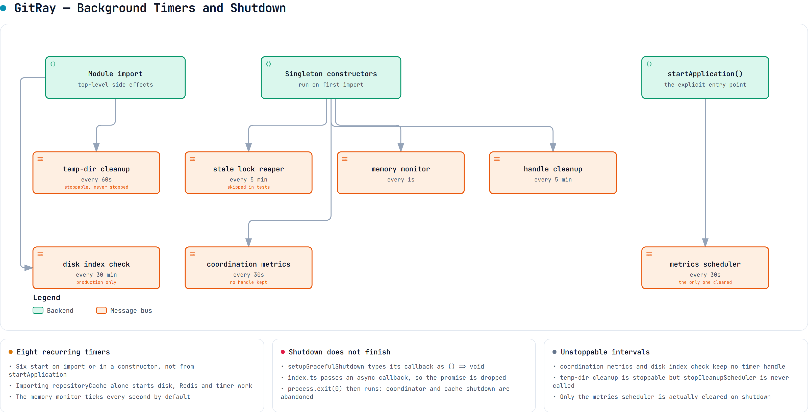](diagrams/gitray-background-jobs.html)

*[`gitray-background-jobs.html`](diagrams/gitray-background-jobs.html) is the interactive version — pan, zoom, search, relationship tracing, dark theme. The eight recurring timers started at boot, and which of them shutdown cannot stop (§10.2).*

`startApplication()` (`index.ts:146`) does, in order: `validateConfig()` →
`validateStartupEnvironment()` (creates lock/cache/log dirs, TCP-probes Redis) → build Express app →
`listen()` → register a 5-minute coordination monitor → a 1-second-delayed cache-stats log → a
30-second metrics scheduler → `setupGracefulShutdown()`.

**Architectural problem — import-time side effects.** `repositoryCache.ts:2978-2984` runs at module
scope:

```ts
export const repositoryCache = new RepositoryCacheManager();
try { await repositoryCache.initialize(); } catch (err) { … }
```

**VERIFIED.** A top-level `await` in a module means *importing* `repositoryCache` constructs three
`HybridLRUCache` instances, opens Redis connections and creates disk directories — before
`startApplication()` runs and regardless of whether the importer needs it. This is why the test
suite needs an elaborate mock setup, and it makes initialisation order implicit rather than
declared.

---

## 5. Dependency Structure

### 5.1 Actual module dependency graph

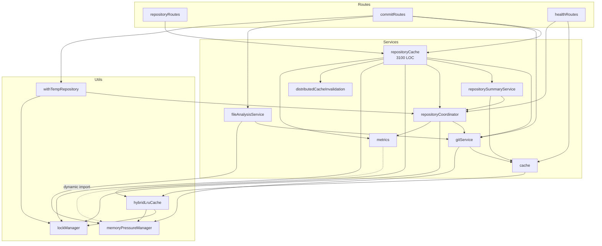

[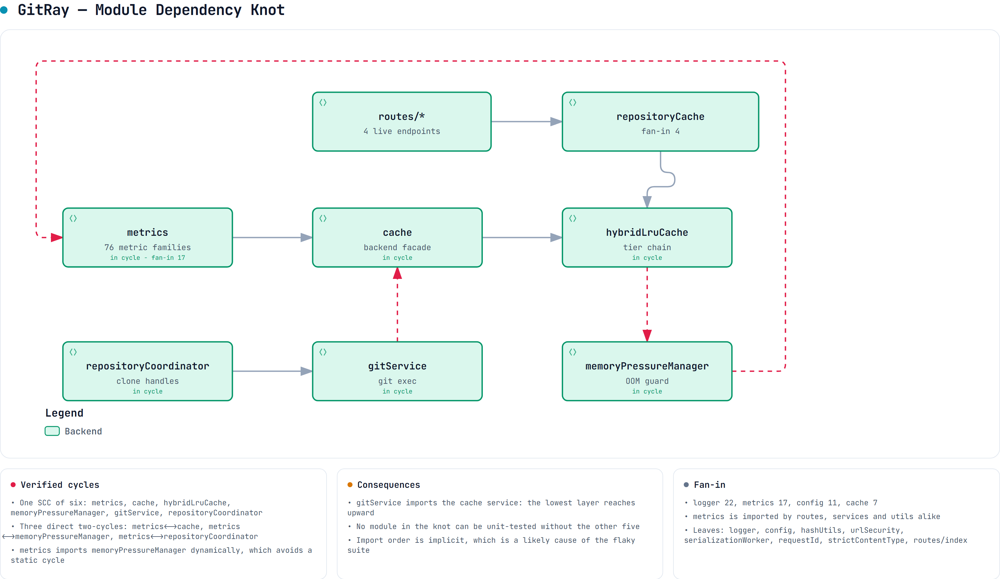](diagrams/gitray-module-dependencies.html)

*[`gitray-module-dependencies.html`](diagrams/gitray-module-dependencies.html) is the interactive version — pan, zoom, search, relationship tracing, dark theme. The same graph with the six-module cycle and fan-in made explicit.*

### 5.2 Layer violations and cycles

**V-1 — `gitService` depends on the cache service. VERIFIED** `gitService.ts:42`
(`import redis from '../services/cache'`). The lowest-level Git-execution module reaches *up* into
the caching layer to store batch results and streaming resume state. This inverts the intended
layering (`repositoryCache` → `gitService`) and creates a cycle at the package level:
`repositoryCache → gitService → cache → hybridLruCache`, while `repositoryCache → hybridLruCache`
directly. **Consequence:** `gitService` cannot be unit-tested or reused without the cache stack.

**V-2 — `metrics` is imported by every layer. VERIFIED** — `metrics.ts` is imported by routes,
services *and* utils, and itself dynamically imports `memoryPressureManager` (`metrics.ts:1689`) to
avoid a static cycle. The dynamic import is a workaround for a real circular dependency, not a
design choice.

**V-3 — `utils/` contains services.** `withTempRepository`, `lockManager`, `hybridLruCache` and
`memoryPressureManager` are stateful singletons with lifecycles, background timers and shutdown
hooks — they are services living in a `utils/` folder. `memoryPressureManager.ts:843` constructs and
exports a singleton with bound methods. Naming does not reflect responsibility here.

**V-4 — Configuration is read from two sources.** `middlewares/adminAuth.ts:22` reads
`process.env.ADMIN_AUTH_ENABLED !== 'false'` **directly**, while `config.ts:188` exposes
`config.adminAuth.enabled` derived from the same variable with *different* default semantics
(`parseEnvBoolean(…, true)` treats any value other than the literal string `"true"` as false,
whereas the middleware treats any value other than `"false"` as true). **VERIFIED.** These two
disagree for inputs like `ADMIN_AUTH_ENABLED=1` or `=yes`: `config` says disabled, the middleware
says enabled. Additionally `config.adminAuth.requireForMetrics` is defined and validated but **never
read** — `/metrics` is unconditionally guarded. **VERIFIED** — zero references outside `config.ts`.

---

## 6. Runtime Flows

### 6.1 The dashboard load — the only flow that matters in practice

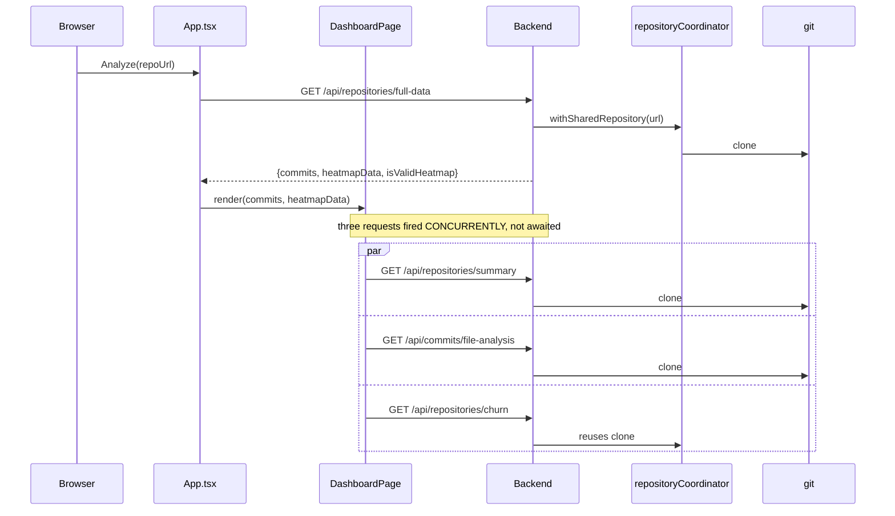

[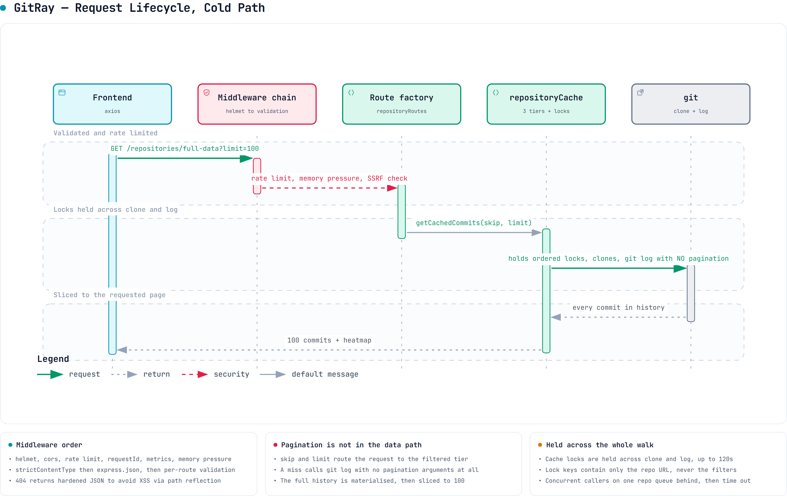](diagrams/gitray-request-lifecycle.html)

*[`gitray-request-lifecycle.html`](diagrams/gitray-request-lifecycle.html) is the interactive version — pan, zoom, search, relationship tracing, dark theme. The cold path end to end, including the pagination that never reaches the data layer (§10.1 C-3).*

**VERIFIED** `DashboardPage.tsx:194-226` — three un-awaited promise chains in a single `useEffect`.

This diagram is the whole problem in one picture: **one user action, three clones of the same
repository, and three concurrent operations racing on shared lock keys.**

### 6.2 `/full-data` in detail

`repositoryRoutes.ts:253` → `getCachedCommits(repoUrl, {skip, limit, …filters})` then
`getCachedAggregatedData(repoUrl, filters)`, **deliberately sequential** (the C-1 workaround).

`getCachedCommits` → `RepositoryCacheManager.getOrParseCommits` (`repositoryCache.ts:1018`):

1. Acquire ordered locks `[cache-filtered:<url>, cache-operation:<url>]` — advisory **file** locks in
   `os.tmpdir()/gitray-locks`, 120 s timeout. **VERIFIED** `repositoryCache.ts:386-388`, `config.ts:124`.
2. `hasSpecificFilters()` returns **true** whenever `skip` or `limit` is set
   (`repositoryCache.ts:2227`), so the request routes to the *filtered* tier.
3. Filtered miss → raw tier miss → `withSharedRepository` → clone →
   `gitService.getCommits(localPath)` **with no pagination arguments** — the entire history.
4. The full `Commit[]` is stored in the raw tier; `applyFilters` then slices `[skip … skip+limit]`
   and stores that slice in the filtered tier.

**C-3 VERIFIED.** Requesting the first 100 commits of a 1M-commit repository materialises 1M commit
objects in the Node heap, serialises them into the hybrid cache, and returns 100. **Pagination
exists at the API boundary but not in the data path.**

`getCachedAggregatedData` then re-reads the full history from cache and calls
`aggregateCommitsByTime`, which **discards everything outside a 365-day window** before bucketing
(`gitService.ts:1546` — `subDays(endDate, 364)` when no `fromDate` is given). **VERIFIED.**

### 6.3 Cost per endpoint

| Endpoint | Git work | Full history? | Cached where | Real cost driver |
| --- | --- | --- | --- | --- |
| `/full-data` | `git log` (all) + in-memory aggregate | yes | raw + filtered + aggregated | full parse, then ~99% discarded |
| `/summary` | `rev-list --count`, `rev-list --max-parents=0`, `log -1`, `shortlog -s -n` on its **own** clone | metadata only | Redis 24 h **and** aggregated tier | the redundant clone |
| `/churn` | `git log --name-only`, last 365 d | no (1 y default) | aggregated tier | per-commit tree diff — the most expensive Git op here |
| `/file-analysis` | `ls-tree -r -l HEAD` on its **own** clone | no (HEAD only) | own file-tree cache + circuit breaker | the redundant clone |

**Note the asymmetry:** commit-*metadata* processing (`git log --pretty`) is roughly linear and cheap
per commit. Per-commit *file* processing (`--name-only`) requires a tree diff per commit and
dominates cost at any repository size. **INFERRED** from the Git command shapes; not measured.

### 6.4 Error handling — two incompatible strategies

`middlewares/validation.ts` exports **two** validation error handlers:

- `handleValidationErrors` (line 29) — **throws** a typed `ValidationError` for the central error handler.
- `handleValidationErrorsWithResponse` (line 47) — **writes a 400 JSON response directly**.

Every route imports the second one *aliased to the first name*:
`import { handleValidationErrorsWithResponse as handleValidationErrors }`.
**VERIFIED** `repositoryRoutes.ts:23`, `commitRoutes.ts:39`.

**`handleValidationErrors` — the throwing variant — has zero references anywhere in the repository.
DEAD** (confirmed with Serena `find_referencing_symbols` → empty result). The aliasing actively
disguises which strategy is in use, and the centralised `errorHandler` never sees validation errors.

---

## 7. Persistence Architecture

> **There is no database.** This section documents what actually persists state, because the
> conventional "tables / columns / migrations" audit has no subject in this repository.
> **VERIFIED** — no ORM, no migration directory, no schema file, no SQL anywhere.

### 7.1 The four persistence mechanisms

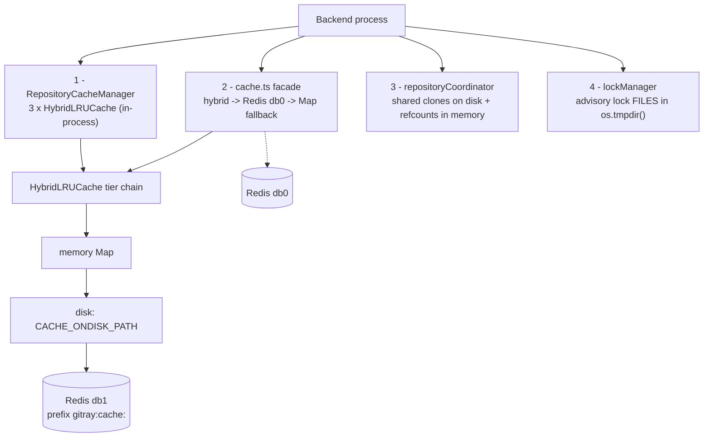

[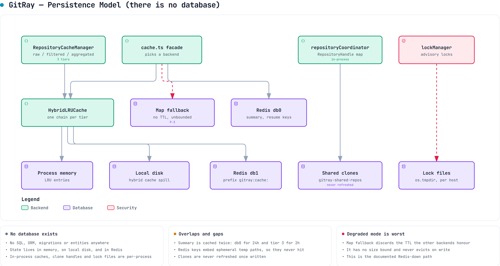](diagrams/gitray-persistence-architecture.html)

*[`gitray-persistence-architecture.html`](diagrams/gitray-persistence-architecture.html) is the interactive version — pan, zoom, search, relationship tracing, dark theme. This stands in for an ER diagram, because there is no database (§7).*

### 7.2 Mechanism 1 — `RepositoryCacheManager` (three tiers)

**VERIFIED** `repositoryCache.ts:222-300`. A singleton owning three `HybridLRUCache` instances with a
hard-split budget of `CACHE_MEMORY_LIMIT_GB` (default 1 GB) and `CACHE_MAX_ENTRIES` (default 10,000):

| Tier | Field | Entries | Memory | Value type | Key format |
| --- | --- | --- | --- | --- | --- |
| 1 — raw | `rawCommitsCache` | 50% | 60% | `Commit[]` (**entire history**) | `raw_commits:<sha256(url)>` |
| 2 — filtered | `filteredCommitsCache` | 30% | 25% | `Commit[]` (a slice) | `filtered_commits:<sha256(url)>:<hash(options)>` |
| 3 — aggregated | `aggregatedDataCache` | 20% | 15% | `CommitHeatmapData \| Contributor[] \| CodeChurnAnalysis \| RepositorySummary` | `aggregated_data:` / `contributors:` / `churn_data:` / `repository_summary:` + `<sha256(url)>[:<hash(filters)>]` |

**VERIFIED** key generators at `repositoryCache.ts:2171-2222`.

**Problem P-1 — unbounded key cardinality on a fixed budget. INFERRED (strong).** The tier-2 key is
`hashObject(options)` where `options` includes `author × authors × fromDate × toDate × skip × limit`.
A paginating client creates one entry *per page*, each a copy of sliced commits. Tier-2 and tier-3
entries are numerous and small; the tier-1 entry is singular and huge — and it is the only genuinely
reusable one. Under LRU pressure the large tier-1 entry is the most likely eviction victim, which
restarts the full clone-and-log cycle.

**Problem P-2 — tier 3 is a union type in one cache.** Four semantically unrelated payload types
share one `HybridLRUCache<AggregatedCacheValue>` (`repositoryCache.ts:57-61`). The code compensates
with runtime type guards, e.g. `isRepositorySummary()` at `repositoryCache.ts:1768`. That guard
exists because the cache cannot express what it holds — a symptom of C-1-class confusion being
defended against at read time.

### 7.3 Mechanism 2 — `cache.ts` façade

**VERIFIED** `cache.ts:29-42`. Three backends behind one API, selected at runtime:
`HybridLRUCache` → direct `ioredis` (db 0) → an in-process `Map<string,string>`.

**Problem P-3 — the memory fallback silently drops TTLs and never evicts on write.
VERIFIED** `cache.ts:247,270` — both write paths call `memoryCache.set(key, value)` with **no
expiry**, discarding the `mode`/`duration` arguments honoured by the other two backends. The
fallback is a plain `Map` with no size bound; eviction happens only in the explicit emergency path
(`cache.ts:398-407`). **Consequence:** when Redis is unavailable — the documented, expected
degraded mode — cached values never expire and the map grows without limit until the memory-pressure
manager intervenes.

### 7.4 Mechanism 3 — repository clones on disk

**VERIFIED** `repositoryCoordinator.ts:29-50`. The unit of persistence is a `RepositoryHandle`:

| Field | Type | Meaning |
| --- | --- | --- |
| `localPath` | string | temp dir of the clone |
| `commitCount` | number | from `rev-list --count` |
| `lastAccessed` | Date | bumped on every acquire |
| `repoUrl` | string | identity key (**raw string**, not canonicalised) |
| `isShared` | boolean | more than one active user |
| `sizeCategory` | `small\|medium\|large\|huge` | drives streaming decisions |
| `refCount` | number | cleanup guard |

Handles live in `Map<string, RepositoryHandle>` (`repositoryCoordinator.ts:198`) with clones under
`REPO_CACHE_BASE_PATH` (default `os.tmpdir()/gitray-shared-repos`), capped by
`REPO_CACHE_MAX_REPOSITORIES` (50) and `REPO_CACHE_MAX_AGE_HOURS` (24).

**C-2 VERIFIED — clones are never refreshed.** The only three `git fetch` invocations in the entire
backend are all in *initial clone* helpers:
`utils/gitUtils.ts:32` (`shallowClone`), `repositorySummaryService.ts:173` (`performSparseClone`),
`fileAnalysisService.ts:1065`. There is **no** `fetch`/`pull` on an existing handle anywhere.
`isHandleValid` checks only directory existence and age since `lastAccessed`
(`repositoryCoordinator.ts:674`) — and `lastAccessed` is bumped on every access
(`repositoryCoordinator.ts:375`).

**Consequence:** a repository that is polled regularly **never expires and never updates**. GitRay
serves an ever-staler snapshot indefinitely while responding `X-Repository-Cached: true`, with no
user-visible indication of snapshot age. This also invalidates any before/after performance
benchmark taken today.

**Problem P-4 — refcount release is a floating promise. VERIFIED**
`repositoryCoordinator.ts:810` — `withSharedRepository`'s `finally` calls
`repositoryCoordinator.releaseRepository(repoUrl)` **without `await`**. Acquire takes lock
`repo-access:<url>` (line 255); release takes a *different* lock `repo-release:<url>` (line 439), so
despite the "atomic reference counting" comment the two are not mutually exclusive. `performCleanup`
deletes only handles with `refCount === 0` (line 769), so a handle whose count drifts above zero is
pinned on disk permanently. `updateDiskUsageMetrics` is a hard-coded `handles × 100 MB` estimate
(line 792), so the disk metric cannot reveal the leak. **INFERRED** that drift occurs under
concurrency or on rejected-promise paths; not reproduced.

**Problem P-5 — repository identity is not canonicalised. VERIFIED.** The frontend appends `.git`
to every URL before calling (`api.ts:37,102,147,193,244,295,365`), while the backend uses the raw
received string as the cache key, lock key and coordinator key. `…/repo` and `…/repo.git` are two
distinct repositories to the backend, as are differing case or a trailing slash.

### 7.5 Mechanism 4 — advisory lock files

**VERIFIED** `lockManager.ts`. Lock files in `LOCK_DIR` (default `os.tmpdir()/gitray-locks`), keyed
by `encodeURIComponent(lockKey)`, 120 s default timeout, stale-reap at 10 min.

**These are per-host, not per-cluster.** Combined with the in-process caches and in-process handle
map, this means **the backend cannot be horizontally scaled** — two instances would have independent
caches, independent handle maps and independent locks, while `distributedCacheInvalidation`
(Redis pub/sub) partially assumes they can. **INFERRED**, and a genuine open question (§17).

### 7.6 Redis key families

| Key | Written by | TTL | Problem |
| --- | --- | --- | --- |
| `gitray:cache:raw:*` / `:filtered:*` / `:aggregated:*` | `HybridLRUCache` (db 1) | per tier | — |
| `repository_summary:*` (db 0, via `cache.ts`) | `repositorySummaryService` | 24 h | **P-6 double-caching** |
| `commits_batch:<localRepoPath>:<skip>:<size>` | `gitService` | 1 h | **P-7 ephemeral-path key** |
| `stream_resume:<localRepoPath>` | `gitService:381` | 2 h | **P-7 + S-1** |

**P-6 — the summary is cached twice, in two systems, with two TTLs. VERIFIED.**
`repositoryCache.getOrGenerateSummary` (line 1759) caches the summary in the **aggregated tier**,
*and* calls `repositorySummaryService.getRepositorySummary`, which independently caches it in the
**`cache.ts` façade** (`repositorySummaryService.ts:39,57`). The two expire independently and can
disagree; invalidating one does not invalidate the other.

**P-7 — Redis keys derived from ephemeral temp paths. VERIFIED**
`gitService.ts:380` — `stream_resume:${localRepoPath}` where `localRepoPath` is an `mkdtemp`
directory that changes on **every** clone. The batch cache therefore can never hit across clones —
defeating its stated purpose — while accumulating one key family per temp directory per run in a
shared Redis DB with no cleanup.

### 7.7 End-to-end data trace: `/api/repositories/summary`

```text
GET /api/repositories/summary?repoUrl=U
  → repoUrlValidation()            express-validator + isSafeGitUrl() SSRF check
  → createCachedRouteHandler('repository_summary')
  → getCachedSummary(U)            repositoryCache.ts:3096
  → getOrGenerateSummary(U)        withOrderedLocks([cache-summary:U, repo-access:U])
      ├─ HIT  → aggregatedDataCache.get('repository_summary:sha256(U)')
      └─ MISS → repositorySummaryService.getRepositorySummary(U)
                  ├─ cache.get('repository_summary:…')      ← 2nd cache, 24h
                  └─ coordinatedOperation(U,'summary')
                       └─ performSparseClone(U)             ← CLONE #2, own mkdtemp
                            git init; addRemote; fetch --filter=blob:none --no-tags origin HEAD; checkout FETCH_HEAD
                            rev-list --count / --max-parents=0 / log -1 / shortlog -s -n
                            rm -rf tempDir
                  └─ cache.set(...)                          ← writes 2nd cache
      └─ transactionalSet(aggregatedDataCache, ...)          ← writes 1st cache
```

Note that this path acquires `repo-access:U` — **the same lock key the coordinator uses for an
entirely different return type**. That is the second instance of C-1 (§10.1).

---

## 8. Authentication and Authorization

### 8.1 What exists

[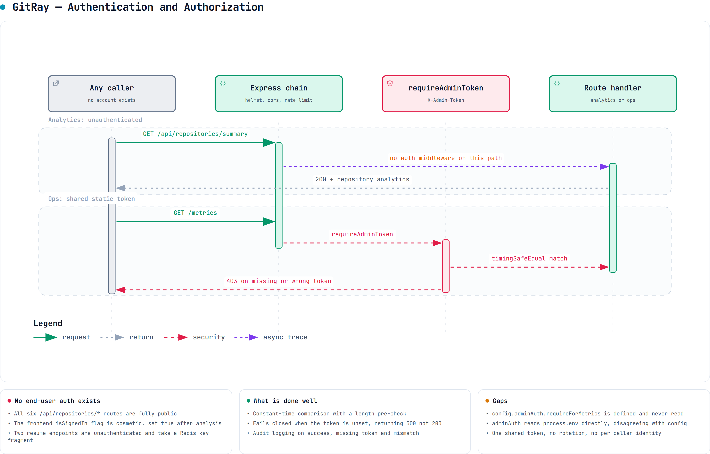](diagrams/gitray-auth.html)

*[`gitray-auth.html`](diagrams/gitray-auth.html) is the interactive version — pan, zoom, search, relationship tracing, dark theme. Everything analytics is public; only the admin surface is gated (§8.2).*

**There is no end-user authentication or authorization of any kind.** Every analytics endpoint is
fully public and unauthenticated. **VERIFIED** — `repositoryRoutes.ts` applies no auth middleware to
any of its six routes.

The only auth mechanism is `middlewares/adminAuth.ts :: requireAdminToken` — a **static shared
bearer token** compared against `process.env.ADMIN_TOKEN`.

**Implementation quality is good:**

- Constant-time comparison via `crypto.timingSafeEqual`, with a length pre-check to avoid
  length-leak timing attacks. **VERIFIED** `adminAuth.ts:75-83`.
- Audit logging on every outcome — success, missing token, invalid token, misconfiguration —
  with `category: 'security'` and a structured `event` field. **VERIFIED**.
- Fails **closed**: if auth is enabled but `ADMIN_TOKEN` is unset, it returns 500 rather than
  allowing the request. **VERIFIED** `adminAuth.ts:34-43`.
- `config.ts:601-610` refuses to start if `ADMIN_AUTH_ENABLED=true` and `ADMIN_TOKEN` is missing,
  and warns if the token is shorter than 32 characters. **VERIFIED**.

### 8.2 Protected endpoints

| Endpoint | Guard |
| --- | --- |
| `GET /metrics` | `adminRateLimiter` + `requireAdminToken` — `index.ts:199` |
| `GET /api/commits/cache/stats` | `adminRateLimiter` + `requireAdminToken` |
| `POST /api/commits/cache/invalidate` | `adminRateLimiter` + `requireAdminToken` |
| `GET /api/commits/cache/repositories` | `adminRateLimiter` + `requireAdminToken` |

### 8.3 Authorization gaps

**S-1 — the two `resume` endpoints are unauthenticated and take a user-controlled Redis key
fragment. VERIFIED.**

- `GET /api/commits/resume/:repoPath` (`commitRoutes.ts:719`) — **no validation, no auth**.
  `decodeURIComponent(req.params.repoPath)` flows straight into
  `gitService.getStreamingResumeState(path)` → `redis.get('stream_resume:' + path)`.
- `POST /api/commits/resume/clear` (`commitRoutes.ts:751`) — **no auth**; `body('repoPath')` is
  validated only with `.notEmpty()`, then flows into `redis.del('stream_resume:' + path)`.

**Assessed severity: MEDIUM, not critical.** The injected value is confined to the
`stream_resume:` key prefix, so this is not arbitrary Redis access and not filesystem path traversal
(**VERIFIED** — `gitService.ts:787-820` performs only `redis.get`/`redis.del` on that prefix). The
real impact is (a) an unauthenticated attacker can **delete** any resume state, and (b) responses
disclose server-internal temp directory paths. Both endpoints are unused by the frontend and are
slated for deletion (§16 Phase 1).

**S-2 — `config.adminAuth.requireForMetrics` is dead. VERIFIED** — defined at `config.ts:191`,
validated, and never read. `/metrics` is unconditionally guarded, so the *effective* behaviour is
safe; the config key is a lie to whoever reads it.

**S-3 — inconsistent env parsing for `ADMIN_AUTH_ENABLED`** — see V-4 in §5.2. The middleware and
the config module disagree on non-`true`/`false` values.

### 8.4 SSRF protection — a genuine strength

`utils/urlSecurity.ts :: isSafeGitUrl` is applied to **every** repo URL on every route via
`repoUrlValidation()` / `repoUrlBodyValidation()`. It enforces protocol allow-listing, a host
allow-list, and private/internal IP rejection including DNS-rebinding resistance.
**VERIFIED** `middlewares/validation.ts:99-108,216-225`. There is a dedicated verification script at
`scripts/verify-ssrf-protection.sh`. This is the best-engineered part of the security surface and
must be preserved verbatim through any refactor.

---

## 9. External Systems

[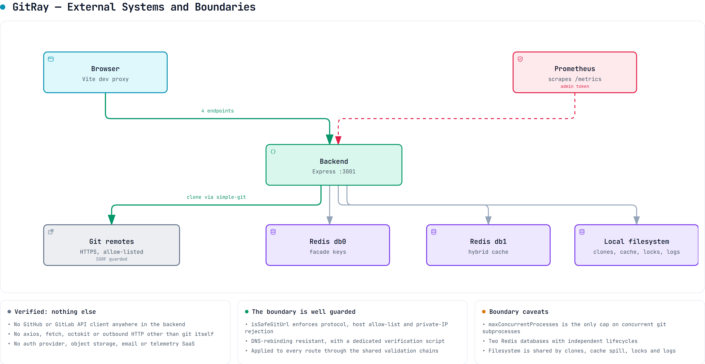](diagrams/gitray-external.html)

*[`gitray-external.html`](diagrams/gitray-external.html) is the interactive version — pan, zoom, search, relationship tracing, dark theme. The SSRF boundary is the one genuine strength of this layer (§8.4).*

| System | Protocol | Used by | Failure mode |
| --- | --- | --- | --- |
| **Git remotes** | HTTPS via `simple-git` subprocess | `gitService`, `repositorySummaryService`, `fileAnalysisService` | Clone failure → `RepositoryError` → 500 |
| **Redis** | ioredis, **two DBs** (db 0 façade, db 1 hybrid cache) | `cache.ts`, `hybridLruCache`, `distributedCacheInvalidation` | Degrades to disk, then to in-process `Map` (see P-3) |
| **Local filesystem** | `node:fs` | clones, disk cache, lock files, winston logs | `ENOSPC` → cascading failures |
| **Prometheus** | scrape `/metrics` | `metrics.ts` (76 families) | Pull-based; no impact if absent |

**There are no other outbound integrations.** No GitHub API, no auth provider, no object storage,
no email, no telemetry SaaS. **VERIFIED.**

`maxConcurrentProcesses` for git is configurable (`config.ts:57`, default from
`GIT_SERVICE.MAX_CONCURRENT_PROCESSES`), which is the only backpressure on subprocess spawning.

---

## 10. Architectural Problems

Ranked by impact × urgency.

### 10.1 CRITICAL

#### C-1 — `withKeyLock` returns another request's result

[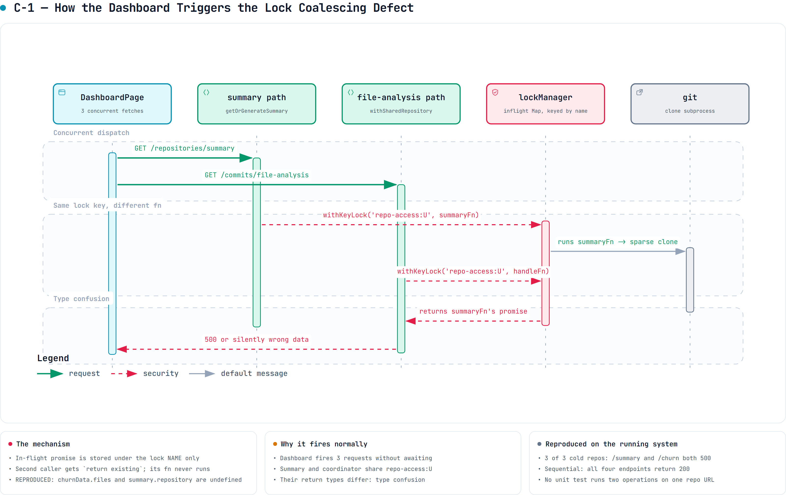](diagrams/gitray-lock-collision.html)

*[`gitray-lock-collision.html`](diagrams/gitray-lock-collision.html) is the interactive version — pan, zoom, search, relationship tracing, dark theme. How the dashboard's three concurrent requests produce C-1. Reproduced on the running system (§0.2).*

**VERIFIED**, with a complete causal chain.

`apps/backend/src/utils/lockManager.ts:289-332`:

```ts
async withKeyLock<T>(key, fn, timeout) {
  const existing = this.inflight.get(key) as Promise<T> | undefined;
  if (existing) { return existing; }        // ← fn is NEVER CALLED
  const promise = (async () => { handle = await this.acquire(key, timeout); return await fn(); })();
  this.inflight.set(key, promise);
  …
}
```

The coalescing key is the **lock name**. `fn` is not part of the identity. Two callers that pass the
*same key* but *different functions* both receive the **first** caller's promise — and therefore the
first caller's payload, of a completely different type.

`withOrderedLocks` (`lockManager.ts:415-451`) then funnels different operations through the same
first lock. It sorts the lock array and recurses, so the *inner* keys are shared even when the
outermost key differs:

| Operation | `withOrderedLocks` chain (sorted) |
| --- | --- |
| commits | `cache-filtered:U` → `cache-operation:U` |
| heatmap | `cache-aggregated:U` → **`cache-filtered:U`** → `cache-operation:U` |
| churn | `cache-churn:U` → **`cache-filtered:U`** → `cache-operation:U` |
| contributors | `cache-contributors:U` → **`cache-filtered:U`** → `cache-operation:U` |
| summary | `cache-summary:U` → **`repo-access:U`** |

**VERIFIED** `repositoryCache.ts:386-420`.

There are **two independent collision points**:

1. **`cache-filtered:U`** — reached by commits, heatmap, churn and contributors. A concurrent
   `/churn` and `/full-data` on one repo: `/full-data` registers
   `inflight['cache-filtered:U'] = promise→Commit[]`; `/churn`, already inside its
   `cache-churn:U` lock, calls `withKeyLock('cache-filtered:U', <churn fn>)`, sees the inflight
   entry and **returns the commits promise**. The churn route then dereferences
   `churnData.files.length` (`repositoryRoutes.ts:219`) on a `Commit[]` → 500.

2. **`repo-access:U`** — `getSummaryLocks` (`repositoryCache.ts:419`) acquires `repo-access:U`,
   *the same key* `repositoryCoordinator.acquireRepository` uses (`repositoryCoordinator.ts:255`),
   but the two return **entirely different types** (`RepositorySummary` vs `RepositoryHandle`).
   A concurrent `/summary` and `/file-analysis` — **which the dashboard fires simultaneously** —
   can hand a `RepositorySummary` to code expecting a `RepositoryHandle`.

**Two failure classes:**

- *Type confusion* → 500s and the existing `isValidHeatmap` guard.
- *Silent wrong data* → the lock keys contain **only `repoUrl`, never the filters**. Two concurrent
  heatmap requests for the same repo with different `author=` values collide, and the second user
  receives the **first user's filtered result with HTTP 200**. This is a cross-request data
  correctness defect and, since author filters are involved, arguably a data-leak defect.
  **INFERRED from verified mechanism.**

**Why the tests do not catch it:** all tests are single-threaded unit tests with mocked
dependencies. There is no concurrency test anywhere in `apps/backend/__tests__`. **VERIFIED.**

**Fix:** remove coalescing from the lock primitive entirely. A lock is mutual exclusion;
deduplication is a separate concern that must key on the **full operation identity** (the generated
cache key, filters included), not the lock name. See §16 Phase 1.

#### C-2 — Cached repositories are never refreshed

Covered in §7.4. **VERIFIED.** GitRay serves a snapshot that can be arbitrarily old while reporting
`X-Repository-Cached: true`, with no age surfaced to the user.

### 10.2 HIGH

#### C-3 — Pagination is not in the data path

Covered in §6.2. **VERIFIED.** `?limit=100` loads the full history into heap.

#### C-4 — Streaming is quadratic and unbounded

**VERIFIED** `gitService.ts:309` builds `git log --skip=<n> -n <batch>` per batch.
`git log --skip=N` must walk N commits before emitting anything, so total traversal is
Σ(skip) ≈ N²/2B. At N = 1,000,000 and B = 1,000 that is ~5×10¹¹ commit visits across 1,000
subprocesses, versus 10⁶ for a single `git log`. **INFERRED** (complexity analysis, not measured).

The path activates only above `STREAMING_COMMIT_THRESHOLD` = 50,000 (`config.ts:148`) — i.e.
**exactly on the repositories it makes worst**. And the caller re-accumulates every batch into one
array, so the batch sizing, memory-pressure logic and resume state buy nothing at the pipeline level.

Status: **PARTIAL** — the endpoint is wired and reachable but is used by nothing and is
architecturally counterproductive.

#### C-5 — Three independent clone paths

**VERIFIED.** Three separate `mkdtemp` + `fetch` implementations:

- `utils/gitUtils.ts:16 :: shallowClone` — used by the coordinator
- `repositorySummaryService.ts:158 :: performSparseClone`
- `fileAnalysisService.ts:1065`

`repositorySummaryService` calls `coordinatedOperation` (line 47), which only de-duplicates
*concurrent identical operation types* — it does **not** reuse the coordinator's clone.
Result: 3× network, 3× disk, 3× clone latency on the cold path, three cleanup regimes.

Note also that `shallowClone` accepts a `depth` parameter that it **never uses** (`gitUtils.ts:19`),
and `config.git.cloneDepth` is validated but has no effect. **VERIFIED — DEAD parameter.**

#### C-6 — Per-repository serialisation with a 120 s lock timeout

**VERIFIED.** All cache locks key on `repoUrl` only, and `getOrParseCommits` holds them across the
clone **and** the full `git log`. `lockConfig.defaultTimeoutMs` = 120,000 (`config.ts:124`).

For a large repository the first request holds the locks for minutes; every other request for that
repository — **including the three the dashboard fires immediately** — waits and then throws a lock
timeout. There is no admission control and no queue-depth limit. **INFERRED** consequence from
verified mechanism.

#### C-7 — Cache hit ratio used as a health signal

**VERIFIED** `index.ts:226-228` and `healthRoutes.ts:92-94`: both compute
`isHealthy = activeClones < 10 && cacheStats.hitRatios.overall > 0.1`, returning **503** otherwise.
A freshly started server has a 0% hit ratio and therefore **reports itself unhealthy until traffic
warms the cache** — which in Kubernetes would prevent it from ever receiving that traffic.

#### C-9 — Graceful shutdown abandons its own cleanup

**VERIFIED.** `utils/gracefulShutdown.ts:24,28` types the cleanup callback as `() => void`:

```ts
const cleanupCallbacks: (() => void)[] = [];
export function setupGracefulShutdown(server, additionalCleanup?: () => void) { … }
```

`index.ts:479` passes an **`async`** callback. TypeScript permits `() => Promise<void>` where
`() => void` is expected (return-type bivariance for `void`), so this compiles silently. The
shutdown loop then invokes it without awaiting:

```ts
for (const callback of cleanupCallbacks) { callback(); }   // promise dropped
…
process.exit(0);                                            // runs immediately
```

**Consequence.** On SIGTERM the entire coordination shutdown — `repositoryCoordinator.shutdown()`
and `repositoryCache.shutdown()`, which flush the disk cache and release repository handles — is
started and then abandoned mid-flight by `process.exit(0)`. Temp clones and disk-cache entries can
be left behind on every restart, which compounds C-2 and P-4.

**Fix.** Type the callback `() => void | Promise<void>` and `await` it. One-line change, in
Option A step 7.

#### C-10 — Eight background timers, six started implicitly, three unstoppable

**VERIFIED** by enumerating every `setInterval` in `apps/backend/src`:

| Timer | Interval | Started by | Stoppable? |
| --- | --- | --- | --- |
| temp-dir cleanup queue | 60 s | **module import** of `cleanupScheduler.ts` (gated on `NODE_ENV !== 'test'`) | handle kept, but `stopCleanupScheduler` is **never called** |
| stale lock reaper | 5 min | `LockManager` constructor | yes |
| memory monitor | **1 s** | `MemoryPressureManager` constructor | yes |
| repository handle cleanup | 5 min | `RepositoryCoordinator` constructor | yes |
| coordination metrics | 30 s | `RepositoryCoordinator` constructor | **no handle kept — cannot be cleared** |
| disk index validation | 30 min | `HybridLRUCache.initializeDiskCache`, **production only** | **no handle kept** |
| coordination monitor | 5 min | `startApplication()` | no handle kept |
| metrics scheduler | 30 s | `startApplication()` | **yes — the only one actually cleared** |

**Consequences.** Importing `repositoryCache` alone starts disk, Redis and timer work before any
server exists (M-7). The disk index is never validated outside production. And because most
handles are discarded, a long-lived embedding of this backend cannot be cleanly torn down — which
is also a plausible contributor to C-8's flakiness.

#### C-8 — The test suite is non-deterministic

**VERIFIED by direct observation.** Two consecutive `npx vitest run` invocations on an unmodified
tree produced different results:

- Run A: 59 files passed, 1,002 passed / 36 skipped.
- Run B: `__tests__/unit/services/repositoryCache.unit.test.ts` **failed**, and all 36 of its tests
  were reported skipped.
- Run C: 59 files passed, **1,038 passed and 0 skipped** — the same file ran fully.
- The same file run **in isolation** passes 36/36 in 2.2 s.

Three different outcomes from identical invocations on an unmodified tree.

Both runs also emit `Failed to create worker: Error: Worker creation failed` and stray
`Sparse clone failed` / `Heatmap route error` output from other files.

**INFERRED cause:** cross-file interference under Vitest's parallel workers. The most likely
mechanism is the import-time side effects documented in §4.5 — importing `repositoryCache`
runs `await repositoryCache.initialize()` at module scope, constructing three `HybridLRUCache`
instances, a serialisation worker pool and Redis connections — combined with module-level
singletons (`lockManager`, `memoryPressureManager`, `repositoryCoordinator`) shared across
test files.

**Why it matters more than a normal flake:** the file that fails is the unit test for
`repositoryCache.ts`, the 3,100-line module at the centre of every defect in this audit. A suite
that intermittently reports that module as untested — while CI treats the run as authoritative —
cannot be relied on as a refactoring safety net. **This must be fixed in Phase 0**, before any
behavioural change, or the migration has no trustworthy baseline.

#### C-11 — Complexity hot spots and a hidden quadratic

**VERIFIED** from the codebase-memory code graph (cyclomatic, cognitive, loop-depth and
`linear_scan_in_loop` metrics computed over every function and method in `apps/backend/src`).

Worst offenders by cognitive complexity:

| Symbol | File | Cyclomatic | Cognitive | Lines |
| --- | --- | ---: | ---: | ---: |
| `startApplication` | `index.ts` | 21 | **59** | **362** |
| `HybridLRUCache.get` | `utils/hybridLruCache.ts` | 14 | **41** | **180** |
| `HybridLRUCache.loadDiskIndex` | `utils/hybridLruCache.ts` | 13 | **39** | 115 |
| `setupGracefulShutdown` | `utils/gracefulShutdown.ts` | 14 | 33 | 98 |
| `shutdown` (inner) | `utils/gracefulShutdown.ts` | 13 | 32 | 76 |
| `HybridLRUCache.del` | `utils/hybridLruCache.ts` | 11 | 26 | 76 |
| `HybridLRUCache.addToDisk` | `utils/hybridLruCache.ts` | 10 | 24 | 89 |
| `withTempRepositoryLegacy` | `utils/withTempRepository.ts` | 9 | 22 | 81 |
| `GitService.getContributors` | `services/gitService.ts` | 9 | 21 | 65 |
| `GitService.getCommitsWithStats` | `services/gitService.ts` | 8 | 21 | 58 |

`startApplication` is a **362-line god function** that validates config, builds the Express app,
mounts routes, defines an inline route handler, registers a monitor, schedules metrics and wires
shutdown. It is the single hardest thing in the repository to modify safely.

**Hidden O(n²) — `linear_scan_in_loop` ≥ 1** (a linear scan such as `find`/`includes`/`indexOf`
nested inside a loop, which loop-depth alone does not reveal):

- `GitService.tallyCommits` (`gitService.ts`) — runs on **every heatmap request**
- `GitService.getCommitsWithStats` — currently unwired, but the `--numstat` parser
- `FileAnalysisService.processRemoteFileTree`
- `FileAnalysisService.executeAnalysisWithFallback`

`tallyCommits` is the concerning one: it is on the live `/full-data` path and scales with the
number of commits times the number of date buckets. **INFERRED** that this matters only for large
repositories; not measured.

#### C-12 — `fileAnalysisService` is a parallel mini-architecture

**VERIFIED** from the method inventory of `services/fileAnalysisService.ts` (3,498 lines, 76
methods). It does not reuse the platform it sits in — it reimplements it:

| Concern | Platform already has | `fileAnalysisService` also has |
| --- | --- | --- |
| Caching | `RepositoryCacheManager`, `HybridLRUCache` | `getCachedFileTree`, `cacheFileTree`, `invalidateFileTreeCache`, `invalidateSpecificCacheEntry`, `invalidateFullRepositoryCache`, `invalidateByPattern` |
| Circuit breaking | `memoryPressureManager` circuit breaker | `isCircuitBreakerOpen`, `recordCircuitBreakerFailure`, `recordCircuitBreakerSuccess`, `registerHalfOpenAttempt`, `executeWithCircuitBreaker`, `getCircuitBreakerStatus`, `resetCircuitBreaker`, `manageCircuitBreakerMemory` |
| Locking | `lockManager` | `runWithAnalysisLock` |
| Cloning | `repositoryCoordinator` + `gitUtils.shallowClone` | `performShallowClone`, `getFileTreeSparse`, `cleanupShallowClone` |

**There are therefore three independent circuit-breaker implementations** in the backend
(`memoryPressureManager`, `fileAnalysisService`, and the health-gating in `cache.ts`), and this
service is the third clone path (C-5).

#### C-13 — Duplicated sync/async method pairs in `HybridLRUCache`

**VERIFIED.** Four near-identical pairs coexist, one sync and one async, with the same logic:
`toJSON`/`toJSONAsync`, `calcSize`/`calcSizeAsync`, `addToMemory`/`addToMemoryAsync`, and
`addToMemoryWithPressureCheck`/`addToMemoryWithPressureCheckAsync`. This is duplicated business
logic in the hottest cache path, and any fix must be applied twice or it silently diverges.

### 10.3 MEDIUM

- **M-1 — Duplicate API surface.** `/api/commits/` and `/api/commits/heatmap` duplicate
  `/api/repositories/commits` and `/heatmap` with a different response envelope and no consumer.
  Two coordination-health endpoints exist with different payloads (`/coordination` in
  `healthRoutes.ts:155` vs `/health/coordination` in `index.ts:208`). **VERIFIED.**
- **M-2 — The "transactional cache" is ceremony without a guarantee. VERIFIED.** ~900 lines of
  transaction / rollback / retry / verification code (`repositoryCache.ts:432-970`) protect
  single-key writes to a non-transactional LRU, and the rollback path is instrumented with five
  dedicated Prometheus metrics (`recordTransactionRollback`, `recordRollbackDuration`,
  `recordRollbackVerification`, `recordCriticalRollbackFailure`, `recordCacheTransaction`). No
  multi-key invariant exists that this defends.
- **M-3 — Summary cached twice** — P-6 above. **VERIFIED.**
- **M-4 — Repository identity not canonicalised** — P-5 above. **VERIFIED.**
- **M-5 — Memory fallback drops TTLs and never bounds itself** — P-3 above. **VERIFIED.**
- **M-6 — `console.error` in route handlers.** `commitRoutes.ts:222,345` use `console.error`,
  directly contradicting the "use the winston logger, never `console.log`" rule in `CLAUDE.md` and
  `AGENTS.md`. **VERIFIED.**
- **M-7 — Import-time side effects** — §4.5. **VERIFIED.**
- **M-8 — 76 Prometheus metric families** for a 4-endpoint application. **VERIFIED** (count of
  `new Counter|Gauge|Histogram|Summary` in `metrics.ts`). There is no metric for clone duration as a
  distinct stage, nor for lock wait time — i.e. the instrumentation does not cover the two things
  that actually dominate latency.
- **M-9 — `zod` and `nanoid` are unused dependencies.** **VERIFIED.**

#### F-1 — The frontend theme source is orphaned; the app renders from a committed build artefact

**VERIFIED.** `apps/frontend/src/main.tsx` imports `./index.css`. That file is **4,192 lines of
pre-compiled Tailwind v4.1.3 output**, committed to git, and containing **no** `@tailwind`,
`@import` or `@theme` directives — so the PostCSS Tailwind plugin has nothing to expand.

`apps/frontend/src/styles/globals.css` (234 lines) holds the actual design tokens — the `:root`
custom properties and `@custom-variant dark`. **Nothing imports it.** Its only other mention in the
whole repository is a *string literal inside mock diff data* at
`apps/frontend/src/components/GitDiffViewer.tsx:90`.

**Consequence:** editing `globals.css` has no effect on the running application. Its values only
reach the UI because they are already baked into the committed `index.css`. Any theme change today
means hand-editing or regenerating a 4,000-line generated file, and there is no script that does
so.

**Severity: MEDIUM for maintainability**, not correctness — the app looks right, but the file a
developer would naturally edit is inert. This also explains why `tailwind.config.js` is referenced
by the Serena memories but does not exist: Tailwind 4 is CSS-first, and this project never
completed the move to it.

**Fix (frontend, outside the backend migration):** give `index.css` a real
`@import "tailwindcss";` plus an `@theme` block sourced from `globals.css`, delete the committed
compiled bundle, and let Vite compile it. Then `globals.css` becomes live again.

#### C-14 — `/file-analysis` barely benefits from its own cache

**VERIFIED by measurement** (§17.6). Cold 2.92 s, warm **1.33 s** — a 2.2x speed-up, against
54-100x for every other live endpoint. It is simultaneously the slowest cold path and the worst
cached one.

**Why it matters architecturally.** `fileAnalysisService` maintains a *private* file-tree cache, a
*private* circuit breaker and a *private* clone (C-12), none of which participate in the shared
cache stack. So the one endpoint that most needs caching is the one endpoint excluded from the
caching investment the rest of the system made.

**Where it belongs.** Phase 4 (one cache). Folding the file-tree cache into `analyticsCache` keyed
by `(repoId, headSha)` should move it into the same 50-100x band, because the file tree at a given
`headSha` is immutable — a perfect cache key. This is the clearest single performance win available
and it costs nothing extra once Phase 4 is being done anyway.

#### P-8 — The entry-point guard is Windows-incompatible

**VERIFIED by execution.** `index.ts:522` guards startup with:

```ts
if (import.meta.url === `file://${process.argv[1]}`) { await startApplication(); }
```

On Linux `process.argv[1]` begins with `/`, so `file://` + it yields the three-slash form that
matches `import.meta.url`. **On Windows it cannot match**: `import.meta.url` is
`file:///C:/…/index.ts` while the template produces `file://C:\…\index.ts`.

Observed directly: on Windows the process starts, every module-level singleton initialises, every
background timer starts — and then `startApplication()` is never called, so **the server never
binds a port and never serves a request, while looking perfectly healthy in the log.**

**Severity: LOW for this team, who develop and run on Linux/WSL** — there it works correctly. It is
recorded because it is a silent failure mode that will cost a Windows contributor hours, and
because the one-line fix (`pathToFileURL(process.argv[1]).href`) is free to apply during Phase 2.

**This also incidentally validates M-7:** the Windows run is a clean natural experiment showing
that importing the module graph alone starts the lock reaper, the memory monitor, the repository
cleanup scheduler, the cleanup queue, three `HybridLRUCache` instances and the coordinator —
*before* the entry point runs at all. The log order is unambiguous: `Index.ts file loading...`
appears **last**.

### 10.4 LOW

- `GET /api` returns `{message:'Hello from Backend!'}` — scaffolding never removed. **VERIFIED.**
- `getRepositoryInfo` is called *after* the data fetch on `/api/commits/` purely to populate response
  headers (`commitRoutes.ts:104`), adding a coordinator round-trip per request. **VERIFIED.**
- `apps/backend/__tests__/unit/routes/repositoryRoutes.unit.test.ts.old` — a committed `.old` file.
  **VERIFIED.**
- Frontend bundle is a single 1.22 MB chunk (361 kB gzipped) with a Vite size warning; no code
  splitting. **VERIFIED** from the build output.
- `vite.config.ts` contains 30+ version-suffixed aliases (`'sonner@2.0.3': 'sonner'`, …) — artefacts
  of a Figma/codegen export, not hand-written config. **VERIFIED.**

---

## 11. Dead, Legacy, and Partial Implementations

Every DEAD entry below was confirmed with Serena `find_referencing_symbols`, not grep.

### 11.1 Confirmed dead code

**Important correction.** An earlier draft of this audit described several of these as having
"zero references". That was wrong, and the distinction matters: **none of them has a production
caller, but almost all of them are exercised by tests.** Deleting them therefore breaks the suite,
and their presence inflates coverage over code that never runs. Verified with codebase-memory
`trace_path(direction=inbound, include_tests=true)`.

| Symbol | Location | Production callers | Test callers |
| --- | --- | --- | --- |
| `withTempRepository` (exported) | `utils/withTempRepository.ts:62` | **none** | `withTempRepository.unit.test.ts`, 14+ call sites |
| `handleValidationErrors` (throwing variant) | `middlewares/validation.ts:29` | **none** | `validation.unit.test.ts` |
| `invalidateCachedRepository` | `services/repositoryCache.ts:3035` | **none** | **none — genuinely unreferenced** |
| `GitService.getCommitsWithStats` | `services/gitService.ts:885` | **none** | `gitService.unit.test.ts`, 5 tests. The *only* `--numstat` parser in the codebase |
| `getRepositoryHeatmap` | `frontend/src/services/api.ts:31` | **none** | `api.test.ts` |
| `getRepositoryCommits` | `frontend/src/services/api.ts:95` | **none** | `api.test.ts` |
| `getRepositoryContributors` | `frontend/src/services/api.ts:359` | **none** | `api.test.ts` |
| `shallowClone(…, depth)` parameter | `utils/gitUtils.ts:19` | **accepted, never used in the body** | — |
| `config.git.cloneDepth` | `config.ts:63` | **functionally inert** — validated (`config.ts:493,497`) and logged (`config.ts:769`, `gitService.ts:109`), but its only real consumer is the unused `depth` parameter above | — |
| `config.adminAuth.requireForMetrics` | `config.ts:191` | **never read and never validated** — `validateAdminAuth` does not mention it | present only in test fixture objects (`index.unit.test.ts`) |
| `zod`, `nanoid` | `apps/backend/package.json` | **zero imports repository-wide** | none |

**Note on `getCommitsWithStats`:** it is dead in production but *covered by tests*. This inflates
coverage on code that never runs, and it means the one capability the code base has for line-level
churn (additions/deletions) is built but unwired. If churn-with-line-counts is a product goal, this
function is the starting point rather than something to delete.

### 11.2 Legacy / parallel implementations (old and new coexisting)

| Pair | Status |
| --- | --- |
| `repositoryRoutes.ts` (factory-based) vs `commitRoutes.ts` (hand-rolled) | **Half-finished migration.** New style covers the live endpoints; old style retains duplicates + admin + streaming. Leftover TODO at `repositoryRoutes.ts:44`. |
| `withTempRepository` (coordinator) vs `withTempRepositoryLegacy` (`:373`) / `withTempRepositoryStreamingLegacy` (`:458`) | **Feature-flagged dual path.** Legacy runs when `config.repositoryCache.enabled === false` or `options.forceLegacy`. Default is `true` (`config.ts:218`), so legacy is normally dark but fully maintained. |
| `cache.ts` façade vs `RepositoryCacheManager` vs `HybridLRUCache` | **Three caching abstractions**, two of which (`cache.ts`, `RepositoryCacheManager`) wrap the third differently. |
| `/coordination` vs `/health/coordination` | Two endpoints, two different payloads, same purpose. |
| Redis db 0 (`cache.ts`) vs db 1 (`hybridCache`) | Two Redis databases with independent lifecycles and no coordinated invalidation. |

### 11.3 Partial / abandoned features

- **Streaming (C-4).** Endpoint exists, is reachable, is documented, has resume-state support and
  metrics — and is used by nothing, is algorithmically counterproductive, and its resume endpoints
  are unauthenticated (S-1). **PARTIAL.**
- **`AIInsights.tsx` (367 LOC) is entirely hardcoded mock data. VERIFIED** — `projectInsights` at
  line 23 is a static object whose summary reads *"This **Angular** project shows good architectural
  patterns…"*, a leftover from an unrelated template. There is no AI integration anywhere in the
  backend. It renders on the live dashboard.
  **Not abandoned — a deliberate placeholder.** The team has confirmed this is an intended future
  feature that is far out of scope right now (§17 Q-7). **Do not delete it.** Two things should
  change: label it in the UI as sample data, and fix the copy so it stops describing an *Angular*
  project as though it were a real analysis of the loaded repository.
- **`PremiumFeatures.tsx` (421 LOC)** — static marketing/upsell UI. Reclassified after reading the
  planning vault: this is **not** speculative. `GitRay-Business-Legal.md` specifies a costed
  freemium model (Premium 9.99 EUR/month, Team 29.99 EUR/month, desktop 149 EUR one-off) and the
  free tier is "public repositories only". The component is a placeholder for a decided business
  model whose backing features do not exist **yet**. **Do not delete**; the tiers it advertises are
  the same ones that make `coverage` and `repositories.visibility` load-bearing in the schema
  (§17.9 R-4, R-5).
- **Frontend `isSignedIn`** — cosmetic; there is no auth. **VERIFIED** `App.tsx:20,72`.
- **`distributedCacheInvalidation`** — Redis pub/sub built for multi-instance deployment, in a
  system whose locks and caches are per-process (§7.5). Constructed and wired, but its purpose is
  unreachable in the current single-instance topology. **INFERRED.**

---

## 12. Documentation Drift

### 12.1 Repository documentation

Audited against the code, then corrected. "Fixed" means this audit changed the file; the
repository's production code was not touched.

| Document | Verdict | Specific findings | Status |
| --- | --- | --- | --- |
| `README.md` | **was STALE** | API section documented `GET /api/commits/heatmap` and `/info` as the commit API; curl examples targeted dead endpoints | **fixed** — now documents the live surface and flags the duplicates |
| `AGENTS.md` | **was STALE** | Documented `GET /api/commits/stream` as Server-Sent Events. It is **`POST`, NDJSON**. Listed only the dead `/api/commits/*` routes as the API. Its frontend stack section was **accurate**. | **fixed** |
| `GEMINI.md` | **was badly STALE** | Same API errors as `AGENTS.md`, **plus** a frontend stack listing four dependencies that are not in `apps/frontend/package.json` at all — `apexcharts`, `react-apexcharts`, `react-calendar-heatmap`, `react-select` — and React **19.1.0** when the pin is `^18.3.1`. The real chart library is Recharts. | **fixed** |
| `CLAUDE.md` | **was partly STALE** | Claimed "React 19"; linked `docs/ARCHITECTURE.md`, `docs/API.md`, `docs/TESTING.md`, none of which existed | **fixed** — version corrected, links replaced with the audit and a note that those three files are Phase 7 work |
| `apps/frontend/README.md` | **was STALE** | Documented a `__tests__/utils/` directory and an `example.test.tsx` template, **neither of which exists**, and told readers to use the missing file as a template. Named `eslint.config.js`; the file is `eslint.config.mjs`. Linked `../backend/README.md`, which **does not exist**. Tailwind 4.1, React 18.3 and the Radix count were **correct**. | **fixed** |
| `apps/backend/perf/README.md` | **STALE in effect** | The k6 script it documents drives `GET /api/commits/heatmap` — a dead endpoint | **flagged** with a warning banner; repointing the script is a code change and was left undone |
| `scripts/api_test_scenarios.md` | **broadly accurate** | Covers `/api/repositories/*`, the live family. Does not distinguish the three routes with no frontend consumer | **annotated** |
| `apps/backend/.env.example` | **accurate** | Correctly documents `/api/commits/cache/*` as admin-gated | unchanged |
| `Strategy.md` | **historical** | A German-language planning document: branching strategy and a proposed `src/client`, `src/server` folder layout that was **never adopted** (the repo uses `apps/backend`, `apps/frontend`) | left as-is, clearly a planning artefact |
| `.serena/memories/architecture_overview.md` | **was STALE** | Claimed "React 19 UI" and "React 19 with automatic batching" | **fixed** to 18.3 |
| `.serena/memories/suggested_commands.md` | **was STALE** | curl examples used `?url=`; the parameter is `repoUrl`. Showed `/api/commits/stream` as a GET | **fixed** inline + banner |
| `.serena/memories/memory_update_summary_2026-01-05.md` | **was STALE** | Listed `POST /api/repositories`, which does not exist, and the dead `/api/commits/*` family as the API | **fixed** inline + banner |
| `.serena/memories/memory_update_summary_2026-01-03.md` | **accurate** | Explicitly records "React 18.3.1 (not 19)" and the apexcharts→Recharts migration | unchanged — it corroborates the `GEMINI.md` finding |
| `.serena/memories/{codebase_structure,coding_standards,frontend_architecture_detailed,project_overview,task_completion_checklist}.md` | **no stale API or version claims found** | Checked for endpoint, React-version and dependency claims | unchanged |
| `prompts/*.md` | out of scope | LLM prompt scratch files, referenced by nothing | unchanged |

### 12.2 The core documentation problem

**Before this audit, every prose description of the API in the repository documented
`/api/commits/*` — the dead surface — and none documented `/api/repositories/*`, the live one.**
A new developer following the docs would have worked on the wrong routes. That was the single
highest-value documentation fix, and it has been made in `README.md`, `AGENTS.md`, `GEMINI.md`
and `CLAUDE.md`.

The residual risk is `apps/backend/perf/README.md`: the k6 harness it documents still drives a
dead endpoint. Repointing it is a **code** change and was therefore left for the migration.

### 12.3 `.serena/memories/`

`memory_update_summary_2026-01-05.md` lists `/api/commits/heatmap`, `/info` and `/stream` as the API
(lines 103-105, 255), and `suggested_commands.md` gives curl examples using a `?url=` parameter
(lines 296, 299) — the actual parameter is `repoUrl`. **STALE.** These are agent-facing notes that
will actively mislead future AI-assisted sessions.

### 12.4 Evaluation of the v1 audit (`~/Downloads/BACKEND_ARCHITECTURE_AUDIT.md`)

The v1 document is **substantially more accurate than its "not authoritative" billing suggests.**
It was written without installing dependencies (so it never ran the build or tests), but its static
reconstruction is largely sound. Claim-by-claim:

| v1 claim | Verdict |
| --- | --- |
| **C-1** `withKeyLock` returns another request's result | **CORRECT AND CURRENT.** Independently re-derived here with the full lock-chain table. v1 identified the `cache-filtered:U` collision; this audit additionally found the **`repo-access:U`** collision between `/summary` and `/file-analysis`, which is the one the dashboard actually triggers. |
| **C-2** Streaming is quadratic and unbounded | **CORRECT.** Verified `gitService.ts:309`. |
| **C-3** Redis keys derived from ephemeral temp paths | **CORRECT.** Verified `gitService.ts:380`. |
| **C-4** Cached repositories are never refreshed | **CORRECT.** Verified — only 3 `fetch` calls exist, all in initial-clone helpers. |
| **H-1** Three independent clone paths | **CORRECT.** Verified all three. |
| **H-2** Clone downloads every blob at HEAD despite `--filter=blob:none` | **PLAUSIBLE, NOT RE-VERIFIED.** The reasoning (empty `sparse-checkout` patterns file ⇒ full checkout ⇒ lazy blob fetch) is sound and the code matches (`gitUtils.ts:25-39`). v1 claims a local git experiment confirmed it; that experiment was **not** repeated here. Carried forward as an **open question** (§17). |
| **H-3** `git log` parsing is lossy (`\|` separator, drops empty-subject commits, `%cI` vs `%aI`) | **CORRECT.** Verified `GIT_SERVICE.LOG_FORMAT` and the split-on-`\|` parsers. |
| **H-4** Refcounting not atomic; `releaseRepository` not awaited | **CORRECT.** Verified `repositoryCoordinator.ts:810`. |
| **H-5** Three-tier cache stores the wrong things | **CORRECT.** |
| **H-6** Per-repo serialisation with 120 s timeout | **CORRECT.** |
| **M-1** dead code list | **CORRECT** — and now upgraded from grep-based to LSP-verified. |
| **M-2** duplicate API surface | **CORRECT.** |
| **M-3** summary cached twice | **CORRECT.** |
| **M-4** transactional cache is ceremony | **CORRECT.** |
| **M-5** client-side `.git` canonicalisation mismatch | **CORRECT.** |
| **M-7** `console.error` in routes | **CORRECT.** |
| "`docs/` referenced by CLAUDE.md does not exist" | **CORRECT** at time of writing. |
| **Method note:** "test suite and build were not executed" | **Now resolved** — both were executed here and both pass (§13). |
| **Recommendation:** adopt PostgreSQL + job queue, delete the cache layer | **CORRECT as the destination, premature as the next step.** This audit reversed its own earlier verdict once the product requirements (§2.4) and the planning vault (§17.9) were known: Postgres is the right end state and is Phase 6, but Phases 1 and 3 are hard prerequisites — an index built on today's lock layer and commit parser would be silently wrong. See §14 Option C and §15.1. |

**What v1 missed** (added by this audit): the `repo-access:U` collision that the dashboard actually
triggers; the memory-fallback TTL/eviction defect (P-3); the `ADMIN_AUTH_ENABLED` dual-source config
inconsistency (V-4); `requireForMetrics` being dead; the unauthenticated `resume` endpoints (S-1);
the cache-hit-ratio-as-health-signal readiness trap (C-7); `AIInsights` being hardcoded mock data;
the React 19 vs 18 discrepancy; and a verified build/test baseline.

**Conclusion:** v1 should be **retired in favour of this document**, not merged with it. Its
findings are preserved above with independent verification.

### 12.5 The planning vault (`NiklasSkulll/GitRayDocs`), read 2026-09-05

The team's Obsidian planning vault was cloned over SSH and read in full. Its **product** content is
authoritative and drives §17.9. Its **technical** content has drifted from the code in the same way
the in-repo documentation had, and for the same reason — it was written on 2025-11-24 and describes
intentions rather than the built system. Every row below was checked against the manifests.

| Claim | Source | Reality (VERIFIED) |
| --- | --- | --- |
| React **v19** | `GitRay-Technical-Architecture.md`, `GitRay-Project-Overview.md` | **`^18.3.1`** in `apps/frontend/package.json`. The same error this audit found in `GEMINI.md` |
| **Jest** for unit and integration tests; `jest.config.cjs` documented as a root config file | `GitRay-Technical-Architecture.md` | **Vitest `^3.2.3`**. There is no `jest.config.cjs` anywhere in the repository |
| `tailwind.config.cjs` with content paths and theme extensions | `GitRay-Technical-Architecture.md` | **Does not exist.** Tailwind 4 is configured CSS-first; only `postcss.config.cjs` is present |
| Backend `tsconfig`: "Module: **CommonJS**" | `GitRay-Technical-Architecture.md` | **ESM.** `"module": "ESNext"` and `"type": "module"` in `apps/backend/package.json` |
| `react-calendar-heatmap` listed as the **current** visualisation library | `GitRay-Technical-Architecture.md` | **Not a dependency.** The heatmap is built on **Recharts `^2.15.2`** |
| `D3.js` / `visx` / `Chart.js` planned | `GitRay-Technical-Architecture.md` | None present; Recharts was chosen instead. Planned-vs-built, not an error, but the note was never updated |
| `GitService.cloneRepository` does a "shallow clone with `--depth 50`" | `GitRay-Technical-Architecture.md` | **Superseded in code.** `utils/gitUtils.ts:13` states plainly that "Previous implementation used --depth which resulted in incomplete history" and now uses blob filtering instead. The vault documents the abandoned approach |

**Assessment.** This is not a criticism of the vault's purpose — it is a planning space, and its
product, legal and design content is exactly what this audit was missing. But its
`GitRay-Technical-Architecture.md` should be treated as **STALE for implementation facts** and is
now a fourth source of the React 19 error (after `CLAUDE.md`, `GEMINI.md` and the Serena memories,
all corrected in this branch). The most consequential drift is the `--depth 50` description, because
a reader planning the indexer from that note would reproduce the very incomplete-history bug the
code has already moved away from.

**Recommendation:** in `GitRay-Technical-Architecture.md`, replace the "Tech Stack", "Configuration
Files" and "Backend Services Deep Dive" sections with a pointer to the repository manifests and to
this audit, keeping the vault authoritative for intent and the repository authoritative for fact.
Those edits belong to the vault's owners; nothing in that repository was modified by this audit.

---

## 13. Validation

### 13.1 What was validated, and how

| Check | Method | Result |
| --- | --- | --- |
| Does it build? | `pnpm run build` | **PASS**, clean |
| Do tests pass? | `npx vitest run`, twice | **FLAKY** — see C-8. 1,002 pass / 36 skipped; one file failed on the second run |
| Is X dead? | Serena `find_referencing_symbols`, **cross-checked** with codebase-memory `trace_path` | 7 symbols have no production caller; **Serena gave one false negative** (§13.3) |
| Cycles? | codebase-memory graph + independent Tarjan SCC over the import graph | 1 SCC of six modules, 3 direct two-cycles (§5.2) |
| Complexity / hot paths? | codebase-memory `query_graph` over per-function metrics | C-11: 10 hot spots, 4 hidden linear-scan-in-loop sites |
| Route inventory | codebase-memory `Route` nodes (77) | Matches the hand-built inventory in §4.2 |
| Which endpoints are live? | Cross-reference every `api.ts` export against call sites | 4 of ~20 (§4.2) |
| Is there a DB? | Repo-wide search for every major ORM/DB token | **None** |
| Are there external APIs? | Repo-wide search for HTTP clients | **None** |
| Route inventory | Read all four route modules end to end | §4.2 |

### 13.3 Where the tools disagreed

Two independent tools were used for reachability, and they did not always agree. This is recorded
because it changes how much confidence a reader should place in any single "dead code" claim.

| Symbol | Serena `find_referencing_symbols` | codebase-memory `trace_path` | Ground truth (grep) |
| --- | --- | --- | --- |
| `withTempRepository` | `{}` — no references | 1 test caller | **14+ call sites in `withTempRepository.unit.test.ts`** |
| `handleValidationErrors` | `{}` — no references | 1 test caller | test-only |
| `invalidateCachedRepository` | `{}` | none | genuinely unreferenced |
| `getCommitsWithStats` | 5 test references | 1 test caller | test-only |

**Conclusion:** Serena under-reports references in this repository — for `withTempRepository` it
returned nothing where 14 call sites exist. Every reachability claim in §11.1 has been re-verified
against the code graph, and the wording changed from "zero references" to the accurate "no
production caller". **Do not delete anything in §11.1 on the strength of a single tool.**

### 13.2 What the green test suite does **not** prove

This is important, because a green run is easy to misread as "the system is correct."

- **There is not a single concurrency test.** **VERIFIED** — no test in
  `apps/backend/__tests__` exercises two simultaneous operations on one repo URL. C-1, the most
  severe defect in the system, is invisible to the entire suite by construction.
- **Tests are unit tests with mocked dependencies.** Only two integration tests exist
  (`adminProtectedRoutes.integration.test.ts`, `securityHeaders.integration.test.ts`), both
  security-focused. There is no end-to-end test that analyses a real repository.
- **Dead code is tested.** `getCommitsWithStats` has 5 passing tests and no production caller,
  so coverage numbers overstate meaningful coverage.
- **No test asserts cross-endpoint data consistency** (e.g. that `/summary`'s commit count agrees
  with `/full-data`'s — which v1's H-3 suggests it may not).

**There are no pre-existing failures.** Any failure appearing after refactoring work begins is
attributable to that work.

---

## 14. Refactoring Options

Four options were considered. Each is assessed on the same axes.

### Option A — Minimal Stabilisation

[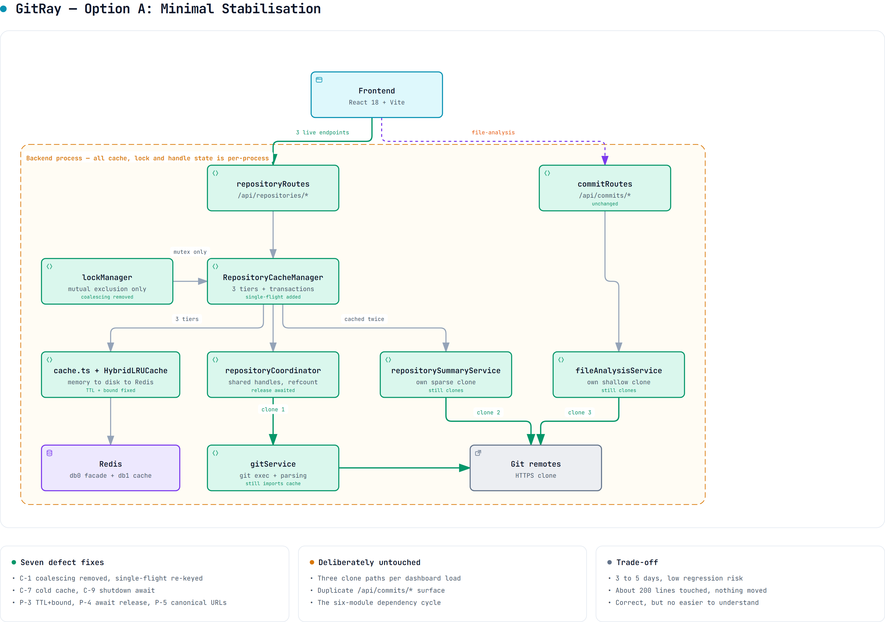](diagrams/gitray-option-a.html)

*[`gitray-option-a.html`](diagrams/gitray-option-a.html) is the interactive version — pan, zoom, search, relationship tracing, dark theme. Option A reuses the exact node positions of the current-state diagram, so the two can be flipped between.*

**Conceptual architecture.** Unchanged. Repair defects in place; move nothing.

**Module structure.** Identical to today: `routes/`, `services/`, `utils/`, `middlewares/`.
No file is created, moved or deleted.

**Dependency rules.** None introduced. The 6-module cycle (§5.2) survives intact.

**Persistence strategy.** Unchanged — four mechanisms, two Redis databases, three cache tiers.

**Proposed database changes.** None. There is no database.

**API implications.** None. All ~20 mounted endpoints keep their paths and envelopes, including
the dead and duplicated ones.

**Service boundaries.** Unchanged, therefore still unclear: `gitService` keeps importing `cache`,
and `utils/` keeps holding stateful singletons.

**Transaction boundaries.** Unchanged. The ~900-line cache transaction engine stays, still
guarding single-key writes to a non-transactional LRU.

**Concrete changes** — exactly seven, all defect repairs:

1. `lockManager.withKeyLock` — delete the `inflight` lookup, the `inflight.set`, the `finally`
   delete, and the `inflight` field. The lock becomes pure mutual exclusion. **Fixes C-1.**
2. Reinstate single-flight keyed on the generated cache key, filters included, in
   `RepositoryCacheManager`. Required, or fixing C-1 multiplies duplicate Git work.
3. `await repositoryCoordinator.releaseRepository(...)` in `withSharedRepository`'s `finally`.
   **Fixes P-4.**
4. Add `canonicaliseRepoUrl()` and apply it in `setupRouteRequest` and the `/file-analysis`
   handler. **Fixes P-5.**
5. Honour TTL and bound size in the `cache.ts` memory fallback. **Fixes P-3.**
6. Drop `hitRatios.overall > 0.1` from readiness in `index.ts` (twice) and `healthRoutes.ts`.
   **Fixes C-7.**
7. Change `setupGracefulShutdown`'s callback type to `() => void | Promise<void>` and await it.
   **Fixes C-9.**

**Migration complexity.** Low. Seven localised edits, no interface changes.

**Compatibility strategy.** Nothing to preserve — no public contract changes.

**Testing implications.** Needs the Phase 0 concurrency test (§18.5) plus a canonicalisation unit
test and a memory-fallback TTL test. Three existing tests encode the old behaviour and must be
rewritten: two in `lockManager.unit.test.ts` that assert coalescing, and one in
`index.unit.test.ts` that asserts a cold cache is unhealthy.

**Expected benefits.** The application becomes correct. Cross-request data corruption stops.

**Disadvantages.** Comprehensibility is unimproved — which is the team's actual stated blocker.
All 21,908 lines, the 6-module cycle, three clone paths and the duplicate API surface remain.

**Risks.** Low, and mostly confined to step 2: removing coalescing without correctly reinstating
single-flight would increase duplicate clones under load.

**Implementation effort.** 3 to 5 days part-time.

**Probability of regressions.** **Low.** Every change is local and test-covered.

**Impact on current code.** About 200 lines touched across 8 files.

**Technical debt remaining.** **High.** Every structural finding in §10 except C-1, C-7 and C-9
survives untouched.

### Option B — Incremental Modular Refactor  ⭐ REQUIRED FOUNDATION (Phases 0-5)

[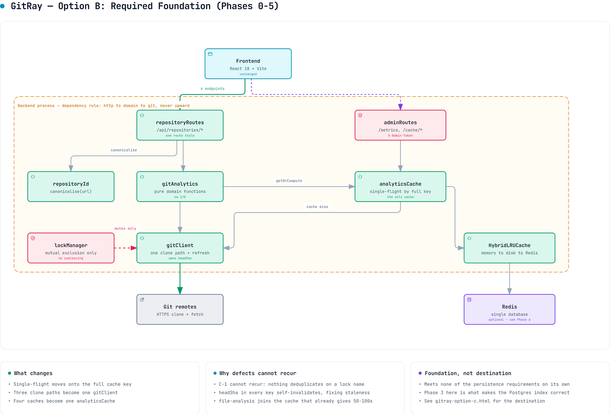](diagrams/gitray-target-architecture.html)

*[`gitray-target-architecture.html`](diagrams/gitray-target-architecture.html) is the interactive version — pan, zoom, search, relationship tracing, dark theme. Option B, the required foundation (Phases 0-5). B, C and D share one layout for the same reason.*

**Concept.** Do Option A first, then **delete** subsystems until one clear path per concern remains.

**Target module structure:**

```text
apps/backend/src/
  http/          routes + middleware  (all routes via the existing factory)
  domain/        gitAnalytics.ts   — pure functions over Commit[]
                 repositoryId.ts   — canonicalisation (fixes P-5)
  git/           gitClient.ts      — the ONE clone path + the ONE log parser
  cache/         analyticsCache.ts — ONE keyed cache over HybridLRUCache
  platform/      config, logger, metrics, memoryPressure
```

**Dependency rule (enforceable by lint):** `http → domain → git`, `* → platform`.
`git` must never import `cache` (fixes V-1).

**Concrete moves — no vague "clean up the service layer":**

| Action | Detail |
| --- | --- |
| **Delete** `lockManager` coalescing | Keep mutual exclusion only; single-flight moves to `analyticsCache`, keyed by the **full cache key** |
| **Delete** `repositoryCache.ts` tiers 2 & 3 | Replace with one `analyticsCache` keyed `analytics:<repoId>:<headSha>:<kind>:<filterHash>`. Tier 1 (raw commits) becomes an internal memo of `gitClient`. |
| **Delete** the transaction engine | `repositoryCache.ts:432-970` (~900 LOC) + 5 rollback metrics. No invariant is lost (M-2). |
| **Delete** the streaming path | `getCommitsStream`, `executeStreamingCommits`, `POST /stream`, both `resume` endpoints, `stream_resume:` and `commits_batch:` keys. Fixes C-4, S-1, P-7. |
| **Delete** `commitRoutes.ts` duplicates | `/`, `/heatmap`, `/info`. Move `/file-analysis` and the three admin `/cache/*` routes into `repositoryRoutes.ts` and an `adminRoutes.ts`. Then delete `commitRoutes.ts`. |
| **Delete** `withTempRepository*Legacy` | Feature flag `forceLegacy` and the dark legacy path go with it. |
| **Merge** three clone paths | `repositorySummaryService` and `fileAnalysisService` receive a `localPath` from the coordinator instead of cloning. Fixes C-5. |
| **Merge** the two summary caches | Summary is cached once, in `analyticsCache`. Fixes P-6. |
| **Add** `HEAD` sha to every cache key | Makes C-2 fixable: refresh = fetch + new sha ⇒ natural invalidation, no manual busting. |
| **Add** one concurrency regression test | Two different operations, one repo URL, concurrent; assert each gets its own shape. |

- **Persistence:** one logical cache (`analyticsCache` over `HybridLRUCache`), one Redis DB, one
  clone store. No new infrastructure, no schema, no migrations.
- **Transaction boundaries:** none needed — single-key writes.
- **API implications:** live 4 endpoints unchanged (frontend untouched). Dead endpoints removed.
- **Compatibility:** delete only endpoints proven to have no consumer (§4.2). Deletions are
  independently revertable.
- **Effort:** ~3–4 weeks part-time. **Regression risk: MEDIUM**, mitigated by phasing (§16) and by
  the fact that the removals target verified-dead code.
- **Benefit:** ~2,600–3,000 LOC removed (measured, §15.3); one path per concern; the system fits
  in two heads again.
- **Debt remaining:** LOW-MEDIUM — still no persistence, so cold analyses remain slow.

### Option C — PostgreSQL + Job Queue  ⭐ RECOMMENDED DESTINATION

[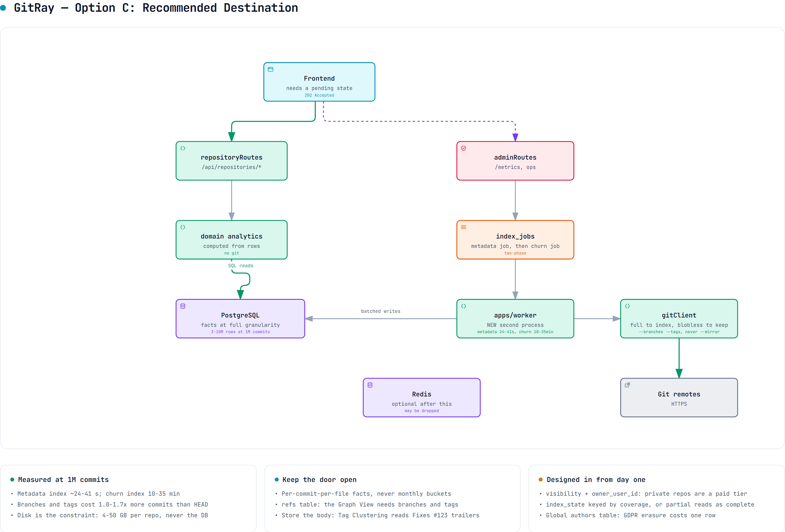](diagrams/gitray-option-c.html)

*[`gitray-option-c.html`](diagrams/gitray-option-c.html) is the interactive version — pan, zoom, search, relationship tracing, dark theme. The recommended destination. Revised 2026-09-05 against the planning vault (§17.9).*

**Conceptual architecture.** Stop deriving analytics per request. Index each repository once into
normalised per-commit facts, maintain materialised rollups, serve reads from SQL, and drive
indexing from a database-backed job queue. Delete the cache layer entirely.

**Module structure.**

```text
apps/backend/src/
  http/            routes + middleware (unchanged surface)
  domain/          analytics computed from rows, not from git
  git/             gitClient.ts - clone, fetch, stream commits
  indexing/        indexer.ts, jobQueue.ts, rollups.ts
  db/              schema.ts, migrations/, repositories/
  platform/        config, logger, metrics
apps/worker/       NEW second process: drains index_jobs
```

**Dependency rules.** `http` to `domain` to `db`; `indexing` may use `git` and `db`;
`domain` must never import `git`. Enforced by lint.

**Persistence strategy.** PostgreSQL is the source of truth. Redis becomes optional or is dropped.
The three cache tiers, the transaction engine, `HybridLRUCache` and the coordinator all go.

**Proposed database changes.** A full schema, none of which exists today. Everything below is
**PROPOSED**.

`repositories` — one row per canonical remote

| Column | Type | Null | Default | Notes |
| --- | --- | --- | --- | --- |
| `id` | `bigserial` | no | | PK |
| `canonical_url` | `text` | no | | **UNIQUE**. Output of `canonicaliseRepoUrl` (Option A step 4) |
| `host` | `text` | no | | denormalised for allow-list reporting |
| `default_branch` | `text` | yes | | resolved at first index |
| `visibility` | `text` | no | `'public'` | CHECK in (`public`, `private`). **A security boundary, not a feature** (§17.9 R-4). Requirement 2 — one analysis shown to everyone — holds only for `public`; private repositories are an explicit paid tier |
| `owner_user_id` | `bigint` | yes | | NULL for the shared public corpus; set when a repository was indexed under a user's token. Nullable FK, so it costs nothing before accounts exist |
| `created_at`, `updated_at` | `timestamptz` | no | `now()` | |

`index_state` — generation-stamped progress per repository **and coverage**

Keyed by coverage rather than by branch. Coverage is a pricing lever (§17.9 R-5) — the free plan
indexes `last_12_months`, premium the full history — but it is keyed for **correctness**: a
12-month index and a full index are different fact sets for the same repository, and if coverage
were a label the delta rule would read a partial index's `head_sha`, conclude the repository is up
to date, and serve truncated history as complete forever. The v1 schema got this right with
`UNIQUE (repo_id, coverage)`; per-branch frontiers live in `refs` instead.

| Column | Type | Null | Notes |
| --- | --- | --- | --- |
| `id` | `bigserial` | no | PK |
| `repository_id` | `bigint` | no | FK to `repositories(id)` **ON DELETE CASCADE** |
| `coverage` | `text` | no | **UNIQUE (repository_id, coverage)**. CHECK in (`full`, `last_12_months`, `last_30_days`) |
| `kind` | `text` | no | `metadata` or `churn` — the two tiers index and refresh independently (§17.7 S-2, §17.8) |
| `generation` | `integer` | no | bumped on force-reindex; every fact and rollup row carries it |
| `status` | `text` | no | CHECK in (`pending`, `indexing`, `ready`, `failed`) |
| `last_indexed_at` | `timestamptz` | yes | supplies the staleness signal C-2 currently lacks |
| `error` | `text` | yes | last failure message |

`refs` — branches and tags, and the per-ref indexing frontier

Required by the Priority-1 Graph View Timeline and the branch dropdown (§17.9 R-1). Note what is
**not** here: there is no branch column on `commits`. A commit is reachable from many refs, so
branch membership is a query over `refs` plus ancestry — putting "the branch" on a fact row is
wrong for every merged commit.

| Column | Type | Null | Notes |
| --- | --- | --- | --- |
| `repository_id` | `bigint` | no | FK CASCADE, part of PK |
| `name` | `text` | no | **PK (repository_id, name)**. Full ref name, e.g. `refs/heads/main` |
| `kind` | `text` | no | CHECK in (`branch`, `tag`) |
| `target_sha` | `char(40)` | no | current tip as of the last fetch |
| `indexed_sha` | `char(40)` | yes | the frontier this audit's delta rule advances **per ref** (§16 Phase 7). A force-push invalidates one ref, not the repository |
| `is_default` | `boolean` | no | exactly one true per repository |

**Ingest rule:** populate from `git for-each-ref refs/heads refs/tags` and walk
`rev-list --branches --tags`. **Never `--mirror`-clone and never index `--all`** — on `git/git` that
pulls in 3,288 `refs/pull/*` refs and inflates the commit universe 2.48x with unmerged fork commits
(§17.9 R-1).

`authors` — identity, deduplicated and mergeable

Measurement (§17.8): distinct authors are **sublinear** (2,790 for 82k commits), and **3.4% of
e-mail addresses appear under more than one name spelling**. Denormalised author strings would
foreclose contributor merging and team grouping, so this is a table, not two columns.

**The stronger reason is GDPR (§17.9 R-6).** Commit author names and e-mail addresses are personal
data of third parties who never interacted with GitRay, and the operating entity is a German GbR
bound to the right to erasure. This table is **global, not per repository**, which is what makes an
erasure request cost **one row** — redact `display_name` and `email_normalised`, keep the surrogate
`id`, and every fact row and aggregate stays valid. Denormalised strings would mean rewriting
millions of fact rows; v1's per-repository `contributors` table would mean one row per repository
the person ever touched. **Erasure is pseudonymisation of this row, never deletion of facts** —
deleting commits would corrupt every aggregate and break the `count == rev-list --count` invariant.

| Column | Type | Null | Notes |
| --- | --- | --- | --- |
| `id` | `bigserial` | no | PK |
| `email_normalised` | `citext` | no | **UNIQUE**. Lower-cased; the join key |
| `display_name` | `text` | no | most recent spelling seen |
| `canonical_author_id` | `bigint` | yes | FK → `authors(id)`. **NULL = this is a canonical identity.** Set to merge two identities (mailmap) without rewriting facts |

`commits` — the per-commit facts

| Column | Type | Null | Notes |
| --- | --- | --- | --- |
| `repository_id` | `bigint` | no | FK CASCADE, part of PK |
| `sha` | `char(40)` | no | **PK (repository_id, sha)** |
| `author_id` | `bigint` | no | FK → `authors(id)` |
| `committer_id` | `bigint` | yes | FK → `authors(id)` |
| `authored_at` | `timestamptz` | no | `%aI` |
| `committed_at` | `timestamptz` | no | `%cI`. **Both are stored** — they diverge after a rebase, and today's code mixes them (H-3) |
| `subject` | `text` | no | **may be empty string**; today's parser drops such commits (§17.4) |
| `body` | `text` | yes | Required by Priority-1 Tag Clustering and Issue Overlay, which read trailers such as `Fixes #123` that are almost never on the subject line. Measured cost: **813 B per commit against 49 B for the subject — 16x**, so ~813 MB at 1M commits (§17.9 R-2). Affordable; do not scan it at query time, see `commit_refs` |
| `parents` | `char(40)[]` | no | **Essential.** 12-26% of commits are merges (§17.8); without parents there is no topology, no branch analysis, no way to separate merge noise from work |
| `is_merge` | `boolean` | no | derived from `array_length(parents,1) > 1`. Merges emit **no** `--numstat` output, so without this flag `commits` and `commit_files` look inconsistent and `rev-list --count` will not reconcile |
| `generation` | `integer` | no | see rebuild semantics, §16 Phase 7 |

Indexes: `(repository_id, committed_at)` for the heatmap; `(repository_id, author_id)` for
contributors; `(repository_id, generation)` for the sweep.

`commit_files` — per-commit, per-file facts, at **full granularity**

**This is the most important schema decision in the plan.** The v1 audit proposed bucketing this
into `file_churn_monthly`. The measured volumes say do not: only **1.66-6.11 rows per commit**, so
**1.7-6.1 M rows for a 1M-commit repository** — unremarkable for Postgres. Bucketing at write time
would permanently foreclose change-coupling, code ownership, bus factor and hotspot-decay analysis,
none of which is reconstructible without a full re-index.

| Column | Type | Null | Notes |
| --- | --- | --- | --- |
| `repository_id` | `bigint` | no | FK CASCADE |
| `sha` | `char(40)` | no | FK → `commits`, **PK (repository_id, sha, path)** |
| `path` | `text` | no | stored inline. Path interning was measured and **rejected** as premature: only 3.8x reuse on react, a few MB saved, against a join on the hottest table |
| `old_path` | `text` | yes | populated on renames. `--numstat` emits **two formats** — `old => new` and `dir/{old => new}` — 1.4% of rows. Unparsed, these become synthetic paths that corrupt per-file history |
| `additions` | `integer` | **yes** | **NULL for binary files**, where `--numstat` emits `-` (0.1% of rows). NULL, never 0 |
| `deletions` | `integer` | **yes** | as above |
| `generation` | `integer` | no | |

Index: `(repository_id, path)`. Batch inserts must be chunked — the largest single commit observed
touched **2,814 files**.

`commit_refs` — issue and pull-request references extracted from the message at index time

Serves the Priority-1 Issue Overlay and Tag Clustering as an indexed join instead of a full-text
scan over ~813 MB of message bodies (§17.9 R-2). Extraction is free at index time — the parser
already holds the message — and re-deriving it later would mean re-reading every commit.

| Column | Type | Null | Notes |
| --- | --- | --- | --- |
| `repository_id` | `bigint` | no | FK CASCADE, part of PK |
| `sha` | `char(40)` | no | FK → `commits`, **PK (repository_id, sha, ref_kind, ref_number)** |
| `ref_kind` | `text` | no | CHECK in (`issue`, `pull`) |
| `ref_number` | `integer` | no | the `#123` |
| `relation` | `text` | yes | `fixes`, `closes`, `refs`, … parsed from the trailer verb where present |
| `generation` | `integer` | no | |

Index: `(repository_id, ref_kind, ref_number)`.

`daily_activity` and `file_churn` — rollups, materialised **in addition to** the facts, never
instead of them. Shapes as before: `(repository_id, day, author_id)` and `(repository_id, path)`,
each carrying `generation` so a stale generation is ignored and then swept.

`index_jobs` — the queue

| Column | Type | Null | Notes |
| --- | --- | --- | --- |
| `id` | `bigserial` | no | PK |
| `repository_id` | `bigint` | no | FK CASCADE |
| `kind` | `text` | no | CHECK in (`full`, `incremental`, `churn`) |
| `status` | `text` | no | CHECK in (`queued`, `running`, `done`, `failed`) |
| `attempts` | `smallint` | no | default 0 |
| `locked_by`, `locked_at` | `text`, `timestamptz` | yes | claimed with `SELECT ... FOR UPDATE SKIP LOCKED` |
| `run_after` | `timestamptz` | no | backoff |

Partial index: `(status, run_after) WHERE status = 'queued'`.

**Explicitly rejected:** an `analysis_sessions` table. The v1 audit proposed one; this audit finds
it has no responsibility that `index_state` plus `index_jobs` does not already cover.

**API implications.** The four live endpoints keep their shapes but gain an honest
`indexState: {status, headSha, lastIndexedAt}` block, and may return `202 Accepted` on a first
request while indexing runs. That is a **frontend-visible change**: `App.tsx` and
`DashboardPage.tsx` would need a pending state.

**Service boundaries.** Reading and indexing become separate processes with a database between
them. The API no longer shells out to git at all.

**Transaction boundaries.** Real ones, for the first time: one transaction per indexed batch
covering `commits`, `commit_files` and `index_state.head_sha`; one per rollup refresh; job claim
and completion each atomic.

**Migration complexity.** **High.** Introduces a database, a migration tool, a connection pool, a
second process, backfill, and a new failure surface, into a repository with no DB experience
encoded in it.

**Compatibility strategy.** Dual-read: serve from SQL when `index_state.status = 'ready'`,
otherwise fall back to the existing cache path. This requires keeping both systems alive through
the migration, which temporarily *increases* the complexity the team is already struggling with.

**Testing implications.** Needs a test database (testcontainers or a CI service), migration tests,
job-queue concurrency tests, and rollup-correctness tests asserting SQL output equals today's
git-derived output. Substantially more test infrastructure than currently exists.

**Expected benefits.** Solves C-2 properly, makes pagination real (SQL `LIMIT`/`OFFSET` over
indexed rows), makes repeat views cheap, and enables incremental indexing. It is the only option
that fixes C-3 at the root rather than by bounding it.

**Disadvantages.** It stacks a new subsystem onto a code base whose existing subsystems are not
yet correct — which is why Phases 1 and 3 are hard prerequisites rather than good practice
(§15.1). It also requires operating Postgres plus a worker.

**Risks.** The dominant risk is not technical failure but **abandonment**: this is a multi-month
migration for a two-person team that has already stalled once. The phased plan in §16 mitigates it
by making Phases 1, 3 and 5 independently valuable — Phase 1 alone restores a working product, and
every phase is a safe stopping point.

**Measured feasibility (§17.7):** ~24 s metadata + ~9.4 min churn for a 1M-commit repository, on a
full bare clone. The one-time cost is affordable; the delta cost afterwards is milliseconds.

**Implementation effort.** 2 to 3 months part-time.

**Probability of regressions.** **High** during the dual-read window; low once complete.

**Impact on current code.** Adds roughly 3,000 lines, then deletes roughly 5,000 (cache tiers,
transaction engine, coordinator, hybrid cache).

**Technical debt remaining.** Low *if completed*. That conditional is the whole problem.

### Option D — Collapse to a single process, drop Redis

[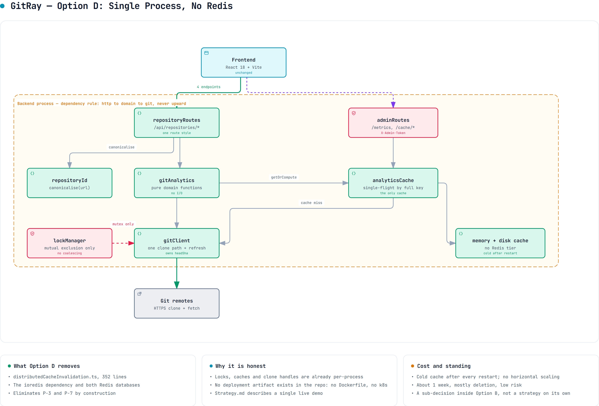](diagrams/gitray-option-d.html)

*[`gitray-option-d.html`](diagrams/gitray-option-d.html) is the interactive version — pan, zoom, search, relationship tracing, dark theme. Option D, optional and deferred to Phase 9.*

**Conceptual architecture.** Stop implying the system is distributed. Locks, caches and repository
handles are already per-process (§7.5), so formalise single-instance operation.

**Module structure.** Unchanged from whatever Option A or B leaves behind. This is a deployment
decision expressed in code, not a restructuring.

**Dependency rules.** Unchanged.

**Persistence strategy.** In-memory LRU with disk spill. Redis is removed entirely, along with the
two-database split and the `stream_resume:` and `commits_batch:` key families.

**Proposed database changes.** None.

**API implications.** None, except that `/health/detailed` stops reporting a Redis backend.

**Service boundaries.** Simplified: the three-backend selection in `cache.ts` collapses to one.

**Transaction boundaries.** Unchanged.

**Concrete changes.** Delete `services/distributedCacheInvalidation.ts` (352 lines) and its wiring
in `repositoryCache.ts`; drop the `ioredis` dependency and the `redisConfig` blocks in `config.ts`;
reduce `cache.ts` to memory plus disk; remove the Redis probe from `validateStartupEnvironment`.

**Compatibility strategy.** None needed — Redis holds only cache data, all of it reconstructible.
The single real loss is cache survival across restarts.

**Testing implications.** Simplifies tests: no Redis mock, no connection-failure paths, fewer
degraded-mode branches. Several existing tests get shorter.

**Expected benefits.** Removes an entire piece of infrastructure. Local setup becomes `pnpm dev`
with no services to start, a genuine benefit for a stalled two-person project. Also eliminates P-3
and P-7 by construction.

**Disadvantages.** Forecloses horizontal scaling without re-adding a shared store. Cold start after
every restart.

**Risks.** Low, but **directionally hard to walk back**: re-adding Redis is easy, yet the decision
signals the project is single-instance.

**Implementation effort.** About 1 week, mostly deletion.

**Probability of regressions.** **Low.** Nothing depends on Redis for correctness — it is a cache.

**Impact on current code.** Removes roughly 600 to 800 lines.

**Technical debt remaining.** Medium. It is orthogonal to C-1 through C-5, none of which it fixes.

**Assessment.** Attractive as a *sub-decision inside* Option B, not as a standalone strategy.
Recommended as an optional Phase 9 (§16), decided once §17.2 Q-3 is confirmed with the team.

### Comparison

| Axis | A | B | **C** | D |
| --- | --- | --- | --- | --- |
| Fixes C-1 correctness | ✅ | ✅ | ✅ | ✅ |
| Fixes C-2 staleness | ✅ | ✅ | ✅ | ✅ |
| Improves comprehensibility | ❌ | ✅✅ | ✅ | ✅ |
| Meets the §2.4 requirements | ❌ | ❌ | **✅ only C** | ❌ |
| LOC delta | ~0 | **−2.6k to −3.0k** | +3k then −5k | −0.9k |
| New infrastructure | none | **none** | Postgres + worker | **−Redis** |
| Effort | 3-5 d | 3-4 wk | **+2-3 mo on top of B's phases** | 1 wk |
| Regression risk | LOW | **MEDIUM** | HIGH | LOW |
| Probability a stalled 2-person team finishes it | High | High | **Medium — phased, each stop is useful** | High |

---

## 15. Recommended Target Architecture

### 15.0 What each defect blocks, and whether fixing it standalone makes sense

The audit found more than twenty issues. They are not equally worth acting on, and several are only
worth fixing *as part of* a phase rather than on their own. This table is the decision filter.

| Defect | What it blocks right now | Fix standalone? | Where it belongs |
| --- | --- | --- | --- |
| **C-1** lock coalescing | **The product.** Half the dashboard 500s on any uncached repository, reproducibly (§0.2). Also blocks trusting *any* measurement, benchmark or bug report taken today. | **Yes — immediately.** Nothing else should be attempted first. | Phase 1 |
| **C-8** flaky suite | Blocks trusting the safety net for every later phase. You cannot tell a real regression from noise. | **Yes** — it is the precondition for phased work. | Phase 0 |
| **C-2** never refreshed | Blocks correctness of every analytic over time, and blocks any honest before/after benchmark. | No — needs the single clone path first. | Phase 3 |
| **C-5** three clone paths | Blocks C-2's fix (nothing owns refresh) and triples cold latency. | No — it *is* Phase 3. | Phase 3 |
| **Q-2** lossy log parser | Blocks trusting commit counts, contributor stats and churn. Two different totals reach one screen. | No — fix inside the single log parser. | Phase 3 |
| **C-3** fake pagination | Blocks large repositories entirely; measured to have no effect at any `limit` (§17.6). | No — needs the cache rework. | Phase 4 |
| **C-14** file-analysis caching | Blocks the slowest endpoint from getting the 50-100x the others already enjoy. | No — free once Phase 4 lands. | Phase 4 |
| **C-4** quadratic streaming | Blocks nothing — the path is unused. It is a liability, not a blocker. | No. **Delete it.** | Phase 5 |
| **S-1** unauthenticated resume endpoints | Verified reachable (`200` with no token). Low impact, but free to remove. | No — deleted with `commitRoutes`. | Phase 5 |
| **C-9** shutdown drops async cleanup | Leaks temp clones across restarts; compounds C-2. | Yes — one-line type fix. | Phase 1 |
| **C-7** cold cache reports unhealthy | Blocks orchestrated deployment; harmless today because there is no deployment. | Yes — trivial. | Phase 1 |
| **P-3** memory fallback | Only bites when Redis is down. Real, but conditional. | Yes — small and contained. | Phase 1 |
| **P-4** unawaited release | **Downgraded**: no refCount drift was observed under load (§17 Q-5). The live symptom is the inverse — releasing an untracked handle. | Yes — one `await`, low value but free. | Phase 1 |
| **P-5** URL canonicalisation | Doubles clones and cache entries for `repo` vs `repo.git`. | Yes — small. | Phase 1 |
| **C-11/C-12/C-13** complexity, parallel architecture, duplicated pairs | Blocks comprehension — the team's stated problem. | No — these dissolve as Phases 3-5 delete code. | Phases 3-5 |
| **P-8** Windows entry guard | Blocks nothing for this team (Linux/WSL). | Yes, one line, while passing. | Phase 2 |
| **F-1** orphaned theme source | Blocks frontend theming: editing `globals.css` does nothing. | Yes — independent of the backend work. | Any time |
| **C-6** 120 s lock hold | Dissolves with C-1 and Phase 4. | No. | Phase 4 |
| **C-10** unstoppable timers | Blocks clean shutdown and contributes to C-8. | Partly — with C-9. | Phase 1-2 |
| **M-1..M-9** duplication, dead code, docs | Blocks comprehension only. | No — bulk deletion. | Phase 2 / 5 |

**The shape of this table is the argument for the plan.** Exactly two things must be fixed
*standalone and now* — C-8 so you can trust tests, then C-1 so the product works. Almost everything
else is cheaper as a by-product of a phase than as its own task.

### 15.1 Recommendation: **Option C as the destination, reached through Option B's phases**

**This reverses the recommendation in the first draft of this audit, and the reason is that the
first draft was answering the wrong question.**

The original brief described a stalled two-person student project that had lost its mental model.
Against that, Option B — delete code, one path per concern, no new infrastructure — was the right
answer, and the argument that "the cache already gives 50-100x warm, so Postgres buys little"
followed from it.

Then the actual product requirements arrived (§2.4): **any repository size including 1M+ commits, a
one-time analysis that is persisted and never lost, shared globally with every later visitor, with
optional notification on completion.**

Under those requirements the earlier argument collapses, for three measured reasons:

1. **The 50-100x cache win was measured on 75-600 commit repositories.** It does not generalise.
   At 1M commits the raw tier holds the entire history as a single cache entry that exceeds the
   whole default memory budget, so it can never be cached at all — every request re-walks. C-3 is
   not a slow path at that scale, it is a **wall**.
2. **A cache is the wrong mechanism for a 15-minute artefact.** Cache entries are evictable under
   memory pressure and lost on restart. Requirement 4 — "the long analysis must be persisted so the
   work is never lost" — is a direct statement that caching is disqualified. That is a database.
3. **There is no job queue, so requirements 3 and 5 are unimplementable.** "Analyse on request, and
   notify me when it is done" needs a durable job with a lifecycle. Nothing in the current design
   has one.

**And the measurements show the plan is affordable.** A 1M-commit repository costs ~24 s of metadata
indexing and ~9.4 minutes of churn indexing — about **15 minutes once**, then milliseconds per
delta, shared by everyone thereafter (§17.7). That is a good trade, and it is the number that turns
the team's instinct into a defensible design.

**So: the team's original instinct — index into Postgres, then delta-update — was right.** This
audit's first draft under-weighted it because it did not know the requirements.

#### What does *not* change

Option B's early phases are **not an alternative to Option C — they are its prerequisite**, and not
for reasons of caution:

| Prerequisite | Why the index cannot be built without it |
| --- | --- |
| **Phase 1, C-1** | The lock layer currently swaps payloads between concurrent operations (§0.2, reproduced). An indexer built on it would write one repository's facts under another's key. |
| **Phase 3, one clone path** | Delta updates need a single owner of `fetch`. There are three clone paths and none of them fetches after the first clone. |
| **Phase 3, real refs** | The delta rule is `merge-base --is-ancestor <indexed_sha> <new_head>`. Today the code checks out a detached `FETCH_HEAD`, so there is **no stable ref to diff against**. |
| **Phase 3, correct parser** | Measured: 4 commits in, **3 parsed** (§17.4). An index built on this parser silently diverges from `rev-list` and the divergence compounds with every delta, invisibly. **This is the one that would quietly corrupt the persisted index.** |
| **Phase 1, canonical identity** | `repo` and `repo.git` are two different repositories today (P-5). The shared index needs one row per remote, not two. |

**The ordering in the v1 audit was therefore correct** — P0 correctness, P1 one clone and one walk,
P2 Postgres — and this audit now agrees with it.

#### Where this audit still disagrees with both documents

| Point | Verdict |
| --- | --- |
| **Analysis Sessions** as a persisted entity | **Reject.** No responsibility that `(repository, index_state, index_job)` does not already own — and, decisively, **there are no users**: no auth exists anywhere, and requirement 2 says results are global. A session entity models a concept the system cannot populate. Keep a request-scoped correlation id for telemetry. |
| Clone with `--filter=blob:none` for indexing (v1 §7.3) | **Reject — measured 624x penalty on the churn pass** (§17.7 S-1). Use a full clone for the initial index; prune to blobless for *retention*, where delta blob fetches are few. |
| Index metadata and churn as one job | **Reject.** 24 s versus 9.4 minutes. Split them so the dashboard is usable in under a minute (§17.7 S-2). |
| "Delete the cache layer entirely" (v1 #10) | **Partially reject.** Delete the three-tier structure and the 538-line transaction engine. **Keep a single response cache** — 9-30 ms reads are worth having in front of Postgres. |
| Incrementally mutating counters (`totalCommits++`) | **Reject**, agreeing with v1: non-idempotent, and a retried job corrupts the counter undetectably. |
| Ancestry-guarded delta with cheap full rebuild (v1 §9.2-9.3) | **Accept unchanged.** This is the strongest idea in either document: `rev-list` yields the full sha set in seconds, so a force-push costs one `rev-list` plus the genuinely new commits. The safe path is also the fast path. |
| Aggregate-only index | **Reject**, agreeing with v1 — persist per-commit facts, materialise rollups. Note one correction: v1 justifies this by calling `/heatmap?author=` and `/contributors` "live endpoints"; they are **mounted but have no frontend consumer** (§4.2). The conclusion holds anyway, because `/full-data` does pass author filters and aggregate-only forces a re-scan for every future feature. |
| SQLite as an interim step | **Reject**, agreeing with v1. |

#### Why not stop at Option B

Because it does not meet requirements 1, 3, 4 or 5. Option B makes the system *correct and
comprehensible*; it does not make it *persistent, shared or scalable to 1M commits*. It is the right
first half of the journey and the wrong place to stop.

#### Why not go straight to Option C

Because of the prerequisite table above — most sharply the parser. Building the persisted index on
today's Git layer would produce a durable, shared, silently-wrong dataset, which is materially worse
than today's transient wrongness.

#### Why not Option A or D

**A** fixes correctness and nothing else; it satisfies none of the five requirements. **D** removes
Redis, which is orthogonal — and under a Postgres design Redis's remaining jobs (response cache,
rate limiting) are small enough that dropping it is a later, optional tidy-up.

### 15.2 What the Option B phases remove along the way (measured)

The earlier draft of this audit estimated "4,000-5,000 lines". That was not grounded. Measured
against the working tree:

| Deletion | Measured lines | Basis |
| --- | ---: | --- |
| `routes/commitRoutes.ts`, minus the `/file-analysis` handler that moves to `repositoryRoutes` | **777** | 1,210 total minus lines 777-1210 |
| Transaction / rollback engine in `repositoryCache.ts` (lines 432-970) | **538** | measured span |
| `gitService` streaming block (`getCommitsStream`, `executeStreamingCommits`, batch helpers, resume state) | **~480** | measured span, approximate boundary |
| `withTempRepository` legacy paths (3 functions) | **226** | 81 + 92 + 53 |
| Verified no-production-caller symbols (§11.1) | **~100** | sum of listed symbols |
| **Subtotal, firmly measured** | **~2,120** | |
| Cache tier 2/3 consolidation and the parallel summary cache | **500-900** | **INFERRED** — cannot be measured precisely without doing the work |
| **Realistic total** | **~2,600-3,000** | backend `src` goes 21,908 → roughly 19,000 |

Option D, if taken later, removes a further ~350 (`distributedCacheInvalidation.ts`) plus the Redis
branches in `cache.ts`.

**This is a smaller reduction than the earlier draft claimed.** The argument for Option B does not
rest on the line count — it rests on collapsing three concurrency mechanisms to one, three clone
paths to one, and four caches to one.

### 15.3 Target architecture — the Option B end state (an intermediate milestone)

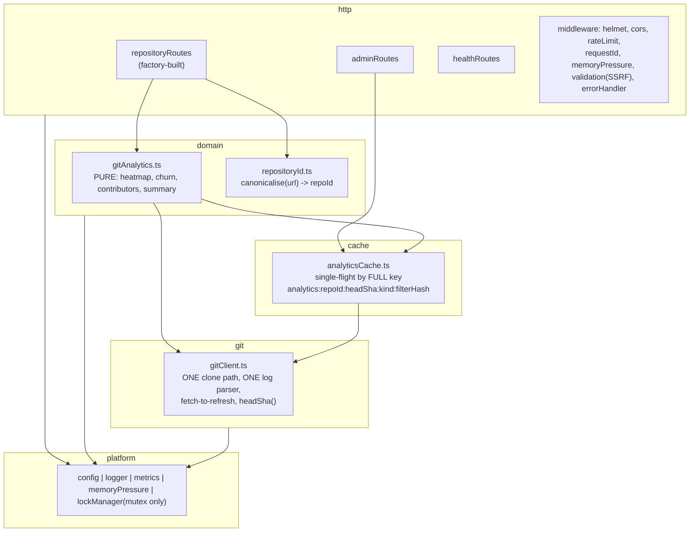

**Key properties versus today:**

| Property | Today | Target |
| --- | --- | --- |
| Concurrency mechanisms | 3 overlapping | 1 (single-flight in `analyticsCache`) + a pure mutex |
| Clone paths | 3 | 1 |
| Cache layers | 4 (`cache.ts`, 3 tiers, coordinator, service-local) | 1 |
| Cache key | `repoUrl` (+ filters, inconsistently) | `(repoId, headSha, kind, filterHash)` — always |
| Staleness | unbounded | bounded by refresh policy; `headSha` makes it self-invalidating |
| Route styles | 2 | 1 |
| `gitService` → cache dependency | yes (cycle) | forbidden by lint rule |
| LOC (backend src) | 21,908 (measured) | ~19,000 after the Option B phases; lower again once the cache tiers are replaced by Postgres reads |

---

## 16. Migration Strategy

Phased, each phase independently shippable, each ending at a **safe checkpoint** where the
application builds, tests pass, and the dashboard works. Work can pause at any checkpoint.

**Universal preconditions:** work on a branch off `dev`; `pnpm run build` and `npx vitest run` green
before starting (baseline confirmed in §13); commit per phase.

---

### Phase 0 — Safety net (prerequisite for everything)

- **Objective:** be able to detect the regressions the current suite cannot see.
- **Tests to add *before* any change:**
  1. **Concurrency regression test** — fire `/full-data` and `/churn` concurrently for one repo URL;
     assert each response has its own shape. *This test must FAIL on current `dev`* — that failure
     is the proof C-1 is real.
  2. **Contract test per live endpoint** — `/full-data`, `/summary`, `/churn`, `/file-analysis`:
     assert response shape against `@gitray/shared-types`.
  3. **Smoke E2E** — analyse one small fixed public repo end to end; snapshot commit count.
- **Also required:** make the suite deterministic (C-8). Isolate the module-level side effects in
  `repositoryCache.ts` behind an explicit `initialize()` call, or give the offending files their own
  Vitest environment/pool, until repeated full runs agree.
- **Verification:** the concurrency test fails; all others pass; **three consecutive full runs agree**.
- **Rollback:** tests only; nothing to roll back.
- **Checkpoint:** ✅

---

### Phase 1 — Correctness (this is Option A, and it is mandatory)

- **Objective:** **make the product work again.** §0.2 shows `/summary` and `/churn` returning 500
  under the dashboard's own concurrency on any cold repository. This phase is the repair, not
  hygiene. No structural change.
- **Affected:** `utils/lockManager.ts`, `services/repositoryCoordinator.ts`, `services/cache.ts`,
  `routes/healthRoutes.ts`, `index.ts`, new `domain/repositoryId.ts`.
- **Changes:**
  1. **Remove coalescing from `withKeyLock`** (`lockManager.ts:294-295`) — delete the
     `inflight` lookup and the `inflight` map. The lock becomes pure mutual exclusion. **Fixes C-1.**
  2. Re-introduce single-flight **in `RepositoryCacheManager`**, keyed by the **generated cache key**
     (filters included), not the lock name.
  3. `await repositoryCoordinator.releaseRepository(repoUrl)` in `withSharedRepository`'s `finally`
     (`repositoryCoordinator.ts:810`). **Fixes P-4.**
  4. Add `canonicaliseRepoUrl()` — strip trailing `/`, normalise case of host, strip/normalise `.git`
     — and apply it at the route boundary before any key is derived. **Fixes P-5/M-4.**
  5. Honour TTL and bound size in the `memoryCache` fallback (`cache.ts:247,270`). **Fixes P-3.**
  6. Drop `hitRatios.overall > 0.1` from the readiness computation in `index.ts:226-228` and
     `healthRoutes.ts:92-94`. **Fixes C-7.**
  7. Reconcile `ADMIN_AUTH_ENABLED` to a single source — `config.adminAuth.enabled` — and delete the
     direct `process.env` read in `adminAuth.ts:22`. **Fixes V-4.**
- **Tests before:** Phase 0 suite. **Tests during:** unit test for `canonicaliseRepoUrl`; unit test
  asserting `withKeyLock` calls **both** `fn`s for two concurrent callers on one key.
- **Acceptance test — use the real reproduction, not just the unit test.** With the server running,
  fire all four live endpoints concurrently at a repository that is not yet cached:

  ```bash
  R="https://github.com/sindresorhus/p-limit.git"; B=http://localhost:3001
  for ep in "repositories/full-data?repoUrl=$R" "repositories/summary?repoUrl=$R" \
            "repositories/churn?repoUrl=$R" "commits/file-analysis?repoUrl=$R"; do
    curl -s -o /dev/null -w "$ep -> %{http_code}\n" "$B/api/$ep" &
  done; wait
  ```

  **Before Phase 1 this returns two 500s. After Phase 1 all four must return 200.**
- **Verification:** the Phase 0 concurrency test now **passes**; the burst above is all-200; the
  existing 1,002 unit tests still pass.
- **Rollback:** revert the phase commit; each item is independent.
- **Checkpoint:** ✅ **This is the single highest-value checkpoint in the plan. If the project only
  ever completes one phase, complete this one.**

---

### Phase 2 — Delete verified-dead code

- **Objective:** shrink the surface before restructuring it.
- **Preconditions:** Phase 1 merged.
- **Changes (all LSP-verified dead, §11.1):** delete `withTempRepository` (exported),
  `handleValidationErrors` (throwing variant), `invalidateCachedRepository`, the unused `depth`
  parameter and `config.git.cloneDepth`, `config.adminAuth.requireForMetrics`, the three unused
  `api.ts` client functions, `zod` + `nanoid` from `package.json`, and
  `__tests__/unit/routes/repositoryRoutes.unit.test.ts.old`.
  **Retain `getCommitsWithStats`** — it is the only `--numstat` parser and is a likely future asset;
  mark it explicitly as unwired rather than deleting it.
- **Verification:** build + full suite green; no behaviour change expected.
- **Rollback:** revert; trivially safe.
- **Checkpoint:** ✅

---

### Phase 3 — One clone path

- **Objective:** eliminate C-5 and C-2 together.
- **Affected:** `utils/gitUtils.ts`, `services/repositoryCoordinator.ts`,
  `services/repositorySummaryService.ts`, `services/fileAnalysisService.ts`.
- **Changes:**
  1. Create `git/gitClient.ts` owning the **only** clone implementation, always `--bare --no-tags`
     (no working tree — §17.1 showed the current `checkout FETCH_HEAD` downloads every HEAD blob).
     **Clone policy is workload-dependent and was measured (§17.7 S-1):**
     - **metadata only** → `--filter=blob:none` is correct and cheap;
     - **anything needing `--numstat` or file sizes** → a **full** clone. Blobless is **624x
       slower** on the churn pass because Git lazily fetches every blob over the network.
  2. Fetch into a **real ref**, not detached `FETCH_HEAD`:
     `git fetch --no-tags origin +refs/heads/<default>:refs/remotes/origin/<default>`.
     This is what later gives `merge-base --is-ancestor` something to compare, and it is a
     prerequisite for Phase 7's delta rule.
  3. Add `refresh(handle)` — `git fetch` on an existing clone — and `headSha(handle)`.
     Call `refresh` from `isHandleValid` when the handle is older than a configurable TTL.
     **Fixes C-2.**
  4. Replace the log format and parser: `%x1e` record separator, `%x1f` field separator, capture
     **both** `%aI` and `%cI`, and **never drop a record for an empty subject**. Measured today:
     4 commits in, 3 out (§17.4). **This is the single most important change in the phase** —
     everything persisted later inherits this parser's correctness.
  5. Change `repositorySummaryService.getRepositorySummary` and the `fileAnalysisService` sparse path
     to accept a `localPath` **parameter** instead of cloning. Route handlers obtain it from the
     coordinator. **Fixes C-5.**
- **Compatibility:** response shapes unchanged.
- **Tests during:** assert exactly **one** clone occurs for a dashboard-shaped burst of 4 concurrent
  requests (spy on `gitClient.clone`).
- **Verification:** smoke E2E passes; clone-count test passes; and **`getCommits(...).length` equals
  `git rev-list --count`** for a repository containing an empty-subject commit and an author name
  containing `|`. That equality is the regression test for §17.4 and the correctness gate for
  everything in Phases 6-8.
- **Rollback:** revert; the two services keep their own clone methods until this phase merges.
- **Checkpoint:** ✅

---

### Phase 4 — One cache

- **Objective:** replace 4 caching mechanisms with 1.
- **Preconditions:** Phase 3 merged (needs `headSha`).
- **Changes:**
  1. Create `cache/analyticsCache.ts` over `HybridLRUCache`, key
     `analytics:<repoId>:<headSha>:<kind>:<filterHash>`, with single-flight keyed on that full key.
  2. Move each `getOrGenerate*` in `repositoryCache.ts` to
     `analyticsCache.getOrCompute(key, () => gitAnalytics.X(...))`.
  3. **Delete** the transaction/rollback engine (`repositoryCache.ts:432-970`) and its 5 metrics.
  4. **Delete** the second summary cache in `repositorySummaryService`. **Fixes P-6.**
  5. Reduce `withOrderedLocks` usage to zero — with single-flight on the true key, the ordered-lock
     dance is unnecessary. **Removes the entire C-1 failure *class*, not just the instance.**
- **Verification:** all contract + concurrency tests green; cache-hit behaviour asserted by a test
  that calls the same endpoint twice and spies on `gitClient`.
- **Rollback:** keep `repositoryCache.ts` in place behind a flag for one release, then delete.
- **Checkpoint:** ✅

---

### Phase 5 — One route style

- **Objective:** collapse the duplicate API surface.
- **Changes:** move `/file-analysis` into `repositoryRoutes.ts` (factory-built); move the three
  `/cache/*` admin routes into a new `http/adminRoutes.ts`; **delete** `commitRoutes.ts` entirely
  (removes `/`, `/heatmap`, `/info`, `POST /stream`, both `resume` endpoints — fixing **S-1**);
  delete `getCommitsStream`/`executeStreamingCommits` and the `stream_resume:`/`commits_batch:`
  key families (**fixes C-4, P-7**); delete `withTempRepository*Legacy` and the `forceLegacy` flag;
  remove the duplicate `/coordination` endpoint; remove the vestigial `GET /api`.
- **Compatibility:** **breaking for `/api/commits/*` consumers.** Verified consumers: none in the
  frontend (§4.2). Non-frontend consumers exist in `scripts/end2end_cache_test.sh` and
  `apps/backend/perf/load-test.ts` — **both must be repointed in the same commit.**
- **Verification:** full suite; repoint and run `scripts/end2end_cache_test.sh`.
- **Rollback:** revert; this is the most consumer-visible phase, so ship it alone.
- **Checkpoint:** ✅

---

### Phase 6 — PostgreSQL facts and the job queue

- **Objective:** make an analysis a durable, shared artefact instead of a cache entry. This is where
  requirements 3, 4 and 5 (§2.4) are met.
- **Preconditions:** Phases 1-5. **Phase 3 is non-negotiable** — the parser, the single clone path
  and a real ref must exist first, or the persisted index will be silently wrong (§15.1).
- **Schema:** as specified in §14 Option C — `repositories`, `index_state`, `refs`, `authors`,
  `commits`, `commit_files`, `commit_refs`, `daily_activity`, `file_churn`, `index_jobs`.
  **No `analysis_sessions` table.** `repositories.visibility` and `owner_user_id` ship in this
  first migration even though nothing enforces them yet (§17.9 R-4), and `index_state` is keyed
  `(repository_id, coverage)` (§17.9 R-5).
- **Ref selection (§17.9 R-1):** index the union of `--branches --tags`, recorded in `refs`.
  **Do not `--mirror`-clone and do not index `--all`** — on `git/git` that pulls 3,288
  `refs/pull/*` refs, inflating the commit universe 2.48x with unmerged fork commits and nearly
  doubling clone size (601 MB against 317 MB). Budget **1.0-1.7x** the §17.7 figures for branch
  coverage.
- **Job queue:** `index_jobs` claimed with `SELECT … FOR UPDATE SKIP LOCKED`, leased with an expiry
  so a crashed worker's row returns to `queued`. A partial unique index prevents two pending jobs
  for the same `(repository_id, kind)`.
- **Two-phase indexing (§17.7 S-2):** `kind='metadata'` first (~24 s at 1M commits), then
  `kind='churn'` (~9.4 min). `index_state` reports each independently so the dashboard can render
  everything except the churn panel within a minute.
- **Clone policy (§17.7 S-1, §17.8 S-6, §17.9 R-3):** a **full** bare clone for the initial churn
  pass — *not* `--filter=blob:none`, which is 624x slower on `--numstat`. **Prune to blobless for
  retention**, which is now measured as safe for the Priority-1 Diff Viewer: the penalty is on
  *bulk* traversal, not *point* lookup, and a single-file diff on a blobless clone costs 0.55 s
  cold and 0.035 s warm.
- **Idempotency:** `commits` inserted `ON CONFLICT DO NOTHING`; rollups recomputed from facts, never
  `+=`'d; `index_state.head_sha` advances only in the transaction that commits the facts.
- **Compatibility:** dual-read. Serve from SQL when `index_state.status='ready'`, else fall back to
  the existing path. Both live until Phase 8.
- **Tests before:** contract tests for the four live endpoints (Phase 0) must still pass unchanged.
- **Tests during:** migration tests; a job-queue concurrency test (two workers, one job, claimed
  once); and an **equivalence test** asserting SQL-derived output matches Git-derived output for a
  fixed repository.
- **Verification:** a 1M-commit repository indexes end to end; `commits` row count equals
  `git rev-list --count --branches --tags`. That equality is the regression test for the parser
  bug (§17.4), and the ref selection must match the one used to index or it will never reconcile.
- **Rollback:** feature-flag the SQL read path; the Git path remains until Phase 8.
- **Checkpoint:** ✅

### Phase 7 — Delta updates

- **Objective:** keep the shared index fresh cheaply. Fixes C-2 permanently.
- **Rule (adopted from v1 §9.2, extended to run per ref — §17.9 R-1):**

  ```text
  fetch --prune
  for each ref in refs/heads + refs/tags:            # NOT --all; see Phase 6 ref selection
      new_tip = rev-parse <ref>
      if new_tip == refs.indexed_sha                            -> no-op
      if git merge-base --is-ancestor <indexed_sha> <new_tip>   -> delta: rev-list indexed_sha..new_tip
      else                                                      -> NON-FAST-FORWARD -> rebuild this ref
  parse the union of all deltas once, then advance every refs.indexed_sha in one transaction
  ```

  Running per ref matters: a force-pushed feature branch invalidates **that ref's frontier only**,
  not the repository's index. Deleted refs are removed by `--prune`; their commits stay as facts
  until they are unreachable from every ref, at which point the generation sweep collects them.
  Parse the **union** of the per-ref deltas so a commit merged into several branches is read once.

- **Why rebuild is safe:** `rev-list <ref>` yields the full sha set in seconds; diff it against
  stored shas and only genuinely new commits need parsing. A force-push rewriting 50 commits costs
  one `rev-list` plus 50 commits — not a re-scan.
- **Generations:** facts carry a `generation`; a rebuild writes a new one and promotes it in a
  single transaction, then sweeps the old one in the background. A half-written generation is never
  visible.
- **Touched-bucket recomputation:** only the days in the delta refresh `daily_activity`, only the
  paths in the delta refresh `file_churn` — each recomputed from `commits`, so re-running a job is
  a no-op.
- **Two freshness tiers (measured, §17.8 S-5/S-6).** Metadata and churn deltas have very different
  costs and must run on different cadences:

  | Tier | Working copy | Cost | Cadence |
  | --- | --- | --- | --- |
  | **Metadata delta** | blobless clone (47 MB for react vs 1.1 GB full) | `rev-list` 365 ms, ancestry check 279 ms | frequent |
  | **Churn delta** | needs blobs | **~94 s per 200 commits** on a blobless clone | slower cadence, or on demand |

  Churn on a blobless clone is 37-100x slower because Git lazily fetches each blob. Re-cloning full
  on demand is **not** a way out — a fresh `react` full clone takes 100 s, the same order. So:
  retain **blobless** clones by default, keep an LRU of **full** clones for recently-viewed
  repositories bounded by measured bytes, and let churn freshness lag metadata freshness.
- **Disk budget:** `REPO_CACHE_DISK_LIMIT_GB` defaults to 5 GB. A single `react`-profile repository
  at 1M commits would be ~50 GB as a full clone. **The limit must be enforced on measured bytes**
  (today `updateDiskUsageMetrics` is a hard-coded `handles x 100 MB` estimate — P-4 area).
- **Tests during:** a delta test (append commits, assert only new ones are parsed); a
  **force-push test** (rewrite history, assert rebuild and a correct final row count).
- **Verification:** after a delta, `commits` count equals `rev-list --count` at the new head.
- **Rollback:** delta is a job kind; disable it and fall back to full re-index.
- **Checkpoint:** ✅

### Phase 8 — Retire the cache tiers and reshape the API

- **Objective:** remove what Postgres has replaced.
- **Changes:** delete the three-tier `RepositoryCacheManager` and `HybridLRUCache`; **keep a single
  response cache** (§15.1). Add `indexState: {status, headSha, lastIndexedAt}` to every analytics
  response, and return `202 Accepted` with a job id when an index is still running. Add the optional
  completion notification (requirement 5) as a job-completion hook.
- **Compatibility:** this changes response shapes — the **frontend must be updated in the same
  change** to render a pending state. It is the only phase that touches the frontend.
- **Checkpoint:** ✅ — at this point all five requirements in §2.4 are met.

### Phase 9 (optional, decide later) — Drop Redis

- **Precondition:** resolve §17 Q-3. Note that after Phase 8, Redis's remaining jobs are only
  response caching and rate limiting, so this becomes a small tidy-up rather than an architectural
  decision.
- **Changes:** if single-instance is acceptable, delete `distributedCacheInvalidation`, the Redis
  backend and the two-DB split; keep memory + disk tiers.
- **Checkpoint:** ✅

---

### Phase 10 — Documentation

Fold §12 corrections into `README.md`, `AGENTS.md`, `GEMINI.md`, `CLAUDE.md`,
`.serena/memories/*`. Write the `docs/ARCHITECTURE.md`, `docs/API.md`, `docs/TESTING.md` that
`CLAUDE.md` already promises.

---

### Safe stopping points

The plan is designed so that work can stop at any checkpoint without leaving the repository
unusable:

| Stop after | You have |
| --- | --- |
| **Phase 1** | A working product. The 500s are gone. **If only one phase is ever done, do this one.** |
| Phase 3 | One clone path, correct parsing, refreshable clones. Cold latency roughly a third of today's. |
| Phase 5 | A comprehensible codebase, ~3,000 fewer lines, one path per concern. |
| **Phase 6** | Persistence. Analyses survive restarts and are shared. |
| Phase 8 | The full product vision of §2.4. |

### Explicitly **out of scope**

- Replacing the `AIInsights` / `PremiumFeatures` mock UI. Confirmed as an intended but far-future
  feature (§17 Q-7) — **do not delete**; label it as sample data and fix the copy that describes an
  *Angular* project.
- Frontend restructuring (router, state library, code splitting). Worth doing, unrelated, safe to
  defer — except the F-1 theme fix, which is independent and can be done any time.
- Coverage **enforcement** and pricing logic. Note the nuance after reading the planning vault
  (§17.9 R-5): coverage is a **confirmed product requirement**, not a speculative one — the free
  plan is limited to `last_12_months` — and it must be part of the `index_state` key in Phase 6 for
  correctness, not merely as a column. Only the *enforcement* waits until the index is proven.
- GDPR implementation — the erasure endpoint, retention automation and the ranking decision
  (§17.9 R-6, R-7). The schema is designed so these remain cheap (one row per identity), but they
  are legal-facing work, and R-7 is an unresolved contradiction between the team's own documents
  that must be decided by them before the Priority-1 Contribution Ranking feature is specified.

## 17. Risks and Open Questions

Distinguishing what is *unknown* from what is *verified*.

| # | Open question | Why it is unknown | Evidence that exists | What would resolve it |
| --- | --- | --- | --- | --- |
| **Q-1** | ~~Does the clone download all HEAD blobs?~~ | **RESOLVED 2026-09-04 by experiment — see §17.1** | — | — |
| **Q-2** | ~~Do the two commit counts disagree?~~ | **RESOLVED by experiment — yes, and there are two distinct corruptions. See §17.4.** | — | — |
| **Q-3** | Is GitRay ever meant to run as more than one instance? | **RESOLVED 2026-09-04 — recommendation in §17.2.** Still reversible; confirm when convenient. | — | — |
| **Q-4** | ~~How stale is served data in practice?~~ | **RESOLVED — see §17.5.** Warm responses are served in 9-30 ms with no network call at all, from a clone that is never refreshed. Staleness is unbounded and invisible. | — | — |
| **Q-5** | ~~Does `refCount` drift and pin clones?~~ | **RESOLVED — no drift observed.** After four concurrent bursts, the admin endpoint reported `refCount=0` for every cached handle. The observed defect is the *opposite*: `Attempted to release non-existent repository`. Disk pinning is **not** currently demonstrated; downgrade P-4 accordingly. | — | — |
| **Q-6** | ~~Are the `.serena/memories/` files still used?~~ | **RESOLVED 2026-09-04 — the team confirmed they are actively used.** All 9 were therefore corrected in place rather than flagged: endpoint lists, curl parameters, React version, component counts, the Tailwind/CSS reality, and three `pnpm` commands that do not work. They must now be kept current alongside the code. | — | — |
| **Q-7** | ~~Is `AIInsights` meant to become real?~~ | **RESOLVED 2026-09-04 — the team confirmed it is a genuinely intended feature, but far out of scope for now.** It is therefore a **deliberate placeholder, not abandoned code: do not delete it.** It should, however, be visibly labelled as sample data in the UI, and its hardcoded copy still describes an *Angular* project, which should be corrected so it does not read as a real result. | — | — |
| **Q-8** | ~~What is the actual performance profile?~~ | **RESOLVED by measurement — see §17.6.** The headline: the cache is extremely effective when it works (50-100x), which materially weakens the performance argument for Option C. | — | — |

### 17.1 Q-1 RESOLVED — the clone does download every blob at HEAD

**Experiment run 2026-09-04** against a local repository (3 commits, 3 files at HEAD, ~1.2 MB of
incompressible blob content, 1.7 MB source `.git`), using git's own partial-clone machinery with
`uploadpack.allowFilter=true`.

**A — GitRay's current sequence** (`utils/gitUtils.ts:25-39`) — `init`, then
`config core.sparseCheckout true`, then `fetch --filter=blob:none --no-tags origin HEAD`,
then `checkout FETCH_HEAD`:

| Stage | `.git` size |
| --- | --- |
| after `fetch --filter=blob:none` | **75 KB** |
| after `checkout FETCH_HEAD` | **866 KB** |

`.git/info/sparse-checkout` **does not exist** after this sequence — so `core.sparseCheckout=true`
is a **no-op**, exactly as v1 suspected. The checkout materialises the full working tree and lazily
fetches every blob reachable from HEAD. **VERIFIED.**

**Conclusion:** the filter saves *historical* blobs only. The `bandwidthSaved: '95-99% vs full clone'`
label at `repositorySummaryService.ts:26` is **wrong for the checkout step** and should be removed
or corrected.

**B — proposed replacement** `git clone --bare --filter=blob:none --no-tags`: **76 KB**, and every
Git operation GitRay actually performs still works:

| Operation | Used by | Works on bare blobless clone? |
| --- | --- | --- |
| `rev-list --count HEAD` | `/summary`, size category | ✅ |
| `rev-list --max-parents=0` | `/summary` first commit | ✅ |
| `log -1`, `log --pretty=…` | commits, heatmap | ✅ |
| `shortlog -s -n` | `/summary` contributors | ✅ |
| `log --name-only` | `/churn` | ✅ |
| `ls-tree -r HEAD` (names only) | file listing | ✅ — stays at 76 KB |
| **`ls-tree -r -l HEAD` (byte sizes)** | **`/file-analysis`** | ⚠️ **fetches every blob: 76 KB → 880 KB** |

**The `-l` caveat is real and is the one thing that still needs blobs.** Therefore the Phase 3
design is:

- `gitClient.clone()` defaults to `--bare --filter=blob:none --no-tags` — **no working tree, no HEAD
  blob download**. Three of the four live endpoints (`full-data`, `summary`, `churn`) then never
  download a single blob.
- File sizes are an explicit opt-in: only the `/file-analysis` path calls a separate
  `materialiseHeadBlobs()` step. It pays the cost it actually needs, and nothing else does.

**Measured saving for the non-file-analysis paths in this fixture: 866 KB → 76 KB (≈91%).**

**C — refresh works, which unblocks the C-2 fix.** On the bare blobless clone, after a new upstream
commit, `git fetch --filter=blob:none --no-tags origin +HEAD:refs/heads/gitray-head` updated the
repo from 76 KB to **84 KB** (an 8 KB incremental fetch), picked up the new commit, and yielded a
stable `headSha` suitable for cache keying. **VERIFIED** — fetch-to-refresh plus `headSha`-keyed
caching is viable exactly as Phase 3/4 assume.

### 17.2 Q-3 RESOLVED — treat single-instance as the operating assumption

**Evidence gathered 2026-09-04:**

- **No deployment artifact of any kind exists**: no `Dockerfile`, no `docker-compose`, no Kubernetes
  manifests, no Helm chart, no `Procfile`, no `fly.toml`/`vercel.json`/`render.yaml`. **VERIFIED.**
- **CI does not deploy.** `.github/workflows/ci.yml` runs lint, test, build and SonarCloud only.
  **VERIFIED.**
- Docker appears in `README.md` solely to run a local Redis container (lines 174-175). **VERIFIED.**
- `Strategy.md` states `main` should be *"immer deploybar (z. B. für die Live-Demo)"* — a single
  live demo. **VERIFIED.**
- README's "Production Ready" and "Scalable Architecture: designed for high-throughput production
  environments" (lines 57-62) are **unsupported by any artifact in the repository**. **STALE.**

**Recommendation (low-regret, reversible): assume single-instance, but do NOT remove Redis.**

- The system *is* single-instance today — locks, caches and repository handles are all per-process
  (§7.5), so a second instance would silently serve divergent data.
- Keeping Redis costs nothing architecturally and preserves the option of scaling later; removing it
  is a one-week change that can be made at any time.
- **Therefore the drop-Redis work (now Phase 9) stays deferred and optional.** It is not on the critical path and no decision
  is required now.
- What *should* change immediately is the documentation: stop claiming horizontal scalability, and
  record that `distributedCacheInvalidation` has no effect in the current topology.

### Risks to the migration itself

| Risk | Likelihood | Mitigation |
| --- | --- | --- |
| Phase 4 (one cache) is the largest single change and touches the hottest path | Medium | Land Phases 1–3 first; keep `repositoryCache.ts` behind a flag for one release |
| Deleting `commitRoutes.ts` breaks the shell/k6 scripts | **High** — verified consumers exist | Repoint `end2end_cache_test.sh` and `load-test.ts` in the *same* commit (Phase 5) |
| The team stalls again mid-refactor | Medium | Every phase is an independently shippable checkpoint; Phase 1 alone delivers the correctness win |
| Removing lock coalescing increases duplicate Git work before Phase 4 restores single-flight | Medium | Phase 1 step 2 restores single-flight *in the same phase*, keyed correctly |

---

### 17.4 Q-2 RESOLVED — the commit parser silently loses and corrupts commits

**Experiment.** A local repository with four commits, one having an **empty subject** and one
authored by a name containing a **pipe character**, run through GitRay's exact log format
(`%H|%cI|%an|%ae|%s`) and its exact parse filter (`gitService.ts:760`, which drops a record if any
field is falsy).

| Measure | Result |
| --- | --- |
| `git rev-list --count HEAD` — what `/summary` reports | **4** |
| Records kept by GitRay's parser — what `/full-data` returns | **3** |
| Silently dropped | **1** (the empty-subject commit) |
| Field-shifted | **1** (author `Pipe\|Name` parsed as name `Pipe`, email `Name`, message `t@t.t\|fourth commit`) |

So there are **two** corruptions, not one:

1. **Loss.** Any commit with an empty subject disappears from every commit-derived analytic while
   still being counted by `/summary`. The dashboard shows two different totals for one repository.
2. **Corruption.** A `|` anywhere in an author name shifts every later field. The commit is *kept*,
   with a wrong email and a message containing the real email. Contributor statistics silently
   absorb this.

Neither is theoretical: both are properties of the format string and the split, and both were
reproduced.

**Fix, and where it belongs.** Use unambiguous separators — `%x1e` between records, `%x1f`
between fields — capture both `%aI` and `%cI`, and never drop a record for an empty subject. This
is a `gitClient` concern in the target architecture (§15) and belongs in **Phase 3**, where the one
clone path and one log parser are created. It is cheap there and awkward anywhere else.

### 17.5 Q-4 RESOLVED — staleness is unbounded and invisible

Measured on a cold repository, then immediately again:

| Endpoint | Cold | Warm |
| --- | ---: | ---: |
| `/api/repositories/summary` | 1.61 s | **0.030 s** |
| `/api/repositories/full-data` | 1.53 s | **0.015 s** |
| `/api/repositories/churn` | 0.17 s | **0.009 s** |

A warm response is served in **9-30 ms with no network access whatsoever**. Combined with the
static finding that **no `git fetch` exists after the initial clone** (§7.4), this means a
repository analysed once is served from that snapshot indefinitely — for up to
`REPO_CACHE_MAX_AGE_HOURS` (24 h default), and longer in practice because `lastAccessed` is bumped
on every read, so a regularly-viewed repository **never expires**.

Nothing in the response tells the user how old the data is. `X-Repository-Cached` is set on some
`/api/commits/*` routes but not on the live `/api/repositories/*` ones.

### 17.6 Q-8 RESOLVED — measured performance, and what it means for the options

Cold and warm timings, sequential, small repositories:

| Endpoint | Cold | Warm | Speed-up |
| --- | ---: | ---: | ---: |
| `/api/repositories/full-data` | 1.53 s | 0.015 s | **~100x** |
| `/api/repositories/summary` | 1.61 s | 0.030 s | **~54x** |
| `/api/repositories/churn` | 0.17 s | 0.009 s | ~19x |
| `/api/commits/file-analysis` | 2.92 s | **1.33 s** | **only 2.2x** |

Three conclusions that bear directly on the architecture decision:

1. **The existing cache is very effective when it works.** Warm reads are 9-30 ms. This is the
   single most important measurement in this audit for choosing between options, and it is
   discussed in §15.1.
2. **`/file-analysis` is the outlier** — the slowest cold path *and* the only one that barely
   benefits from caching (2.92 s → 1.33 s). It has its own private cache, its own circuit breaker
   and its own clone (C-12), and it is the only path that genuinely needs Git blobs (§17.1). It is
   the natural first target once Phase 3 lands.
3. **Pagination changes nothing.** `limit=1`, `limit=10` and `limit=100` all cost the same warm
   (0.017 s / 0.041 s / 0.047 s), consistent with C-3: the limit is applied after the full history
   has been materialised.

### 17.7 Scale measurements — what a 1M-commit index actually costs

Measured on real repositories on 2026-09-05, to test whether the team's persistence plan is viable
at the stated scale. **This is the most decision-relevant data in the audit.**

> **Scope caveat added after §17.9.** Every figure in this section was measured on the **default
> branch**. The Priority-1 Graph View Timeline and the branch dropdown require branches and tags,
> which cost **1.0-1.7x** more commits (4% on `git/git`, 62% on `react`). Treat these numbers as
> the floor and apply that multiplier — see §17.9 R-1.

| Repository | Commits | Full bare clone | Blobless bare clone | `--numstat` on FULL | `--numstat` on BLOBLESS |
| --- | ---: | ---: | ---: | ---: | ---: |
| `p-limit` *(clean, isolated run)* | 81 | 150 KB | 111 KB | **63 ms** | **39,299 ms** |
| `express` | 6,163 | 11 MB | 4 MB | 1,595 ms | killed at >10 min |
| `git/git` | 82,135 | 317 MB | 117 MB | 46,298 ms | killed at >20 min |

Only the `p-limit` row is a clean head-to-head (the two larger blobless runs were terminated). It
is unambiguous: **identical output — 361 lines both ways — and 624x slower on the blobless clone.**

#### Finding S-1 — you cannot compute file churn from a `--filter=blob:none` clone

`git log --numstat` must diff each commit against its parent, which requires the blobs. On a
partial clone those blobs are absent and Git fetches them **lazily, over the network, one round
trip at a time**. The result is correct and roughly 600x slower.

This **contradicts the v1 audit's §7.3 recommendation** to clone with
`--bare --filter=blob:none --no-tags` on first index. That is right for commit metadata and wrong
for churn. It is also the same mechanism as §17.1's finding that `ls-tree -r -l` triggers blob
fetching.

The disk saving does not justify it: blobless saves 26% on `p-limit` and 63% on `git/git`, against
a ~600x penalty on the one pass that needs blobs.

#### Extrapolated cost of a one-time index at 1,000,000 commits

> **Corrected by §17.8 (S-4).** The figures below are from `git/git` and are the **optimistic end**
> of a measured 3.7x throughput spread and 13x disk spread. The realistic range is
> **9.4-34.6 minutes** of churn indexing and **4-50 GB** of clone, depending on the repository's
> blob profile rather than its commit count.

From the `git/git` full-clone rates (1,774 commits/s for `--numstat`; 41,000 commits/s for
metadata):

| Stage | Cost at 1M commits | Notes |
| --- | --- | --- |
| Full bare clone | minutes; **~4 GB disk** | extrapolated from 317 MB / 82k commits |
| **Commit metadata walk** | **~24 seconds** | one `git log`, streamed |
| **File churn walk (`--numstat`)** | **~9.4 minutes** | the dominant cost |
| **Total one-time index** | **~15 minutes** | |
| Subsequent delta (a day of commits) | **milliseconds** | |

**This is the number that makes the team's plan viable.** A 15-minute one-time cost, paid once and
shared by every subsequent visitor, is entirely reasonable. It is also far too long to sit inside
an HTTP request — which is precisely why it must be a persisted background job rather than a cache
fill.

#### Finding S-2 — index the two phases separately

Metadata is **24 seconds**; churn is **9.4 minutes** — a 23x difference. Indexing them as one job
makes the dashboard wait 15 minutes for data that was ready in 24 seconds.

**Commit metadata should be phase one and churn phase two**, with `index_state` reporting them
independently. The heatmap, contributors, summary and commit list all become available in under a
minute for a 1M-commit repository; only the churn panel waits.

Neither the team's brainstorm nor the v1 audit makes this split. It is the single highest-value
refinement available to the plan.

#### Finding S-3 — disk, not CPU, is the real scaling constraint

A full bare clone must be **retained** after indexing, because delta updates need it to `fetch`.
At ~4 GB per 1M-commit repository, and `REPO_CACHE_DISK_LIMIT_GB` defaulting to **5 GB**, the
current configuration holds roughly **one** large repository.

A refinement that neither document proposes: **the retained clone can be blobless.** Delta metadata
needs no blobs, and churn for a *delta* needs blobs only for the handful of newly-touched files —
where lazy fetching is entirely acceptable, since the 600x penalty applies per blob, not per repo.
So: full clone for the initial churn pass, then prune to blobless for retention.

### 17.8 Data-shape measurements and what they mean for the schema

Measured 2026-09-05 on two real repositories with deliberately different profiles, to test whether
the proposed schema is right and whether it forecloses future features.

| Measure | `git/git` | `facebook/react` | Spread |
| --- | ---: | ---: | ---: |
| Commits | 82,135 | 21,678 | |
| Full bare clone | 317 MB | **1.1 GB** | |
| **KB per commit** | 3.9 | **50.7** | **13x** |
| Full clone wall time | 28 s | **100 s** | |
| `--numstat` walk | 46 s | 45 s | |
| **Throughput (commits/s)** | **1,774** | **482** | **3.7x** |
| Merge commits | 25.9% | 12.0% | |
| File-change rows | 136,387 | 132,443 | |
| **Rows per commit** | 1.66 | 6.11 | 3.7x |
| p95 / p99 / max files per commit | 5 / 12 / **928** | 18 / 61 / **2,814** | |
| Distinct authors | 2,790 | 2,163 | |
| Distinct paths | 8,216 | 35,291 | |
| Path reuse | 16.6x | 3.8x | |
| Empty-subject commits | **1** | 0 | |
| `\|` in author name | **2** | 0 | |

#### S-4 — the single-point estimates in §17.7 were the optimistic end

Both throughput and disk vary by more than 3x and 13x respectively. Corrected ranges for a
**1,000,000-commit** repository:

| | Optimistic (`git`-like) | Pessimistic (`react`-like) |
| --- | ---: | ---: |
| Churn index time | **9.4 min** | **34.6 min** |
| Full clone on disk | **~4 GB** | **~50 GB** |
| `commit_files` rows | 1.7 M | 6.1 M |

The database is never the problem — 6 M rows is unremarkable for Postgres. **Disk for the working
clones is the real operational constraint**, and it is repo-dependent, not commit-count-dependent.

#### S-5 — blobless retention works for metadata deltas, and is 23x smaller

On `react`: full 1.1 GB versus **blobless 47 MB**, cloned in 5 s. Everything the delta rule needs
still works on the blobless copy:

| Operation | Time on blobless clone |
| --- | ---: |
| `rev-list --count` | 365 ms |
| Full metadata walk | 1,538 ms |
| `merge-base --is-ancestor` | 279 ms |

#### S-6 — but churn deltas on a blobless clone are 37-100x slower, and re-cloning is no better

This **refutes** the naive "keep a blobless clone for everything" refinement:

| Delta size (react) | Full clone | Blobless clone | Ratio |
| --- | ---: | ---: | ---: |
| 10 commits | 206 ms | 7.6 s | 37x |
| 50 commits | 340 ms | 24.0 s | 71x |
| 200 commits | 933 ms | **93.7 s** | 100x |

And re-cloning full on demand is not a way out: a fresh full `react` clone takes **100 s** — the
same order as just accepting the lazy fetches.

**Design conclusion — decouple the two freshness tiers.** This is the same split as S-2, applied to
deltas rather than the initial index:

| Tier | Clone needed | Cost | Cadence |
| --- | --- | --- | --- |
| **Commit metadata** (commit list, heatmap, contributors, summary) | blobless, 47 MB | seconds | frequently, cheap |
| **File churn** | blobs required | ~1.5 min per 200 commits | slower cadence, or on demand |

Optionally keep an LRU of **full** clones for recently-viewed repositories, falling back to blobless
for cold ones — bounded by measured bytes, not by a repository count.

#### Schema consequences — what the data says to build, and what to avoid

| Decision | Verdict | Evidence |
| --- | --- | --- |
| **Per-commit-per-file facts** (not monthly buckets) | **Keep full granularity.** | Only 1.7-6.1 M rows at 1M commits. v1 proposed `file_churn_monthly`; bucketing is premature optimisation that **destroys** change-coupling, code-ownership and bus-factor analysis — all of which need to know *which files changed together in which commit*. |
| **`authors` table with identity resolution** | **Yes.** | Distinct authors are sublinear: 2,790 for 82k commits. And **3.4% of e-mails appear under more than one name**, so identity merging (mailmap) is a real requirement, not a nicety. Raw denormalised strings would foreclose contributor merging and team grouping. |
| **Store `parents`** | **Yes, essential.** | **12-26% of commits are merges.** Without parents you cannot reconstruct topology, distinguish merge from work, or do any branch analysis. Cheap to store. |
| **`is_merge` flag** | **Yes.** | Merges emit no `--numstat` output. Without the flag, `commits` count and `commit_files` coverage look inconsistent and `rev-list --count` will not reconcile. |
| **Store both `%aI` and `%cI`** | **Yes.** | They diverge after rebases; today's code mixes them (H-3). |
| **Path interning table** | **No — premature.** | Reuse is only 3.8x on react. Absolute saving is ~1.7 MB at 82k commits, extrapolating to tens of MB at 1M. Not worth a join on the hottest table. Revisit only if a repo profile proves otherwise. |
| **Rename handling** | **Needed in the parser.** | 1.4% of rows, in **two formats**: `old => new` and `dir/{old => new}`. Unparsed, these become synthetic paths that corrupt per-file history. Storing `old_path` also opens file-lineage features. |
| **Batch-insert sizing** | **Cap it.** | Max files in one commit: 928 (git) and **2,814** (react). A naive per-commit insert of every row is fine; a naive *unbounded* multi-row statement is not. |
| **Binary files** | **Nullable additions/deletions.** | `--numstat` emits `-` for binaries (0.1% of rows). Store NULL, not 0. |

#### Why full granularity keeps the door open

The features a Git-analytics product plausibly grows into — code ownership, bus factor, change
coupling ("files that change together"), hotspot decay over time, per-team views, contributor
merging — **all need per-commit-per-file rows**. Every one of them is foreclosed by pre-aggregating
to monthly buckets, and none of them is affordable to reconstruct later without a full re-index.

Given that the full-granularity table is only 1.7-6.1 M rows per 1M-commit repository, **there is no
performance reason to aggregate away information at write time.** Materialise rollups *in addition*
to the facts, never *instead of* them.

**Dependency RESOLVED (2026-09-05).** The team's planning vault
(`GitRayDocs/GitRayPlanning/3_notes/`) was cloned over SSH and read in full; the earlier 404 was an
access problem, not a missing repository. It confirms the full-granularity decision above and adds
six requirements the measured data shape alone could not reveal — branch coverage, commit bodies,
account and private-repository support, coverage tiers, and GDPR. **See §17.9**, which supersedes
this note and lists exactly what changed as a result.

On the specific question posed here: the roadmap has **no per-line feature** (no blame, no
line-level ownership), so no further column family is needed. The nearest items — a Git Diff Viewer
at Priority 1, and Refactoring Detection and PlantUML generation at Priority 3-4 — read blobs from
the clone on demand rather than from the database, and §17.9 R-3 measures that this works on the
pruned blobless copy.

### 17.9 Roadmap reconciliation — what the planning vault requires of the schema

**Status: VERIFIED.** `NiklasSkulll/GitRayDocs` was cloned over SSH on 2026-09-05 and read in full
(7 planning notes, 2,945 lines). This resolves the blocking dependency recorded in §17.8. Six
requirements land on the schema; three of them **change decisions made earlier in this audit**, and
each is measured below rather than asserted.

#### R-1 — Branch coverage: the commit universe is wider than HEAD, and how much wider varies 15x

Every cost figure elsewhere in this audit (§17.7, §17.8) was measured on the **default branch
only**. The roadmap's Priority-1 "Graph View Timeline" and the branch dropdown in
`GitRay-UI-Design.md:132` require branches and tags. Measured on two clones:

| Ref selection | `git/git` | vs HEAD | `facebook/react` | vs HEAD |
| --- | ---: | ---: | ---: | ---: |
| `HEAD` | 82,135 | 1.00x | 21,678 | 1.00x |
| **`--branches --tags`** | **85,557** | **1.04x** | **35,213** | **1.62x** |
| `--all` on a `--mirror` clone | 203,538 | **2.48x** | 35,213 | 1.62x |

Two findings, both actionable:

1. **Branch coverage is affordable, but budget for it.** It costs **4% more commits on `git/git`
   and 62% more on `react`** (968 branches). Multiply the §17.7 and §17.8 cost and row estimates by
   **1.0-1.7x**; they were not wrong, but they were the floor.
2. **Never clone with `--mirror`, and never index `--all`.** A mirror of a GitHub repository
   fetches `refs/pull/*` — **3,288 pull-request refs on `git/git`** — which inflates the commit
   universe to **2.48x** with commits from forks that were never merged and are not part of the
   project's history. It also nearly doubles disk: the `git/git` mirror is **601 MB** against
   **317 MB** for the ordinary bare clone (§17.8). The correct selection is
   **`--branches --tags`**.

   ```text
   git for-each-ref  # on the git/git mirror
     3288 refs/pull      <- fetched by --mirror, must not be indexed
     1008 refs/tags
        8 refs/heads
        1 refs/notes
   ```

**Schema consequence:** a `refs` table, and `commits` keyed by `(repository_id, sha)` with no branch
column — a commit is reachable from many refs, so branch membership is a *query* over `refs` plus
ancestry, never a column on the fact row. Storing "the branch" on a commit is the classic error here
and would be wrong for every merged commit.

**Migration consequence (§16 Phase 7):** the delta rule is currently written for one ref. It must
run **per ref**, and the `merge-base --is-ancestor` fast-forward guard applies per ref: a branch
that was force-pushed invalidates only that branch's frontier, not the repository's index. The
reconciliation invariant becomes `count(commits) == git rev-list --count --branches --tags`.

#### R-2 — The commit body is required, and costs 16x the subject

"Tag Clustering" (Priority 1) groups commits by issue tag and by message pattern
(`bugfix`, `feature`, `refactor`); "Issue Overlay" links commits to GitHub Issues and PRs. Both read
the **body**, not the subject — a `Fixes #123` trailer is almost never on the subject line. The
schema in §14 stores `subject` only.

Measured over 10,000 `git/git` commits:

| Stored field | Bytes | Per commit | Extrapolated to 1M commits |
| --- | ---: | ---: | ---: |
| `subject` (`%s`) | 489,499 | 49 B | **49 MB** |
| full message (`%B`) | 8,129,757 | 813 B | **813 MB** |

**Verdict: store the body.** 813 MB at the extreme end of the size range is affordable, and the
feature is Priority 1. But do **not** make the Issue Overlay scan it: extract issue and PR
references at index time into a narrow `commit_refs` table, so the overlay is an indexed join rather
than a full-text scan of 813 MB. Extraction at index time is free — the parser already has the
message in hand — and re-deriving it later would mean re-reading every commit.

#### R-3 — The Diff Viewer does **not** break blobless retention (this rescues S-6)

§17.8 measured that `--numstat` over a blobless clone is 37-100x slower, and concluded that blobs
must be present for churn indexing. The Priority-1 Diff Viewer appeared to extend that to
retention — if a user can click any file in any commit, the blobs can never be pruned.

Measured on the blobless `react` clone (47 MB):

| Operation | Cold (lazy fetch) | Warm |
| --- | ---: | ---: |
| Single-file diff, `git diff <sha>^ <sha> -- <path>` | **550 ms** | **35 ms** |
| Whole-commit diff, `git show <sha>` | **550 ms** | — |

**The distinction is bulk versus point access, not blobless versus full.** A partial clone's lazy
fetch costs roughly one network round trip; that is catastrophic when repeated across 200 commits
(93.7 s, §17.8 S-6) and entirely acceptable once, on click (0.55 s). So the two-tier retention
policy in §17.8 **stands and is now stronger**:

| Access pattern | Clone needed | Measured |
| --- | --- | --- |
| Bulk history traversal (churn indexing, `--numstat`) | **full** | 37-100x penalty on blobless |
| Point lookup (Diff Viewer, one file or one commit) | **blobless is fine** | 0.55 s cold, 0.035 s warm |

Prune to blobless after the churn pass, and serve the Diff Viewer from the blobless copy.

#### R-4 — Accounts and private repositories exist, and requirement 2 does not survive contact with them

§1.5 and §14 reject the v1 `analysis_sessions` table partly on the grounds that "there are no
users — no authentication exists anywhere, and results are global by requirement." **The first half
of that sentence is true today and the second half is not true of the plan.** The roadmap has user
accounts at Priority 2, and `GitRay-Business-Legal.md` makes private-repository support a paid tier
with the free tier explicitly "public repositories only".

**The rejection of `analysis_sessions` still stands**, but on its own merits and not this one: it
conflates job state with session state, and `(repository, index_state, index_job)` covers every
responsibility it had (§14). What must change is the `repositories` table:

| Column | Why it must exist from the first migration |
| --- | --- |
| `visibility` (`'public'` / `'private'`) | A private repository's index must never be served to a visitor who is not authorised. Requirement 2 — "shown to everyone" — is **conditional on public**. |
| `owner_user_id` (nullable FK) | NULL for the public global corpus; set for a repository indexed under a user's token. |

This is a **security boundary**, not a feature. Adding it later means a migration that must
retroactively decide the visibility of every already-indexed repository, with no reliable evidence
to decide it from — and the failure mode is disclosing the structure, file paths and contributor
identities of a private codebase. The columns cost nothing now. **Enforcement** logic can wait; the
columns cannot.

#### R-5 — Coverage is part of the index's identity, and v1 got this right

`GitRay Backend Refactor...md` §9 Phase 4 and `GitRay-Business-Legal.md` make coverage a pricing
lever: the free plan is limited to `last_12_months`, premium gets full history. The v1 schema
encodes this correctly with `UNIQUE (repo_id, coverage)` on `analysis_runs` — **this audit should
credit that rather than drop it.**

It matters for correctness, not just billing: a 12-month index and a full index are **different
fact sets for the same repository**. If coverage is a label rather than part of the key, the delta
rule will read a partial index's `head_sha`, conclude the repository is up to date, and permanently
serve truncated history as though it were complete. `index_state` is therefore keyed
`(repository_id, coverage)`.

One consequence the v1 document does not draw: its `file_churn` table stores lifetime totals per
path with **no time dimension at all**, so it cannot answer "churn in the last 12 months" — the very
query its own coverage tiers require, and it forecloses hotspot decay. The per-commit-per-file
granularity argued for in §17.8 resolves this; it is another reason not to pre-aggregate.

#### R-6 — GDPR: the strongest argument for the `authors` table, and a real conflict with requirement 4

`GitRay-Business-Legal.md` establishes that the operating entity is a German **GbR** subject to a
named supervisory authority, and commits GitRay to the right to erasure, storage limitation and data
minimisation. This audit had **no coverage of it**, and it bears directly on the schema: commit
author names and e-mail addresses are **personal data of third parties who never interacted with
GitRay**, indexed at a scale of thousands of identities per repository.

**This is the real justification for a single global `authors` table** — stronger than the
deduplication argument in §17.8:

| Design | Cost of one erasure request |
| --- | --- |
| Author strings denormalised onto `commits` | Rewrite every matching fact row — millions, across every repository indexed |
| v1's per-repository `contributors` table | One row **per repository** the person ever contributed to |
| **A global `authors` table (recommended)** | **One row.** Redact `display_name` and `email_normalised`, keep the surrogate `id`; every fact row and every aggregate stays valid |

Erasure should therefore be **pseudonymisation of the identity row**, never deletion of facts —
deleting commits would silently corrupt every aggregate and break the
`count == rev-list --count` invariant.

**An unresolved conflict the team must decide, not the architect:** requirement 4 says the analysis
"must be persisted so the work is never lost"; `GitRay-Business-Legal.md` commits to **storage
limitation** — "define retention periods, automatic deletion after period expires" — and to
"delete temporary repositories after analysis", which is in tension with retaining clones for cheap
delta updates. The technical reading that satisfies both is that retention limits apply to *personal
data and working clones*, while derived aggregate facts persist. **That reading is a legal question,
not an engineering one**, and should be put to the same advisor already engaged for the
Datenschutzerklärung.

#### R-7 — A contradiction inside the team's own documents (not hidden, not resolved here)

The two planning notes disagree, and the schema cannot settle it:

- `GitRay Backend Refactor...md` §8.2, on the `contributors` table:
  **"Keine Ranking-Ausgabe im UI (DSGVO)"** — no ranking may be displayed, on data-protection
  grounds.
- `GitRay-Features-Roadmap.md` Priority 1: **"Contribution Ranking"** — lines added/removed,
  commit counts, files touched, per user. Priority 4 adds **leaderboards** and **gamification with
  member levels by commit count**. `GitRay-Project-Overview.md` lists "Contribution analysis and
  ranking" in the core value proposition.

These cannot all be true. The schema is unaffected — `commit_count` is stored either way, and it is
the *display* that is at issue — but this is a **product and legal decision that blocks a Priority-1
feature**, and it should be resolved before that feature is specified. Ranking colleagues by output
is precisely the kind of processing a works council or a DPO will scrutinise.

#### Summary — what changed in this audit as a result

| § | Was | Now |
| --- | --- | --- |
| §17.7, §17.8 cost models | Default branch only | Multiply by **1.0-1.7x** for branch coverage (R-1) |
| §17.8 retention | "Prune to blobless" left the Diff Viewer unresolved | **Confirmed safe** — point lookups cost 0.55 s (R-3) |
| §14 `commits` | `subject` only | Adds `body`, plus an extracted `commit_refs` table (R-2) |
| §14 schema | No refs | Adds `refs`; branch membership is a query, never a column (R-1) |
| §14 `repositories` | Global, unqualified | Adds `visibility` + `owner_user_id` (R-4) |
| §14 `index_state` | Keyed by repository | Keyed by **`(repository_id, coverage)`** (R-5) |
| §1.5 reasoning | "There are no users" | True today, **false of the plan** (R-4) |
| §14 `authors` | Justified by deduplication | Justified primarily by **GDPR erasure** (R-6) |
| — | GDPR absent | New constraint, with one unresolved legal conflict (R-6, R-7) |

### 17.3 Diagram index

Twelve interactive diagrams accompany this audit, in `docs/diagrams/`. Each was produced with
Archify at the `showcase` quality profile (9/9 artifact checks, 0 errors, 0 warnings) and verified
in a real browser at 1440x900, 1600x1000, 1920x1080 and 2048x1320 in both light and dark themes.

Each one is **also embedded inline in the section it belongs to**, as a PNG in `docs/diagrams/img/`.
The PNG is a rendering of the same `.html` file under its own print stylesheet, so it carries the
node tags and conclusion cards but none of the viewer chrome; it is generated, never hand-drawn, and
is regenerated from the `.html` (see `docs/diagrams/README.md`). Where a section already carries a
Mermaid sketch, the sketch is kept and the rendered diagram follows it — the sketch is the shape of
the argument, the diagram is the detail.

**Current state — what the repository actually is:**

| File | Embedded in | Shows |
| --- | --- | --- |
| [`gitray-current-architecture.html`](diagrams/gitray-current-architecture.html) | §4.1 | System context, containers and backend components in one view, including the three clone paths and the duplicate route surface |
| [`gitray-module-dependencies.html`](diagrams/gitray-module-dependencies.html) | §5.1 | The six-module strongly connected component and the fan-in distribution |
| [`gitray-persistence-architecture.html`](diagrams/gitray-persistence-architecture.html) | §7.1 | The four persistence mechanisms — this replaces an ER diagram, because there is no database |
| [`gitray-request-lifecycle.html`](diagrams/gitray-request-lifecycle.html) | §6.1 | The cold-path request sequence, showing pagination that is not in the data path |
| [`gitray-auth.html`](diagrams/gitray-auth.html) | §8.1 | Public analytics versus the admin-token path |
| [`gitray-background-jobs.html`](diagrams/gitray-background-jobs.html) | §4.5 | Eight recurring timers, how each is started, and which cannot be stopped |
| [`gitray-external.html`](diagrams/gitray-external.html) | §9 | External systems and the SSRF boundary |
| [`gitray-lock-collision.html`](diagrams/gitray-lock-collision.html) | §10.1 C-1 | How the dashboard triggers C-1, the critical defect |

**Target state — the four options, drawn to be comparable:**

| File | Embedded in | Option |
| --- | --- | --- |
| [`gitray-option-a.html`](diagrams/gitray-option-a.html) | §14 Option A | A — Minimal stabilisation (same topology as current, defects repaired) |
| [`gitray-target-architecture.html`](diagrams/gitray-target-architecture.html) | §14 Option B | **B — required foundation, Phases 0-5** |
| [`gitray-option-c.html`](diagrams/gitray-option-c.html) | §14 Option C | **C — PostgreSQL + job queue ⭐ recommended destination** |
| [`gitray-option-d.html`](diagrams/gitray-option-d.html) | §14 Option D | D — Single process, no Redis (optional Phase 9) |

Option A deliberately reuses the *exact* node positions of the current-state diagram so the two
can be flipped between; B, C and D share a second common layout for the same reason.

---

## 18. Evidence Appendix

### 18.1 Primary evidence for the critical findings

#### C-1 — lock coalescing

- `apps/backend/src/utils/lockManager.ts:289-332` :: `LockManager.withKeyLock` — coalesces on `key`
- `apps/backend/src/utils/lockManager.ts:415-451` :: `withOrderedLocks` — sorts, recurses,
  sharing inner keys
- `apps/backend/src/services/repositoryCache.ts:386-420` :: `getCommitLocks` / `getAggregatedLocks` /
  `getChurnLocks` / `getContributorLocks` / `getSummaryLocks` — the overlapping key sets
- `apps/backend/src/services/repositoryCoordinator.ts:255` :: `acquireRepository` — `repo-access:${repoUrl}`
- `apps/backend/src/routes/repositoryRoutes.ts:294-296` — the in-code admission of the symptom
- `apps/frontend/src/components/DashboardPage.tsx:194-226` — the concurrent trigger

#### C-2 — no refresh

- `apps/backend/src/utils/gitUtils.ts:32`, `services/repositorySummaryService.ts:173`,
  `services/fileAnalysisService.ts:1065` — the only three `fetch` calls, all initial-clone
- `apps/backend/src/services/repositoryCoordinator.ts:674` :: `isHandleValid`
- `apps/backend/src/services/repositoryCoordinator.ts:375` :: `incrementReference` — bumps `lastAccessed`

#### C-3 — fake pagination

- `apps/backend/src/services/repositoryCache.ts:1018` :: `getOrParseCommits`
- `apps/backend/src/services/repositoryCache.ts:2227` :: `hasSpecificFilters`
- `apps/backend/src/services/repositoryCache.ts:~2348` :: `applyFilters`

#### C-4 — quadratic streaming

- `apps/backend/src/services/gitService.ts:300-339` :: `fetchBatchFromGit` — `--skip=<n> -n <batch>`
- `apps/backend/src/services/gitService.ts:~632` :: `executeStreamingCommits` — re-accumulates

#### C-5 — three clone paths

- `apps/backend/src/utils/gitUtils.ts:16` :: `shallowClone`
- `apps/backend/src/services/repositorySummaryService.ts:158` :: `performSparseClone`
- `apps/backend/src/services/fileAnalysisService.ts:1065`

### 18.2 Dead-code evidence (Serena `find_referencing_symbols`)

| Symbol | File | Result |
| --- | --- | --- |
| `withTempRepository` | `utils/withTempRepository.ts` | `{}` — no references |
| `handleValidationErrors` | `middlewares/validation.ts` | `{}` — no references |
| `invalidateCachedRepository` | `services/repositoryCache.ts` | `{}` — no references |
| `GitService.getCommitsWithStats` | `services/gitService.ts` | 5 refs, all in its unit test |
| `getRepositoryContributors` | `frontend/src/services/api.ts` | 1 ref — barrel export, line 421 |
| `getRepositoryHeatmap` | `frontend/src/services/api.ts` | 1 ref — barrel export, line 415 |

### 18.3 Baseline commands

```text
$ pnpm run build
  shared-types OK   backend tsc OK   frontend tsc -b && vite build OK
  (frontend: 2804 modules, build/assets/index-BnDFpiNG.js 1,223.83 kB, gzip 361.40 kB)

$ npx vitest run            # run 1
  Test Files  59 passed (59)
       Tests  1002 passed | 36 skipped (1038)
    Duration  44.37s

$ npx vitest run            # run 2, same tree, no changes
  Test Files  1 failed | 58 passed (59)
       Tests  1002 passed | 36 skipped (1038)
       failed: __tests__/unit/services/repositoryCache.unit.test.ts (36 tests, all skipped)
    Duration  62.07s

$ npx vitest run --project backend .../repositoryCache.unit.test.ts
  Test Files  1 passed (1)
       Tests  36 passed (36)          # passes in isolation
    Duration  2.79s
```

### 18.4 Configuration defaults that determine which code path runs

| Key | Env var | Default | Effect |
| --- | --- | --- | --- |
| `repositoryCache.enabled` | `REPO_CACHE_ENABLED` | **true** | Coordinator live; legacy path dark |
| `operationCoordination.enabled` | `REPO_OPERATION_COORDINATION_ENABLED` | **true** | Queue + coalescing |
| `cacheStrategy.hierarchicalCaching` | `CACHE_HIERARCHICAL_ENABLED` | **true** | Three-tier cache on |
| `streaming.enabled` | `STREAMING_ENABLED` | **true** | `POST /stream` reachable |
| `streaming.commitThreshold` | `STREAMING_COMMIT_THRESHOLD` | **50000** | Quadratic path above this |
| `hybridCache.enableRedis` / `enableDisk` | `CACHE_ENABLE_REDIS` / `_DISK` | **true** | Full tier chain |
| `adminAuth.enabled` | `ADMIN_AUTH_ENABLED` | **true** | Admin endpoints guarded |
| `locks.defaultTimeoutMs` | `CACHE_LOCK_TIMEOUT_MS` | **120000** | C-6 stall window |

---

### 18.5 Reproducing C-1 in five minutes

Save as `apps/backend/__tests__/unit/utils/lockManager.concurrency.unit.test.ts` and run
`npx vitest run --project backend apps/backend/__tests__/unit/utils/lockManager.concurrency.unit.test.ts`.

On the unmodified tree the first three cases **fail**; the fourth (mutual exclusion) passes and
must keep passing after any fix.

```ts
import { describe, test, expect, beforeEach, vi } from 'vitest';

const mockFileHandle = { writeFile: vi.fn(), close: vi.fn() };
const mockFs = vi.hoisted(() => ({
  mkdir: vi.fn(), open: vi.fn(), unlink: vi.fn(), readdir: vi.fn(), stat: vi.fn(),
}));

vi.mock('fs', () => ({ promises: mockFs }));
vi.mock('node:fs', () => ({ promises: mockFs }));
vi.mock('../../../src/services/logger', () => ({
  __esModule: true, default: global.mockLogger, getLogger: global.getLogger,
}));

const tick = () => new Promise((r) => setTimeout(r, 0));

describe('lockManager concurrency contract (C-1)', () => {
  let withKeyLock: any;
  let withOrderedLocks: any;

  beforeEach(async () => {
    vi.clearAllMocks();
    vi.resetModules();
    mockFileHandle.writeFile.mockResolvedValue(undefined);
    mockFileHandle.close.mockResolvedValue(undefined);
    mockFs.mkdir.mockResolvedValue(undefined);
    mockFs.open.mockResolvedValue(mockFileHandle);
    mockFs.unlink.mockResolvedValue(undefined);
    mockFs.readdir.mockResolvedValue([]);
    mockFs.stat.mockResolvedValue({ mtimeMs: Date.now() });
    const mod = await import('../../../src/utils/lockManager');
    withKeyLock = mod.withKeyLock;
    withOrderedLocks = mod.withOrderedLocks;
  });

  // FAILS on dev: handleFn is never called and `handle` is the RepositorySummary.
  test('runs BOTH functions when two operations share one lock key', async () => {
    const summaryFn = vi.fn().mockResolvedValue({ kind: 'RepositorySummary' });
    const handleFn = vi.fn().mockResolvedValue({ kind: 'RepositoryHandle' });
    const p1 = withKeyLock('repo-access:U', summaryFn);
    const p2 = withKeyLock('repo-access:U', handleFn);
    await tick();
    const [summary, handle] = await Promise.all([p1, p2]);
    expect(handleFn).toHaveBeenCalledTimes(1);
    expect(summary).toEqual({ kind: 'RepositorySummary' });
    expect(handle).toEqual({ kind: 'RepositoryHandle' });
  });

  // FAILS on dev: bob receives ['commit-by-alice'] with HTTP 200 semantics.
  test('keeps results separate when callers differ only by filter', async () => {
    const aliceFn = vi.fn().mockResolvedValue(['commit-by-alice']);
    const bobFn = vi.fn().mockResolvedValue(['commit-by-bob']);
    const p1 = withKeyLock('cache-filtered:U', aliceFn);
    const p2 = withKeyLock('cache-filtered:U', bobFn);
    await tick();
    const [alice, bob] = await Promise.all([p1, p2]);
    expect(alice).toEqual(['commit-by-alice']);
    expect(bob).toEqual(['commit-by-bob']);
  });

  // FAILS on dev: churn receives { commits: [1,2,3] } -> route 500s on churnData.files.
  test('keeps results separate across overlapping ordered-lock chains', async () => {
    const commitsFn = vi.fn().mockResolvedValue({ commits: [1, 2, 3] });
    const churnFn = vi.fn().mockResolvedValue({ files: ['a.ts'] });
    const p1 = withOrderedLocks(['cache-filtered:U', 'cache-operation:U'], commitsFn);
    const p2 = withOrderedLocks(
      ['cache-churn:U', 'cache-filtered:U', 'cache-operation:U'], churnFn);
    await tick();
    const [commits, churn] = await Promise.all([p1, p2]);
    expect(commits).toEqual({ commits: [1, 2, 3] });
    expect(churn).toEqual({ files: ['a.ts'] });
  });

  // PASSES on dev and MUST keep passing: a lock is still mutual exclusion.
  // The default mock cannot express exclusivity, so emulate real open(path,'wx').
  test('still serialises concurrent callers on the same key', async () => {
    const held = new Set<string>();
    mockFs.open.mockImplementation(async (lockPath: string, flags: string) => {
      if (flags === 'wx' && held.has(lockPath)) {
        const err: NodeJS.ErrnoException = new Error('EEXIST');
        err.code = 'EEXIST';
        throw err;
      }
      held.add(lockPath);
      return mockFileHandle;
    });
    mockFs.unlink.mockImplementation(async (p: string) => { held.delete(p); });

    let active = 0;
    let maxConcurrent = 0;
    const critical = async () => {
      active += 1;
      maxConcurrent = Math.max(maxConcurrent, active);
      await tick();
      active -= 1;
      return 'done';
    };
    await Promise.all([
      withKeyLock('cache-operation:U', critical),
      withKeyLock('cache-operation:U', critical),
      withKeyLock('cache-operation:U', critical),
    ]);
    expect(maxConcurrent).toBe(1);
  });
});
```

**The one-line fix this test drives** (`utils/lockManager.ts`): delete the `inflight` lookup at the
top of `withKeyLock`, the `this.inflight.set(...)` after it, the `finally` that deletes from it, and
the `private readonly inflight` field. Then reinstate single-flight where it belongs — keyed on
operation + canonical repo URL + a hash of every filter — at the `repositoryCache` facade, not in
the lock. See §16 Phase 1.

*End of audit. Diagrams accompanying this document: `docs/diagrams/`.*
